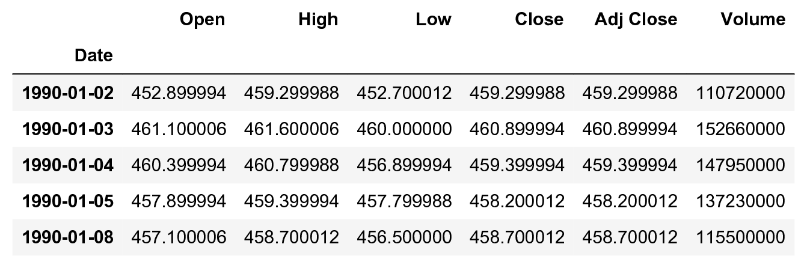
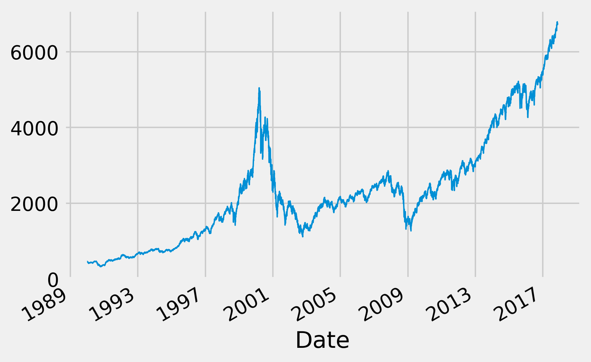
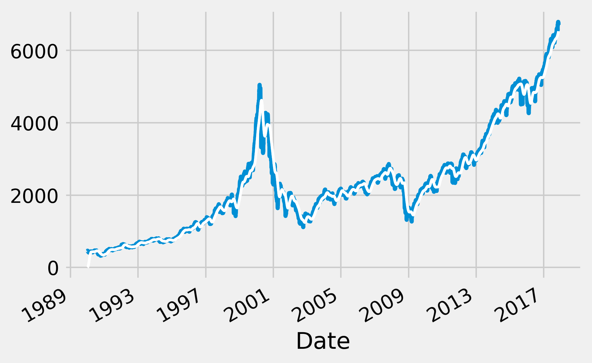
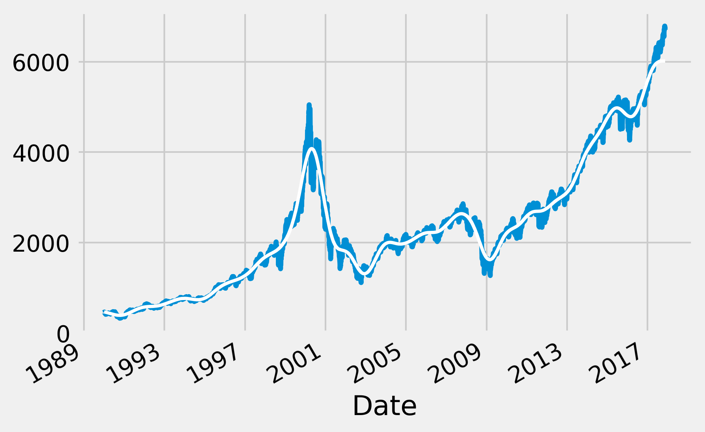
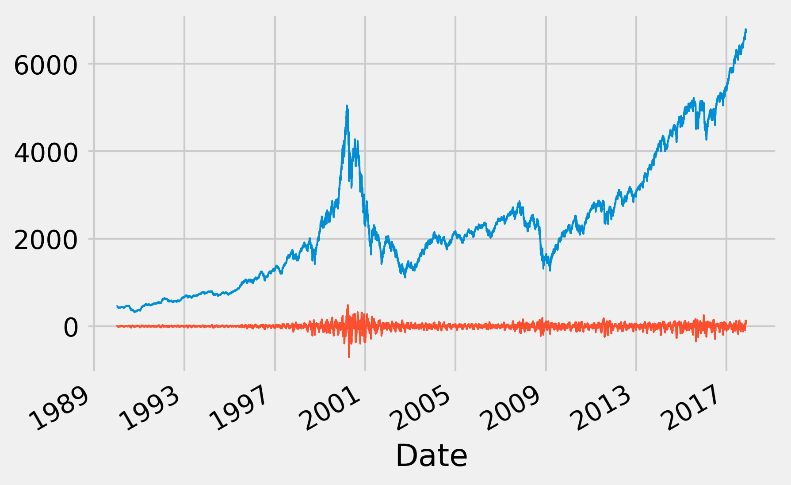

<a href="https://github.com/ipython-books/cookbook-2nd"></a> *This is one of the 100+ free recipes of the [IPython Cookbook, Second Edition](https://github.com/ipython-books/cookbook-2nd), by [Cyrille Rossant](http://cyrille.rossant.net), a guide to numerical computing and data science in the Jupyter Notebook. The ebook and printed book are available for purchase at [Packt Publishing](https://www.packtpub.com/big-data-and-business-intelligence/ipython-interactive-computing-and-visualization-cookbook-second-e).*

▶ *[Text on GitHub](https://github.com/ipython-books/cookbook-2nd) with a [CC-BY-NC-ND license](https://creativecommons.org/licenses/by-nc-nd/3.0/us/legalcode)*  
▶ *[Code on GitHub](https://github.com/ipython-books/cookbook-2nd-code) with a [MIT license](https://opensource.org/licenses/MIT)*

[*Chapter 10 : Signal Processing*](./)

# 10.2. Applying a linear filter to a digital signal

Linear filters play a fundamental role in signal processing. With a linear filter, one can extract meaningful information from a digital signal.

In this recipe, we will show two examples using stock market data (the NASDAQ stock exchange). First, we will smooth out a very noisy signal with a low-pass filter to extract its slow variations. We will also apply a high-pass filter to the original time series to extract the fast variations. These are just two common examples among a wide variety of applications of linear filters.

## How to do it...

1. Let's import the packages:

```python
import numpy as np
import scipy as sp
import scipy.signal as sg
import pandas as pd
import matplotlib.pyplot as plt
%matplotlib inline
```

2. We load the NASDAQ data (obtained from https://finance.yahoo.com/quote/%5EIXIC/history?period1=631148400&period2=1510786800&interval=1d&filter=history&frequency=1d) with pandas:

```python
nasdaq_df = pd.read_csv(
    'https://github.com/ipython-books/'
    'cookbook-2nd-data/blob/master/'
    'nasdaq.csv?raw=true',
    index_col='Date',
    parse_dates=['Date'])
```

```python
nasdaq_df.head()
```



3. Let's extract two columns: the date and the daily closing value:

```python
date = nasdaq_df.index
nasdaq = nasdaq_df['Close']
```

4. Let's take a look at the raw signal:

```python
fig, ax = plt.subplots(1, 1, figsize=(6, 4))
nasdaq.plot(ax=ax, lw=1)
```



5. Now, we will follow the first approach to get the slow variations of the signal. We will convolve the signal with a triangular window, which corresponds to a **FIR filter**. We will explain the idea behind this method in the *How it works...* section of this recipe. For now, let's just say that we replace each value with a weighted mean of the signal around this value:

```python
# We get a triangular window with 60 samples.
h = sg.get_window('triang', 60)
# We convolve the signal with this window.
fil = sg.convolve(nasdaq, h / h.sum())
```

```python
fig, ax = plt.subplots(1, 1, figsize=(6, 4))
# We plot the original signal...
nasdaq.plot(ax=ax, lw=3)
# ... and the filtered signal.
ax.plot_date(date, fil[:len(nasdaq)],
             '-w', lw=2)
```



6. Now, let's use another method. We create an IIR Butterworth low-pass filter to extract the slow variations of the signal. The `filtfilt()` method allows us to apply a filter forward and backward in order to avoid phase delays:

```python
fig, ax = plt.subplots(1, 1, figsize=(6, 4))
nasdaq.plot(ax=ax, lw=3)
# We create a 4-th order Butterworth low-pass filter.
b, a = sg.butter(4, 2. / 365)
# We apply this filter to the signal.
ax.plot_date(date, sg.filtfilt(b, a, nasdaq),
             '-w', lw=2)
```



7. Finally, we use the same method to create a high-pass filter and extract the *fast* variations of the signal:

```python
fig, ax = plt.subplots(1, 1, figsize=(6, 4))
nasdaq.plot(ax=ax, lw=1)
b, a = sg.butter(4, 2 * 5. / 365, btype='high')
ax.plot_date(date, sg.filtfilt(b, a, nasdaq),
             '-', lw=1)
```



The fast variations around 2000 correspond to the **dot-com bubble burst**, reflecting the high-market volatility and the fast fluctuations of the stock market indices at that time. For more details, refer to https://en.wikipedia.org/wiki/Dot-com_bubble.

## How it works...

In this section, we explain the very basics of linear filters in the context of digital signals.

A **digital signal** is a discrete sequence $(x_n)$ indexed by $n \geq 0$. Although we often assume infinite sequences, in practice, a signal is represented by a *vector* of the finite size $N$.

In the continuous case, we would rather manipulate time-dependent functions $f(t)$. Loosely stated, we can go from continuous signals to discrete signals by discretizing time and transforming integrals into sums.

### What are linear filters?

A **linear filter** $F$ transforms an input signal $x = (x_n)$ to an output signal $y = (y_n)$. This transformation is linear—the transformation of the sum of two signals is the sum of the transformed signals: $F(x+y) = F(x)+F(y)$.

In addition to this, multiplying the input signal by a constant yields the same output as multiplying the original output signal by the same constant: $F(\lambda x) = \lambda F(x)$.

A **Linear Time-Invariant (LTI) filter** has an additional property: if the signal $(x_n)$ is transformed to $(y_n)$, then the shifted signal $(x_{n-k})$ is transformed to $(y_{n-k})$, for any fixed $k$. In other words, the system is time-invariant because the output does not depend on the particular time the input is applied.

> From now on, we will only consider LTI filters.

### Linear filters and convolutions

A very important result in the LTI system theory is that LTI filters can be described by a single signal: the impulse response $h$. This is the output of the filter in response to an impulse signal. For digital filters, the impulse signal is $(1, 0, 0, 0, ...)$.

It can be shown that $x=(x_n)$ is transformed to $y=(y_n)$ defined by the **convolution** of the impulse response $h$ with the signal $x$:

$$\mathbf{y} = \mathbf{h} * \mathbf{x}, \quad \textrm{or} \quad y_n = \sum_{k=0}^{n} h_k x_{n-k}$$

The convolution is a fundamental mathematical operation in signal processing. Intuitively, and considering a convolution function peaking around zero, the convolution is equivalent to taking a local average of the signal ($x$ here), weighted by a given window ($h$ here).

It is implied, by our notations, that we restrict ourselves to **causal filters** ($h_n = 0$ for $n < 0$). This property means that the output of the signal only depends on the present and the past of the input, not the future. This is a natural property in many situations.

### The FIR and IIR filters

The **support** of a signal $(h_n)$ is the set of $n$ such that $h_n \neq 0$. LTI filters can be classified into two categories:

* **A Finite Impulse Response (FIR) filter** has an impulse response with finite support
* **A Infinite Impulse Response (IIR) filter** has an impulse response with infinite support

A FIR filter can be described by a finite impulse response of size $N$ (a vector). It works by convolving a signal with its impulse response. Let's define $b_n = h_n$ for $n \leq N$. Then, $y_n$ is a linear combination of the last $N+1$ values of the input signal:

$$y_n = \sum_{k=0}^N b_k x_{n-k}$$

On the other hand, an IIR filter is described by an infinite impulse response that cannot be represented exactly under this form. For this reason, we often use an alternative representation:

$$y_n = \frac{1}{a_0} \left( \sum_{k=0}^N b_k x_{n-k} - \sum_{l=1}^M a_l y_{n-l} \right)$$

This **difference equation** expresses $y_n$ as a linear combination of the last $N+1$ values of the *input* signal (the **feedforward term**, like for a FIR filter) and a linear combination of the last $M$ values of the *output* signal (**feedback term**). The feedback term makes the IIR filter more complex than a FIR filter in that the output depends not only on the input but also on the previous values of the output (dynamics).

### Filters in the frequency domain

We only described filters in the temporal domain. Alternate representations in other domains exist such as Laplace transforms, Z-transforms, and Fourier transforms.

In particular, the *Fourier transform* has a very convenient property: it transforms convolutions into multiplications in the frequency domain. In other words, in the frequency domain, an LTI filter multiplies the Fourier transform of the input signal by the Fourier transform of the impulse response.

### The low-, high-, and band-pass filters

Filters can be characterized by their effects on the amplitude of the input signal's frequencies. They are as follows:

* A **low-pass filter** attenuates the components of the signal at frequencies *higher* than a **cutoff frequency**
* A **high-pass filter** attenuates the components of the signal at frequencies *lower* than a cutoff frequency
* A **band-pass filter** passes the components of the signal at frequencies within a certain range and attenuates those outside

In this recipe, we first convolved the input signal with a triangular window (with finite support). It can be shown that this operation corresponds to a low-pass FIR filter. It is a particular case of the **moving average method**, which computes a local weighted average of every value in order to smooth out the signal.

Then, we applied two instances of the **Butterworth filter**, a particular kind of IIR filter that can act as a low-pass, high-pass, or band-pass filter. In this recipe, we first used it as a low-pass filter to smooth out the signal, before using it as a high-pass filter to extract fast variations of the signal.

## There's more...

Here are some general references about digital signal processing and linear filters:

* Digital signal processing on Wikipedia, available at https://en.wikipedia.org/wiki/Digital_signal_processing
* Linear filters on Wikipedia, available at https://en.wikipedia.org/wiki/Linear_filter
* LTI filters on Wikipedia, available at https://en.wikipedia.org/wiki/LTI_system_theory

## See also

* Analyzing the frequency components of a signal with a Fourier transform
