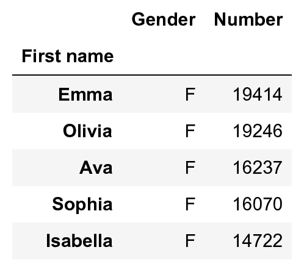
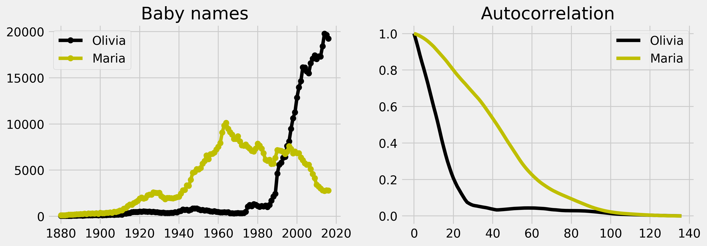

<a href="https://github.com/ipython-books/cookbook-2nd"></a> *This is one of the 100+ free recipes of the [IPython Cookbook, Second Edition](https://github.com/ipython-books/cookbook-2nd), by [Cyrille Rossant](http://cyrille.rossant.net), a guide to numerical computing and data science in the Jupyter Notebook. The ebook and printed book are available for purchase at [Packt Publishing](https://www.packtpub.com/big-data-and-business-intelligence/ipython-interactive-computing-and-visualization-cookbook-second-e).*

▶ *[Text on GitHub](https://github.com/ipython-books/cookbook-2nd) with a [CC-BY-NC-ND license](https://creativecommons.org/licenses/by-nc-nd/3.0/us/legalcode)*  
▶ *[Code on GitHub](https://github.com/ipython-books/cookbook-2nd-code) with a [MIT license](https://opensource.org/licenses/MIT)*

[*Chapter 10 : Signal Processing*](./)

# 10.3. Computing the autocorrelation of a time series

The autocorrelation of a time series can inform us about repeating patterns or serial correlation. The latter refers to the correlation between the signal at a given time and at a later time. The analysis of the autocorrelation can thereby inform us about the timescale of the fluctuations. Here, we use this tool to analyze the evolution of baby names in the US, based on data provided by the United States Social Security Administration.

## How to do it...

1. We import the following packages:

```python
import os
import numpy as np
import pandas as pd
import matplotlib.pyplot as plt
%matplotlib inline
```

2. We download the *Babies* dataset (available on the GitHub data repository of the book) using the *requests* third-party package. The dataset was obtained initially from the *data.gov* website (https://catalog.data.gov/dataset/baby-names-from-social-security-card-applications-national-level-data). We extract the archive locally in the `babies` subdirectory. There is one CSV file per year. Each file contains all baby names given that year with the respective frequencies.

```python
import io
import requests
import zipfile
```

```python
url = ('https://github.com/ipython-books/'
       'cookbook-2nd-data/blob/master/'
       'babies.zip?raw=true')
r = io.BytesIO(requests.get(url).content)
zipfile.ZipFile(r).extractall('babies')
```

```python
%ls babies
```

```{output:stdout}
yob1902.txt
yob1903.txt
yob1904.txt
...
yob2014.txt
yob2015.txt
yob2016.txt
```

3. We read the data with pandas. We load the data in a dictionary, containing one `DataFrame` per year:

```python
files = [file for file in os.listdir('babies')
         if file.startswith('yob')]
```

```python
years = np.array(sorted([int(file[3:7])
                         for file in files]))
```

```python
data = {year:
        pd.read_csv('babies/yob%d.txt' % year,
                    index_col=0, header=None,
                    names=['First name',
                           'Gender',
                           'Number'])
        for year in years}
```

```python
data[2016].head()
```



4. We write functions to retrieve the frequencies of baby names as a function of the name, gender, and birth year:

```python
def get_value(name, gender, year):
    """Return the number of babies born a given year,
    with a given gender and a given name."""
    dy = data[year]
    try:
        return dy[dy['Gender'] == gender] \
                 ['Number'][name]
    except KeyError:
        return 0
```

```python
def get_evolution(name, gender):
    """Return the evolution of a baby name over
    the years."""
    return np.array([get_value(name, gender, year)
                     for year in years])
```

5. Let's define a function that computes the autocorrelation of a signal. This function is essentially based on NumPy's `correlate()` function.

```python
def autocorr(x):
    result = np.correlate(x, x, mode='full')
    return result[result.size // 2:]
```

6. Now, we create a function that displays the evolution of a baby name as well as its (normalized) autocorrelation:

```python
def autocorr_name(name, gender, color, axes=None):
    x = get_evolution(name, gender)
    z = autocorr(x)

    # Evolution of the name.
    axes[0].plot(years, x, '-o' + color,
                 label=name)
    axes[0].set_title("Baby names")
    axes[0].legend()

    # Autocorrelation.
    axes[1].plot(z / float(z.max()),
                 '-' + color, label=name)
    axes[1].legend()
    axes[1].set_title("Autocorrelation")
```

6. Let's take a look at two female names:

```python
fig, axes = plt.subplots(1, 2, figsize=(12, 4))
autocorr_name('Olivia', 'F', 'k', axes=axes)
autocorr_name('Maria', 'F', 'y', axes=axes)
```



The autocorrelation of Olivia is decaying much faster than Maria's. This is mainly because of the steep increase of the name Olivia at the end of the twentieth century. By contrast, the name Maria is varying more slowly globally, and its autocorrelation is decaying slower.

## How it works...

A **time series** is a sequence indexed by time. Important applications include stock markets, product sales, weather forecasting, biological signals, and many others. Time series analysis is an important part of statistical data analysis, signal processing, and machine learning.

There are various definitions of the autocorrelation. Here, we define the autocorrelation of a time series $(x_n)$ as:

$$R(k) = \frac 1 N \sum_{n} x_n x_{n+k}$$

In the previous plot, we normalized the autocorrelation by its maximum so as to compare the autocorrelation of two signals. The autocorrelation quantifies the average similarity between the signal and a shifted version of the same signal, as a function of the delay between the two. In other words, the autocorrelation can give us information about repeating patterns as well as the timescale of the signal's fluctuations. The faster the autocorrelation decays to zero, the faster the signal varies.

## There's more...

Here are a few references:

* NumPy's correlation function documentation, available at http://docs.scipy.org/doc/numpy/reference/generated/numpy.correlate.html
* Autocorrelation function in statsmodels, documented at http://statsmodels.sourceforge.net/stable/tsa.html
* Time series on Wikipedia, available at https://en.wikipedia.org/wiki/Time_series
* Serial dependence on Wikipedia, available at https://en.wikipedia.org/wiki/Serial_dependence
* Autocorrelation on Wikipedia, available at https://en.wikipedia.org/wiki/Autocorrelation

## See also

* Analyzing the frequency components of a signal with a Fast Fourier Transform
