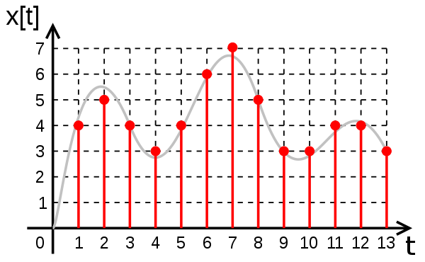

# Chapter 10 : Signal Processing

In this chapter, we will cover the following topics:

* [10.1. Analyzing the frequency components of a signal with a Fast Fourier Transform](01_fourier.md)
* [10.2. Applying a linear filter to a digital signal](02_filter.md)
* [10.3. Computing the autocorrelation of a time series](03_autocorrelation.md)

Signals are mathematical functions that describe the variation of a quantity across time or space. Time-dependent signals are often called **time series**. Examples of time series include share prices, which are typically presented as successive points in time spaced at uniform time intervals. In physics or biology, experimental devices record the evolution of variables such as electromagnetic waves or biological processes.

In signal processing, a general objective consists of extracting meaningful and relevant information from raw, noisy measurements. Signal processing topics include signal acquisition, transformation, compression, filtering, and feature extraction, among others. When dealing with a complex dataset, it can be beneficial to clean it before applying more advanced mathematical analysis methods (such as machine learning, for instance).

In this concise chapter, we will illustrate and explain the main foundations of signal processing. In the next chapter, *Chapter 11, Image and Audio Processing*, we will see particular signal processing methods adapted to images and sounds.

First, we will give some important definitions in this introduction.

## Analog and digital signals

Signals can be time-dependent or space-dependent. In this chapter, we will focus on time-dependent signals.

Let $x(t)$ be a time-varying signal. We say that:

* This signal is **analog** if $t$ is a continuous variable and $x(t)$ is a real number
* This signal is **digital** if $t$ is a discrete variable (**discrete-time signal**) and $x(t)$ can only take a finite number of values (**quantified signal**)

The following figure shows the difference between an analog signal (the continuous curve) and a digital signal (dots):

Analog signals are found in mathematics and in most physical systems such as electric circuits. Yet, computers being discrete machines, they can only understand digital signals. This is why computational science especially deals with digital signals.

A digital signal recorded by an experimental device is typically characterized by two important quantities:

* **The sampling rate**: The number of values (or samples) recorded every second (in Hertz)
* **The resolution**: The precision of the quantization, usually in bits per sample (also known as **bit depth**)

Digital signals with high sampling rates and bit depths are more accurate, but they require more memory and processing power. These two parameters are limited by the experimental devices that record the signals.

## The Nyquist–Shannon sampling theorem

Let's consider a continuous (analog) time-varying signal $x(t)$. We record this physical signal with an experimental device, and we obtain a digital signal with a sampling rate of $f_s$. The original analog signal has an infinite precision, whereas the recorded signal has a finite precision. Therefore, we expect to lose information in the analog-to-digital process.

The **Nyquist–Shannon sampling theorem** states that under certain conditions on the analog signal and the sampling rate, it is possible not to lose any information in the process. In other words, under these conditions, we can recover the exact original continuous signal from the sampled digital signal. For more details, refer to https://en.wikipedia.org/wiki/Nyquist%E2%80%93Shannon_sampling_theorem.

Let's define these conditions. The **Fourier transform** $\hat{x}(f)$ of $x(t)$ is defined by:

$$\hat{x}(f) = \int_{-\infty}^{+\infty} x(t) e^{-2i\pi ft} dt$$

Here, the Fourier transform is a representation of a time-dependent signal in the frequency domain. The **Nyquist criterion** states that:

$$\textrm{there exists} \quad B < f_s/2 \quad \textrm{such that, for all} \quad|f|>B, \quad \hat{x}(f)=0.$$

In other words, the signal must be **bandlimited**, meaning that it must not contain any frequency higher than a certain cutoff frequency $B$. Additionally, the sampling rate $f_s$ needs to be at least twice as large as this frequency $B$. Here are a couple of definitions:

* The **Nyquist rate** is $2B$. For a given bandlimited analog signal, it is the minimal sampling rate required to sample the signal without loss.
* The **Nyquist frequency** is $f_s/2$. For a given sampling rate, it is the maximal frequency that the signal can contain in order to be sampled without loss.

Under these conditions, we can theoretically reconstruct the original analog signal from the sampled digital signal.

## Compressed sensing

**Compressed sensing** is a recent and important approach to signal processing. It acknowledges that many real-world signals are intrinsically low dimensional. For example, speech signals have a very specific structure depending on the general physical constraints of the human vocal tract.

Even if a speech signal has many frequencies in the Fourier domain, it may be well approximated by a **sparse decomposition** on an adequate basis (dictionary). By definition, a decomposition is sparse if most of the coefficients are zero. If the dictionary is chosen well, every signal is a combination of a small number of the basis signals.

This dictionary contains elementary signals that are specific to the signals considered in a given problem. This is different from the Fourier transform that decomposes a signal on a universal basis of sine functions. In other words, with sparse representations, the Nyquist condition can be circumvented. We can precisely reconstruct a continuous signal from a sparse representation containing fewer samples than what the Nyquist condition requires.

Sparse decompositions can be found with sophisticated algorithms. In particular, these problems may be turned into convex optimization problems that can be tackled with specific numerical optimization methods.

Compressed sensing has many applications in signal compression, image processing, computer vision, biomedical imaging, and many other scientific and engineering areas.

Here are further references about compressed sensing:

* https://en.wikipedia.org/wiki/Compressed_sensing
* https://en.wikipedia.org/wiki/Sparse_approximation
* Compressed sensing in Python at http://www.pyrunner.com/weblog/2016/05/26/compressed-sensing-python/

## References

Here are a few references:

* *Understanding Digital Signal Processing, Richard G. Lyons, Pearson Education, (2010).*
* For good coverage of compressed sensing, refer to the book *A Wavelet Tour of Signal Processing: The Sparse Way, Mallat Stéphane, Academic Press, (2008)*.
* Harmonic Analysis Lectures on Awesome Math, at https://github.com/rossant/awesome-math/#harmonic-analysis
* The book *Python for Signal Processing* by Jose Unpingco contains many more details than what we can cover in this chapter. The code is available as Jupyter notebooks on GitHub (http://python-for-signal-processing.blogspot.com).
* *Digital Signal Processing* on WikiBooks available at http://en.wikibooks.org/wiki/Digital_Signal_Processing.
* Numerical Tours in Python, available at http://www.numerical-tours.com/python/
