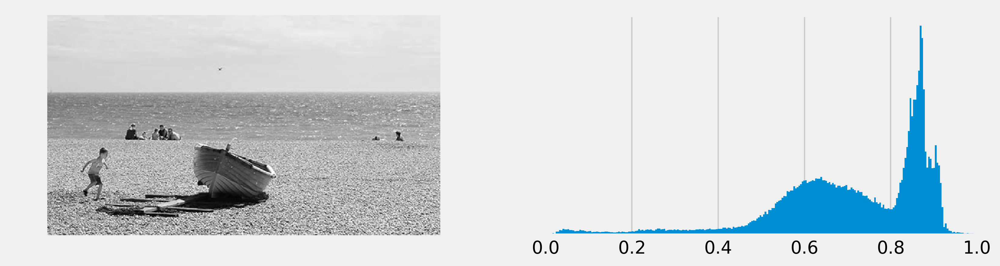
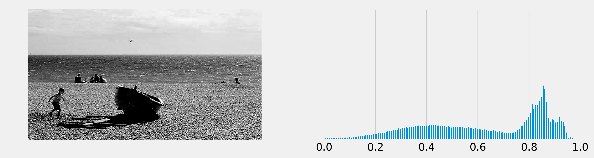
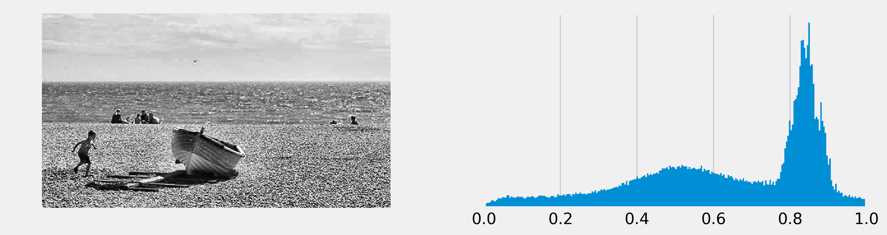

<a href="https://github.com/ipython-books/cookbook-2nd"></a> *This is one of the 100+ free recipes of the [IPython Cookbook, Second Edition](https://github.com/ipython-books/cookbook-2nd), by [Cyrille Rossant](http://cyrille.rossant.net), a guide to numerical computing and data science in the Jupyter Notebook. The ebook and printed book are available for purchase at [Packt Publishing](https://www.packtpub.com/big-data-and-business-intelligence/ipython-interactive-computing-and-visualization-cookbook-second-e).*

▶ *[Text on GitHub](https://github.com/ipython-books/cookbook-2nd) with a [CC-BY-NC-ND license](https://creativecommons.org/licenses/by-nc-nd/3.0/us/legalcode)*  
▶ *[Code on GitHub](https://github.com/ipython-books/cookbook-2nd-code) with a [MIT license](https://opensource.org/licenses/MIT)*

[*Chapter 11 : Image and Audio Processing*](./)

# 11.1. Manipulating the exposure of an image

The **exposure** of an image tells us whether the image is too dark, too light, or balanced. It can be measured with a histogram of the intensity values of all pixels. Improving the exposure of an image is a basic image-editing operation. As we will see in this recipe, it can be done easily with scikit-image.

## Getting ready

scikit-image should be included by default in Anaconda. Otherwise, you can always install it manually with `conda install scikit-image`.

## How to do it...

1. Let's import the packages:

```python
import numpy as np
import matplotlib.pyplot as plt
import skimage.exposure as skie
%matplotlib inline
```

2. We open an image with matplotlib. We only take a single RGB component to have a grayscale image (it is a very crude way of doing it, we give much better ways at the end of this recipe):

```python
img = plt.imread('https://github.com/ipython-books/'
                 'cookbook-2nd-data/blob/master/'
                 'beach.png?raw=true')[..., 0]
```

3. We create a function that displays the image along with its **histogram** of the intensity values (that is, the exposure):

```python
def show(img):
    # Display the image.
    fig, (ax1, ax2) = plt.subplots(1, 2,
                                   figsize=(12, 3))

    ax1.imshow(img, cmap=plt.cm.gray)
    ax1.set_axis_off()

    # Display the histogram.
    ax2.hist(img.ravel(), lw=0, bins=256)
    ax2.set_xlim(0, img.max())
    ax2.set_yticks([])

    plt.show()
```

4. Let's display the image along with its histogram:

```python
show(img)
```



The histogram is unbalanced and the image appears overexposed (many pixels are too bright).

5. Now, we rescale the intensity of the image using scikit-image's `rescale_intensity` function. The `in_range` and `out_range` parameters define a linear mapping from the original image to the modified image. The pixels that are outside `in_range` are clipped to the extremal values of `out_range`. Here, the darkest pixels (intensity less than 100) become completely black (0), whereas the brightest pixels (>240) become completely white (255):

```python
show(skie.rescale_intensity(
    img, in_range=(0.4, .95), out_range=(0, 1)))
```



Many intensity values seem to be missing in the histogram, which reflects the poor quality of this crude exposure correction technique.

6. We now use a more advanced exposure correction technique called **Contrast Limited Adaptive Histogram Equalization (CLAHE)**:

```python
show(skie.equalize_adapthist(img))
```



The histogram seems more balanced, and the image now appears more contrasted.

## How it works...

An image's histogram represents the distribution of the pixels' intensity values. It is a central tool in image editing, image processing, and computer vision.

The `rescale_intensity()` function stretches or shrinks the intensity levels of the image. One use case is to ensure that the whole range of values allowed by the data type is used by the image.

The `equalize_adapthist()` function works by splitting the image into rectangular sections and computing the histogram for each section. Then, the intensity values of the pixels are redistributed to improve the contrast and enhance the details.

The `skimage.color.rgb2gray()` function converts a colored image to a grayscale image using a special weighting of the color channels that preserves luminance.

## There's more...

Here are some references:

* Transforming image data in the scikit-image documentation, at http://scikit-image.org/docs/dev/user_guide/transforming_image_data.html
* Histogram equalization in the scikit-image documentation, at http://scikit-image.org/docs/dev/auto_examples/color_exposure/plot_equalize.html
* Image histogram on Wikipedia, available at https://en.wikipedia.org/wiki/Image_histogram
* Histogram equalization on Wikipedia, available at https://en.wikipedia.org/wiki/Histogram_equalization
* Adaptive histogram equalization on Wikipedia, available at https://en.wikipedia.org/wiki/Adaptive_histogram_equalization
* Contrast on Wikipedia, available at https://en.wikipedia.org/wiki/Contrast_(vision)

## See also

* Applying filters on an image
