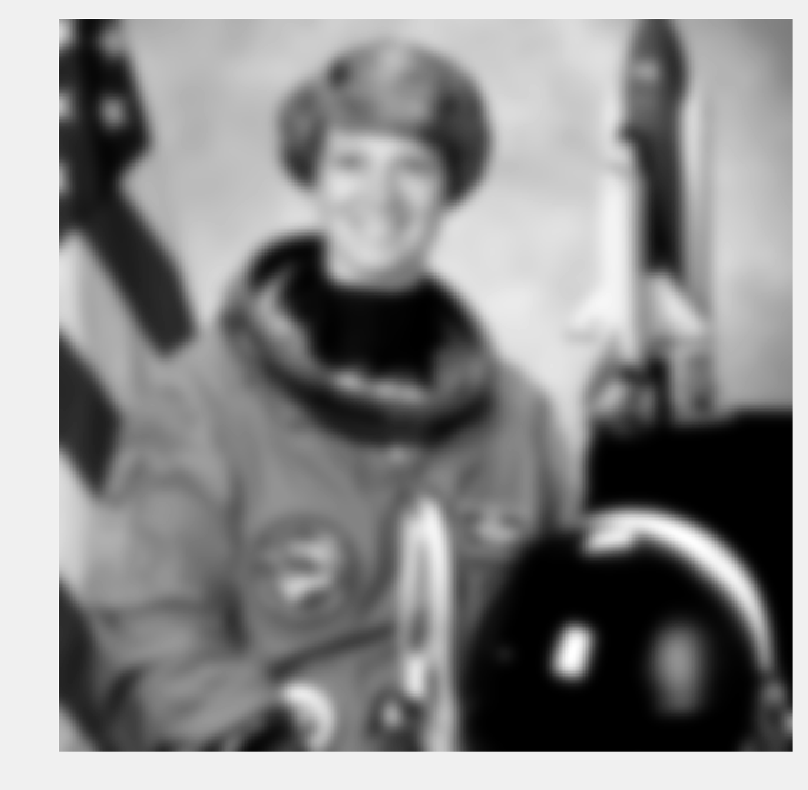
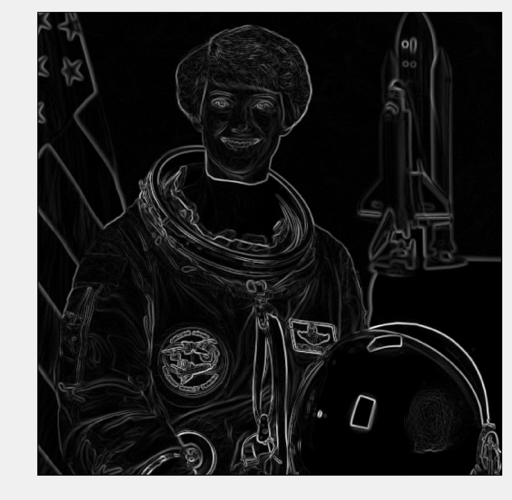
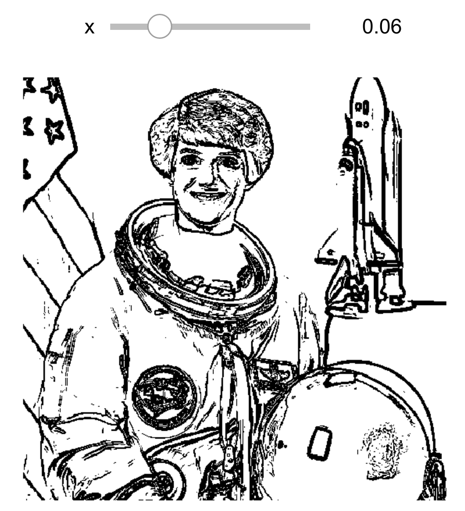
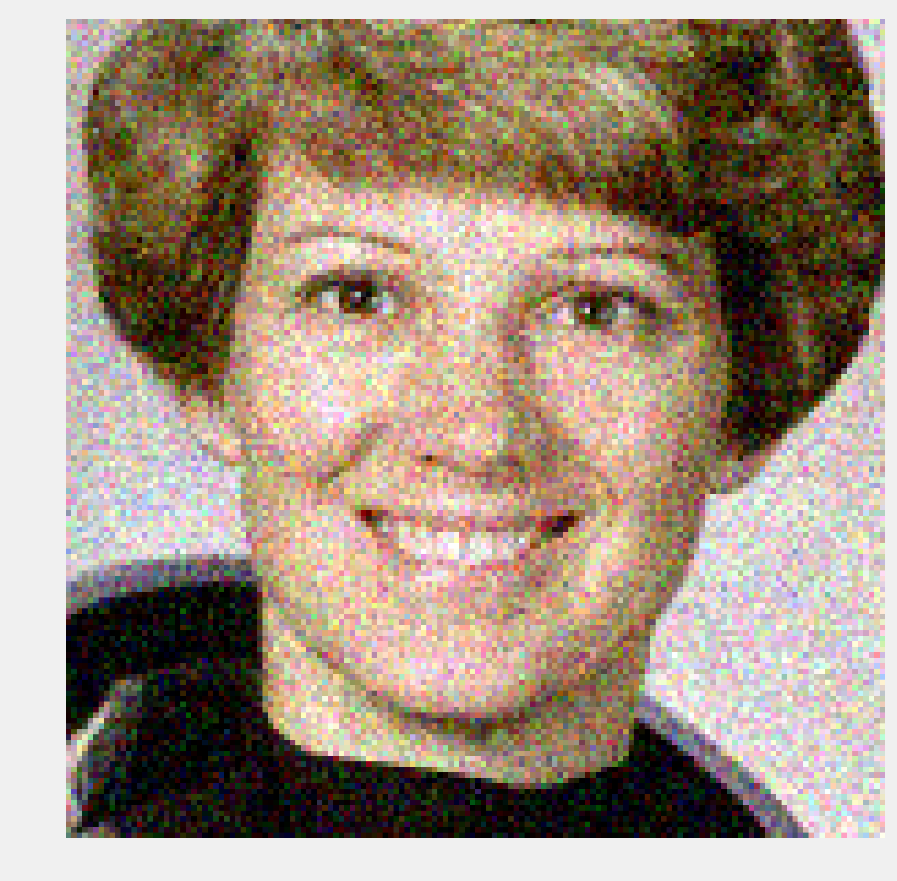
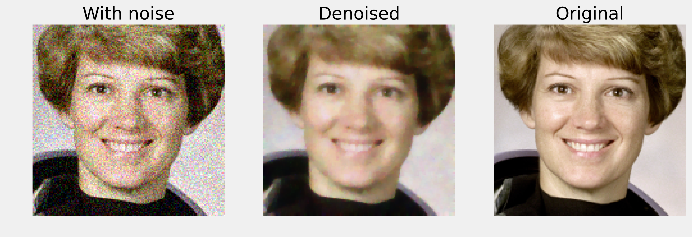

<a href="https://github.com/ipython-books/cookbook-2nd"></a> *This is one of the 100+ free recipes of the [IPython Cookbook, Second Edition](https://github.com/ipython-books/cookbook-2nd), by [Cyrille Rossant](http://cyrille.rossant.net), a guide to numerical computing and data science in the Jupyter Notebook. The ebook and printed book are available for purchase at [Packt Publishing](https://www.packtpub.com/big-data-and-business-intelligence/ipython-interactive-computing-and-visualization-cookbook-second-e).*

▶ *[Text on GitHub](https://github.com/ipython-books/cookbook-2nd) with a [CC-BY-NC-ND license](https://creativecommons.org/licenses/by-nc-nd/3.0/us/legalcode)*  
▶ *[Code on GitHub](https://github.com/ipython-books/cookbook-2nd-code) with a [MIT license](https://opensource.org/licenses/MIT)*

[*Chapter 11 : Image and Audio Processing*](./)

# 11.2. Applying filters on an image

In this recipe, we apply filters on an image for various purposes: blurring, denoising, and edge detection.

## How it works...

1. Let's import the packages:

```python
import numpy as np
import matplotlib.pyplot as plt
import skimage
import skimage.color as skic
import skimage.filters as skif
import skimage.data as skid
import skimage.util as sku
%matplotlib inline
```

2. We create a function that displays a grayscale image:

```python
def show(img):
    fig, ax = plt.subplots(1, 1, figsize=(8, 8))
    ax.imshow(img, cmap=plt.cm.gray)
    ax.set_axis_off()
    plt.show()
```

3. Now, we load the *Astronaut* image (bundled in scikit-image). We convert it to a grayscale image with the `rgb2gray()` function:

```python
img = skic.rgb2gray(skid.astronaut())
```

```python
show(img)
```


4. Let's apply a blurring **Gaussian filter** to the image:

```python
show(skif.gaussian(img, 5.))
```



5. We now apply a **Sobel filter** that enhances the edges in the image:

```python
sobimg = skif.sobel(img)
show(sobimg)
```



6. We can threshold the filtered image to get a *sketch effect*. We obtain a binary image that only contains the edges. We use a Notebook widget to find an adequate thresholding value; by adding the `@interact` decorator, we display a slider on top of the image. This widget lets us control the threshold dynamically.

```python
from ipywidgets import widgets

@widgets.interact(x=(0.01, .2, .005))
def edge(x):
    show(sobimg < x)
```



7. Finally, we add some noise to the image to illustrate the effect of a denoising filter:

```python
img = skimage.img_as_float(skid.astronaut())

# We take a portion of the image to show the details.
img = img[50:200, 150:300]

# We add Gaussian noise.
img_n = sku.random_noise(img)
show(img_n)
```



8. The `denoise_tv_bregman()` function implements total-variation denoising using the Split Bregman method:

```python
img_r = skimage.restoration.denoise_tv_bregman(
    img_n, 5.)

fig, (ax1, ax2, ax3) = plt.subplots(
    1, 3, figsize=(12, 8))

ax1.imshow(img_n)
ax1.set_title('With noise')
ax1.set_axis_off()

ax2.imshow(img_r)
ax2.set_title('Denoised')
ax2.set_axis_off()

ax3.imshow(img)
ax3.set_title('Original')
ax3.set_axis_off()
```



## How it works...

Many filters used in image processing are linear filters. These filters are very similar to those seen in *Chapter 10, Signal Processing*; the only difference is that they work in two dimensions. Applying a linear filter to an image amounts to performing a discrete **convolution** of the image with a particular function. The Gaussian filter applies a convolution with a Gaussian function to blur the image.

The Sobel filter computes an approximation of the gradient of the image. Therefore, it can detect fast-varying spatial changes in the image, which generally correspond to edges.

**Image denoising** refers to the process of removing noise from an image. **Total variation denoising** works by finding a regular image close to the original (noisy) image. Regularity is quantified by the **total variation** of the image:

$$V(x) = \sum_{i,j} \sqrt{ |x_{i+1,j} - x_{i,j}|^2 + |x_{i,j+1} - x_{i,j}|^2 }$$

The **Split Bregman method** is a variant based on the L1 norm. It is an instance of **compressed sensing**, which aims to find regular and sparse approximations of real-world noisy measurements.

## There's more...

Here are a few references:

* API reference of the skimage.filter module available at http://scikit-image.org/docs/dev/api/skimage.filters.html
* Noise reduction on Wikipedia, available at https://en.wikipedia.org/wiki/Noise_reduction
* Gaussian filter on Wikipedia, available at https://en.wikipedia.org/wiki/Gaussian_filter
* Sobel filter on Wikipedia, available at https://en.wikipedia.org/wiki/Sobel_operator
* The Split Bregman algorithm explained at http://www.ece.rice.edu/~tag7/Tom_Goldstein/Split_Bregman.html

## See also

* Manipulating the exposure of an image
