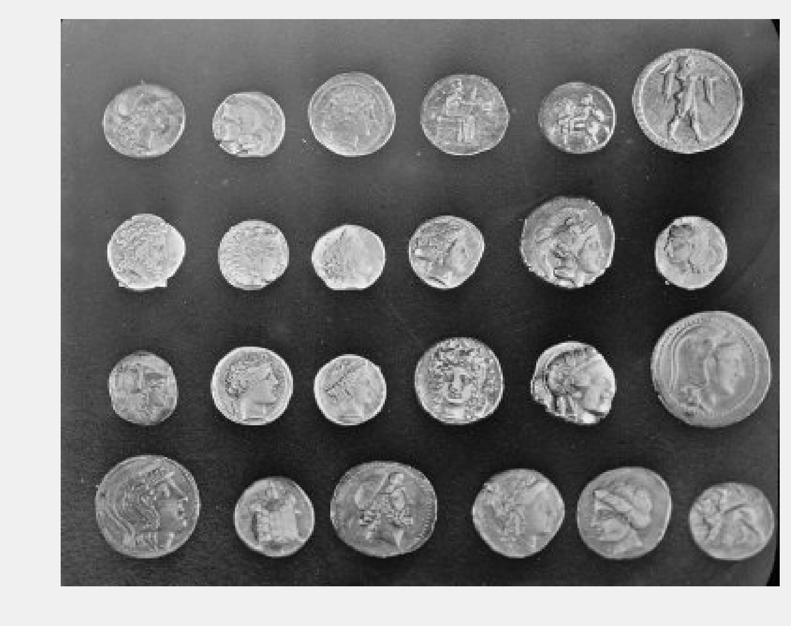
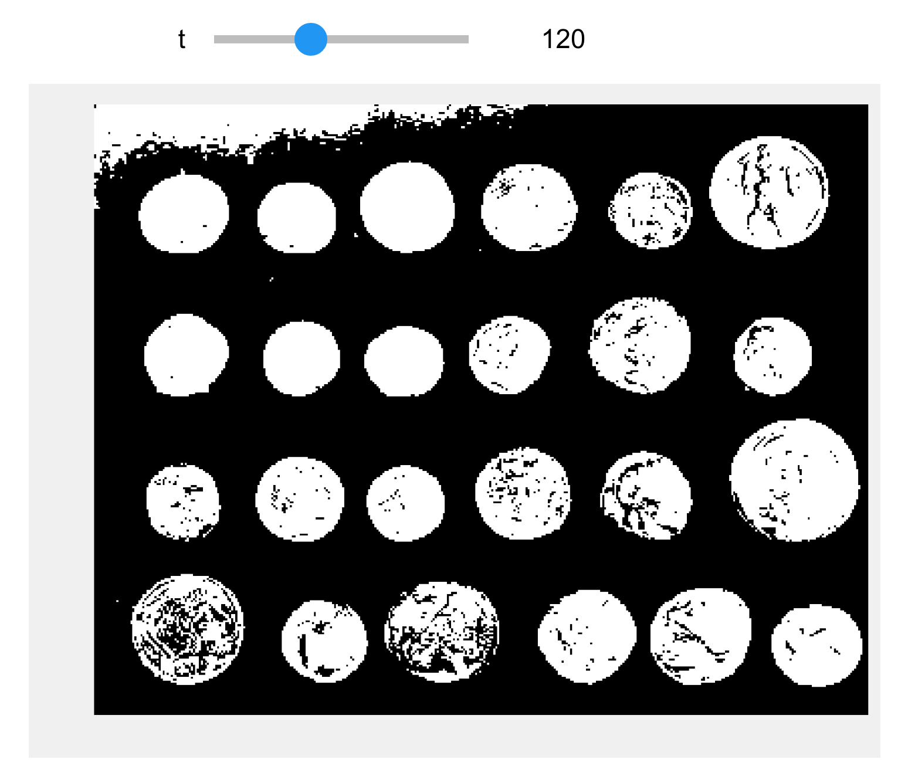
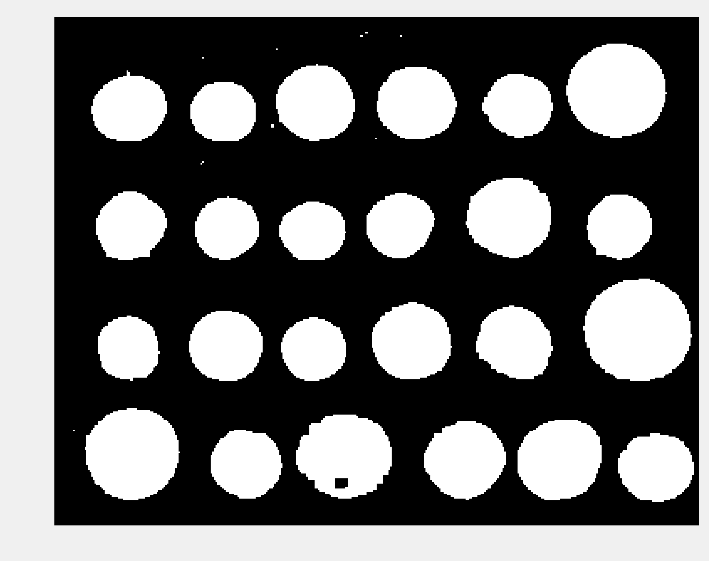
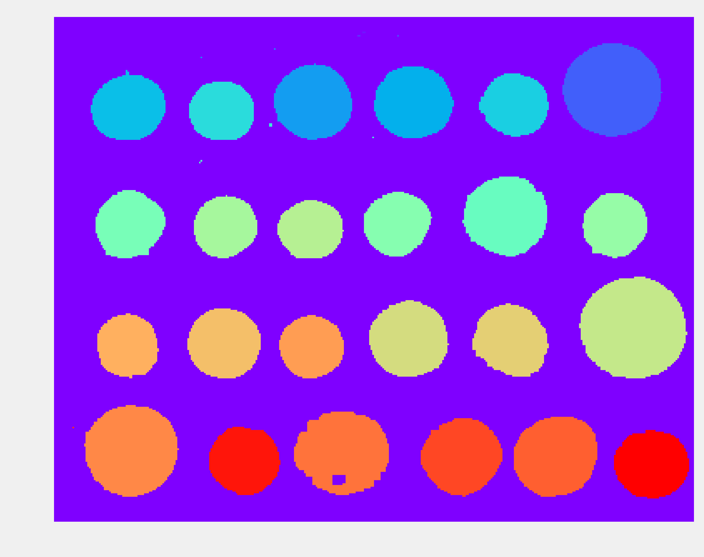
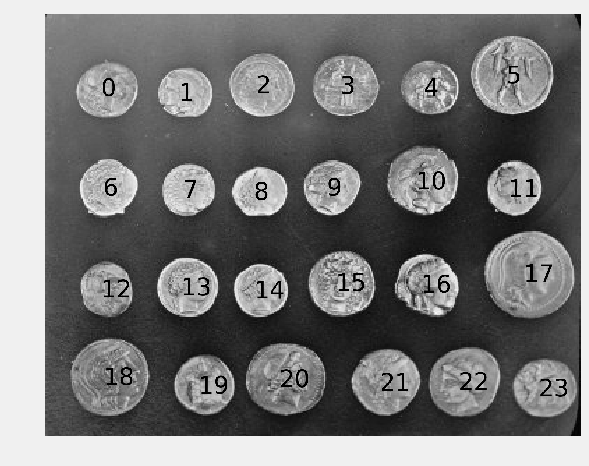

<a href="https://github.com/ipython-books/cookbook-2nd"></a> *This is one of the 100+ free recipes of the [IPython Cookbook, Second Edition](https://github.com/ipython-books/cookbook-2nd), by [Cyrille Rossant](http://cyrille.rossant.net), a guide to numerical computing and data science in the Jupyter Notebook. The ebook and printed book are available for purchase at [Packt Publishing](https://www.packtpub.com/big-data-and-business-intelligence/ipython-interactive-computing-and-visualization-cookbook-second-e).*

▶ *[Text on GitHub](https://github.com/ipython-books/cookbook-2nd) with a [CC-BY-NC-ND license](https://creativecommons.org/licenses/by-nc-nd/3.0/us/legalcode)*  
▶ *[Code on GitHub](https://github.com/ipython-books/cookbook-2nd-code) with a [MIT license](https://opensource.org/licenses/MIT)*

[*Chapter 11 : Image and Audio Processing*](./)

# 11.3. Segmenting an image

Image segmentation consists of partitioning an image into different regions that share certain characteristics. This is a fundamental task in computer vision, facial recognition, and medical imaging. For example, an image segmentation algorithm can automatically detect the contours of an organ in a medical image.

scikit-image provides several segmentation methods. In this recipe, we will demonstrate how to segment an image containing different objects. This recipe is inspired by a scikit-image example available at http://scikit-image.org/docs/dev/user_guide/tutorial_segmentation.html

## How to do it...

1. Let's import the packages:

```python
import numpy as np
import matplotlib.pyplot as plt
from skimage.data import coins
from skimage.filters import threshold_otsu
from skimage.segmentation import clear_border
from skimage.morphology import label, closing, square
from skimage.measure import regionprops
from skimage.color import lab2rgb
%matplotlib inline
```

2. We create a function that displays a grayscale image:

```python
def show(img, cmap=None):
    cmap = cmap or plt.cm.gray
    fig, ax = plt.subplots(1, 1, figsize=(8, 6))
    ax.imshow(img, cmap=cmap)
    ax.set_axis_off()
    plt.show()
```

3. We get a test image bundled in scikit-image, showing various coins on a plain background:

```python
img = coins()
```

```python
show(img)
```



4. The first step to segment the image is finding an intensity threshold separating the (bright) coins from the (dark) background. **Otsu's method** defines a simple algorithm to automatically find such a threshold.

```python
threshold_otsu(img)
```

```{output:result}
107
```

```python
show(img > 107)
```


5. There appears to be a problem in the top-left corner of the image, with part of the background being too bright. Let's use a Notebook widget to find a better threshold:

```python
from ipywidgets import widgets

@widgets.interact(t=(50, 240))
def threshold(t):
    show(img > t)
```



6. The threshold 120 looks better. The next step consists of cleaning the binary image by smoothing the coins and removing the border. scikit-image contains a few functions for these purposes.

```python
img_bin = clear_border(closing(img > 120, square(5)))
show(img_bin)
```



7. Next, we perform the segmentation task itself with the `label()` function. This function detects the connected components in the image and attributes a unique label to every component. Here, we color code the labels in the binary image:

```python
labels = label(img_bin)
show(labels, cmap=plt.cm.rainbow)
```



8. Small artifacts in the image result in spurious labels that do not correspond to coins. Therefore, we only keep components with more than 100 pixels. The `regionprops()` function allows us to retrieve specific properties of the components (here, the area and the bounding box):

```python
regions = regionprops(labels)
boxes = np.array([label['BoundingBox']
                  for label in regions
                  if label['Area'] > 100])
print(f"There are {len(boxes)} coins.")
```

```{output:stdout}
There are 24 coins.
```

9. Finally, we show the label number on top of each component in the original image:

```python
fig, ax = plt.subplots(1, 1, figsize=(8, 6))
ax.imshow(img, cmap=plt.cm.gray)
ax.set_axis_off()

# Get the coordinates of the boxes.
xs = boxes[:, [1, 3]].mean(axis=1)
ys = boxes[:, [0, 2]].mean(axis=1)

# We reorder the boxes by increasing
# column first, and row second.
for row in range(4):
    # We select the coins in each of the four rows.
    if row < 3:
        ind = ((ys[6 * row] <= ys) &
               (ys < ys[6 * row + 6]))
    else:
        ind = (ys[6 * row] <= ys)
    # We reorder by increasing x coordinate.
    ind = np.nonzero(ind)[0]
    reordered = ind[np.argsort(xs[ind])]
    xs_row = xs[reordered]
    ys_row = ys[reordered]
    # We display the coin number.
    for col in range(6):
        n = 6 * row + col
        ax.text(xs_row[col] - 5, ys_row[col] + 5,
                str(n),
                fontsize=20)
```



## How it works...

To clean up the coins in the thresholded image, we used **mathematical morphology** techniques. These methods, based on set theory, geometry, and topology, allow us to manipulate shapes.

For example, let's explain **dilation** and **erosion**. First, if $A$ is a set of pixels in an image, and $b$ is a 2D vector, we denote $A_b$ the set $A$ translated by $b$ as:

$$A_b = \{a+b \mid a\in A\}$$

Let $B$ be a set of vectors with integer components. We call *B* the **structuring element** (here, we used a square). This set represents the neighborhood of a pixel. The dilation of $A$ by $B$ is:

$$A  \oplus B = \bigcup_{b\in B} A_b$$

The erosion of $A$ by $B$ is:

$$A \ominus B = \{z\in E \mid B_{z} \subseteq A\}$$

A dilation extends a set by adding pixels close to its boundaries. An erosion removes the pixels of the set that are too close to the boundaries. The **closing** of a set is a dilation followed by an erosion. This operation can remove small dark spots and connect small bright cracks. In this recipe, we used a square structuring element.

## There's more...

Here are a few references:

* SciPy lecture notes on image processing available at http://scipy-lectures.github.io/packages/scikit-image/
* Image segmentation on Wikipedia, available at https://en.wikipedia.org/wiki/Image_segmentation
* Otsu's method to find a threshold explained at https://en.wikipedia.org/wiki/Otsu's_method
* Segmentation tutorial with scikit-image (which inspired this recipe) available at http://scikit-image.org/docs/dev/user_guide/tutorial_segmentation.html
* Mathematical morphology on Wikipedia, available at https://en.wikipedia.org/wiki/Mathematical_morphology
* API reference of the skimage.morphology module available at http://scikit-image.org/docs/dev/api/skimage.morphology.html

## See also

* *Computing connected components in an image*, in Chapter 14, *Graphs and Geometry* chapter.
