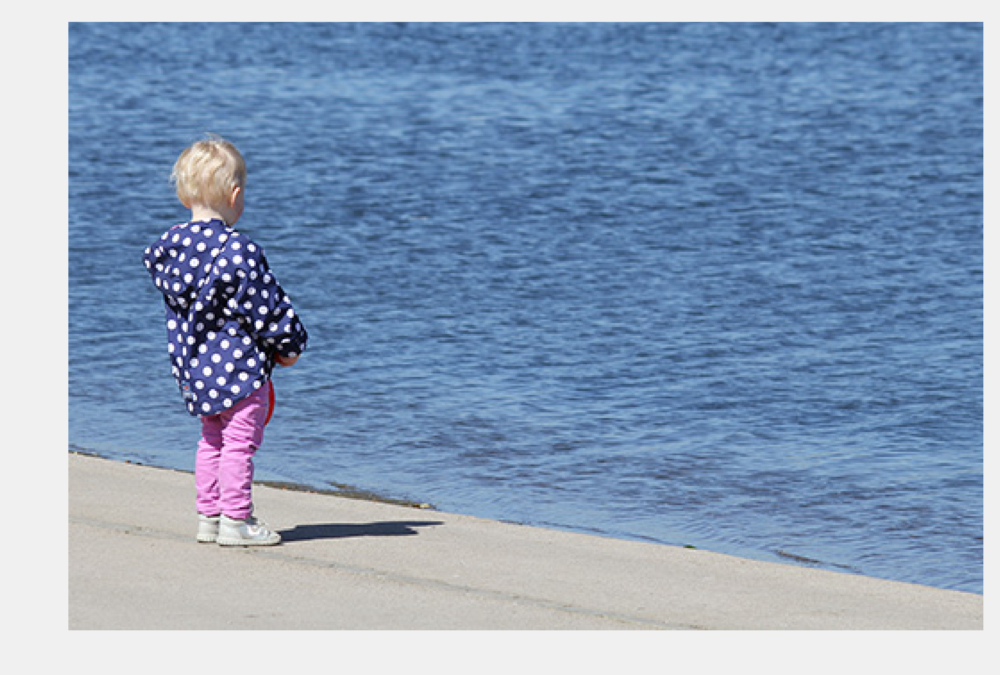
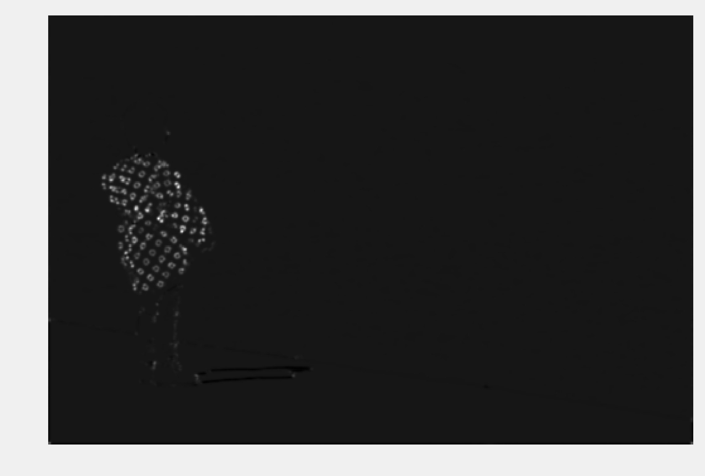
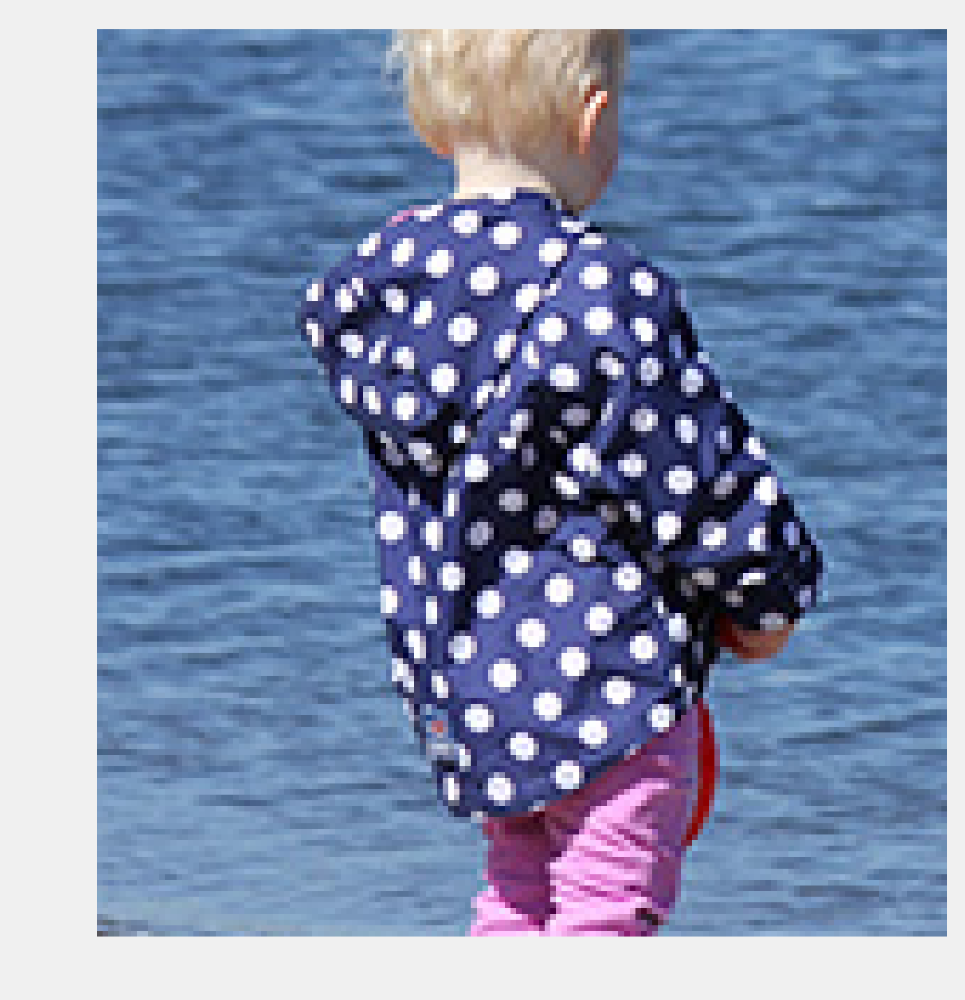

<a href="https://github.com/ipython-books/cookbook-2nd"></a> *This is one of the 100+ free recipes of the [IPython Cookbook, Second Edition](https://github.com/ipython-books/cookbook-2nd), by [Cyrille Rossant](http://cyrille.rossant.net), a guide to numerical computing and data science in the Jupyter Notebook. The ebook and printed book are available for purchase at [Packt Publishing](https://www.packtpub.com/big-data-and-business-intelligence/ipython-interactive-computing-and-visualization-cookbook-second-e).*

▶ *[Text on GitHub](https://github.com/ipython-books/cookbook-2nd) with a [CC-BY-NC-ND license](https://creativecommons.org/licenses/by-nc-nd/3.0/us/legalcode)*  
▶ *[Code on GitHub](https://github.com/ipython-books/cookbook-2nd-code) with a [MIT license](https://opensource.org/licenses/MIT)*

[*Chapter 11 : Image and Audio Processing*](./)

# 11.4. Finding points of interest in an image

In an image, **points of interest** are positions where there might be edges, corners, or interesting objects. For example, in a landscape picture, points of interest can be located near a house or a person. Detecting points of interest is useful in image recognition, computer vision, or medical imaging.

In this recipe, we will find points of interest in an image with scikit-image. This will allow us to crop an image around the subject of the picture, even when this subject is not in the center of the image.

## How to do it...

1. Let's import the packages:

```python
import numpy as np
import matplotlib.pyplot as plt
import skimage
import skimage.feature as sf
%matplotlib inline
```

2. We create a function to display a colored or grayscale image:

```python
def show(img, cmap=None):
    cmap = cmap or plt.cm.gray
    fig, ax = plt.subplots(1, 1, figsize=(8, 6))
    ax.imshow(img, cmap=cmap)
    ax.set_axis_off()
    return ax
```

3. We load an image:

```python
img = plt.imread('https://github.com/ipython-books/'
                 'cookbook-2nd-data/blob/master/'
                 'child.png?raw=true')
```

```python
show(img)
```



4. Let's find salient points in the image with the Harris corner method. The first step consists of computing the **Harris corner measure response image** with the `corner_harris()` function (we will explain this measure in *How it works...*). This function requires a grayscale image, thus we select the first RGB component:

```python
corners = sf.corner_harris(img[:, :, 0])
```

```python
show(corners)
```



We see that the patterns in the child's coat are well detected by this algorithm.

5. The next step is to detect corners from this measure image, using the `corner_peaks()` function:

```python
peaks = sf.corner_peaks(corners)
```

```python
ax = show(img)
ax.plot(peaks[:, 1], peaks[:, 0], 'or', ms=4)
```


6. Finally, we create a box around the median position of the corner points to define our region of interest:

```python
# The median defines the approximate position of
# the corner points.
ym, xm = np.median(peaks, axis=0)
# The standard deviation gives an estimation
# of the spread of the corner points.
ys, xs = 2 * peaks.std(axis=0)
xm, ym = int(xm), int(ym)
xs, ys = int(xs), int(ys)
show(img[ym - ys:ym + ys, xm - xs:xm + xs])
```



## How it works...

Let's explain the method used in this recipe. The first step consists of computing the **structure tensor** (or **Harris matrix**) of the image:

$$A = \begin{bmatrix}
\langle I_x^2 \rangle & \langle I_x I_y \rangle\\
\langle I_x I_y \rangle & \langle I_y^2 \rangle
\end{bmatrix}$$

Here, $I(x, y)$ is the image, $I_x$ and $I_y$ are the partial derivatives, and the brackets denote the local spatial average around neighboring values.

This tensor associates a $(2,2)$ positive symmetric matrix at each point. This matrix is used to calculate a sort of autocorrelation of the image at each point.

Let $\lambda$ and $\mu$ be the two eigenvalues of this matrix (the matrix is diagonalizable because it is real and symmetric). Roughly, a corner is characterized by a large variation of the autocorrelation in all directions, or in large positive eigenvalues $\lambda$ and $\mu$. The corner measure image is defined as:

$$M = \det(A) - k \times \mathrm{trace}(A)^2 = \lambda\mu - k(\lambda+\mu)^2$$

Here, $k$ is a tunable parameter. $M$ is large when there is a corner. Finally, `corner_peaks()` finds corner points by looking at local maxima in the corner measure image.

## There's more...

Here are a few references:

* A corner detection example with scikit-image available at http://scikit-image.org/docs/dev/auto_examples/features_detection/plot_corner.html
* An image processing tutorial with scikit-image available at http://blog.yhathq.com/posts/image-processing-with-scikit-image.html
* Corner detection on Wikipedia, available at https://en.wikipedia.org/wiki/Corner_detection
* Structure tensor on Wikipedia, available at https://en.wikipedia.org/wiki/Structure_tensor
* API reference of the skimage.feature module available at http://scikit-image.org/docs/dev/api/skimage.feature.html
