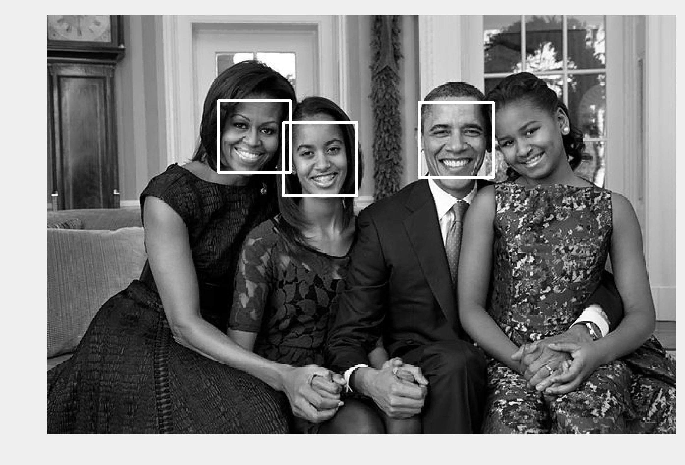
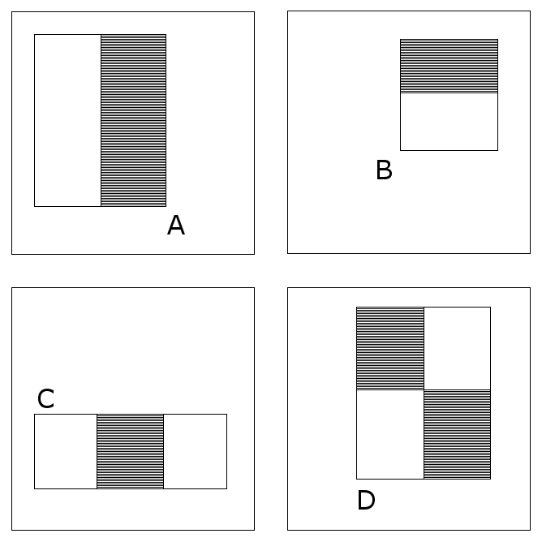

<a href="https://github.com/ipython-books/cookbook-2nd"></a> *This is one of the 100+ free recipes of the [IPython Cookbook, Second Edition](https://github.com/ipython-books/cookbook-2nd), by [Cyrille Rossant](http://cyrille.rossant.net), a guide to numerical computing and data science in the Jupyter Notebook. The ebook and printed book are available for purchase at [Packt Publishing](https://www.packtpub.com/big-data-and-business-intelligence/ipython-interactive-computing-and-visualization-cookbook-second-e).*

▶ *[Text on GitHub](https://github.com/ipython-books/cookbook-2nd) with a [CC-BY-NC-ND license](https://creativecommons.org/licenses/by-nc-nd/3.0/us/legalcode)*  
▶ *[Code on GitHub](https://github.com/ipython-books/cookbook-2nd-code) with a [MIT license](https://opensource.org/licenses/MIT)*

[*Chapter 11 : Image and Audio Processing*](./)

# 11.5. Detecting faces in an image with OpenCV

[The recipe is available in the book, to be purchased on Packt.](https://www.packtpub.com/big-data-and-business-intelligence/ipython-interactive-computing-and-visualization-cookbook-second-e)

<!-- REMOVE AS PER PACKT AGREEMENT

**OpenCV (Open Computer Vision)** is an open source C++ library for computer vision. It features algorithms for image segmentation, object recognition, augmented reality, face detection, and other computer vision tasks.

In this recipe, we will use OpenCV in Python to detect faces in a picture.

## Getting ready

You need OpenCV and the Python wrapper. You can install them with `conda install -c conda-forge opencv`.

## How to do it...

1. First, we import the packages:

```python
import io
import zipfile
import requests
import numpy as np
import cv2
import matplotlib.pyplot as plt
%matplotlib inline
```

2. We download and extract the dataset in the `data/` subfolder:

```python
url = ('https://github.com/ipython-books/'
       'cookbook-2nd-data/blob/master/'
       'family.zip?raw=true')
r = io.BytesIO(requests.get(url).content)
zipfile.ZipFile(r).extractall('data')
```

3. We open the JPG image with OpenCV:

```python
img = cv2.imread('data/family.jpg')
```

4. Then, we convert it to a grayscale image using OpenCV's `cvtColor()` function. For face detection, it is sufficient and faster to use grayscale images.

```python
gray = cv2.cvtColor(img, cv2.COLOR_BGR2GRAY)
```

5. To detect faces, we will use the **Viola–Jones object detection framework**. A cascade of Haar-like classifiers has been trained on many images to detect faces (more details are given in the next section). The result of the training is stored in an XML file which is part of the archive that was downloaded in step 2. We load this cascade from this XML file with OpenCV's `CascadeClassifier` class:

```python
path = 'data/haarcascade_frontalface_default.xml'
face_cascade = cv2.CascadeClassifier(path)
```

6. Finally, the `detectMultiScale()` method of the classifier detects the objects on a grayscale image and returns a list of rectangles around these objects:

```python
for x, y, w, h in face_cascade.detectMultiScale(
        gray, 1.3):
    cv2.rectangle(
        gray, (x, y), (x + w, y + h), (255, 0, 0), 2)
fig, ax = plt.subplots(1, 1, figsize=(8, 6))
ax.imshow(gray, cmap=plt.cm.gray)
ax.set_axis_off()
```



We see that, although all detected objects are indeed faces, one face out of four is not detected. This is probably due to the fact that this face is not perfectly facing the camera, whereas the faces in the training set were. This shows that the efficacy of this method is limited by the quality and generality of the training set.

## How it works...

The Viola–Jones object detection framework works by training a cascade of boosted classifiers with Haar-like features. First, we consider a set of features:



A feature is positioned at a particular location and size in the image. It covers a small window in the image (for example, 24 x 24 pixels). The sum of all pixels in the black area is subtracted to the sum of the pixels in the white area. This operation can be done efficiently with integral images.

Then, the set of all classifiers is trained with a boosting technique; only the best features are kept for the next stage during training. The training set contains positive and negative images (with and without faces). Although the classifiers yield poor performance individually, the cascade of boosted classifiers is both efficient and fast. This method is therefore well-adapted to real-time processing.

The XML file has been obtained in OpenCV's package. There are multiple files corresponding to different training sets. You can also train your own cascade with your own training set.

## There's more...

Here are a few references:

* A cascade tutorial with OpenCV (C++) available at http://docs.opencv.org/doc/tutorials/objdetect/cascade_classifier/cascade_classifier.html
* Documentation to train a cascade, available at http://docs.opencv.org/doc/user_guide/ug_traincascade.html
* Haar cascades library, available at https://github.com/Itseez/opencv/tree/master/data/haarcascades
* OpenCV's cascade classification API reference available at http://docs.opencv.org/modules/objdetect/doc/cascade_classification.html
* The Viola–Jones object detection framework on Wikipedia, available at https://en.wikipedia.org/wiki/Viola%E2%80%93Jones_object_detection_framework
* Boosting or how to create one strong classifier from many weak classifiers, explained at https://en.wikipedia.org/wiki/Boosting_%28machine_learning%29

-->
