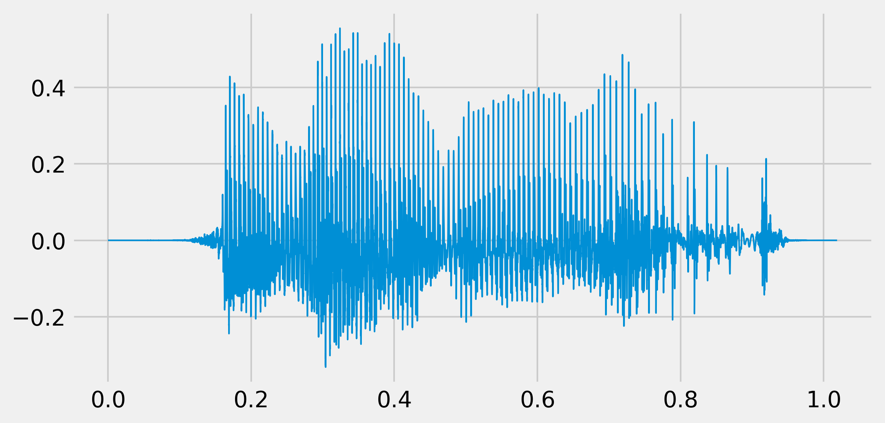
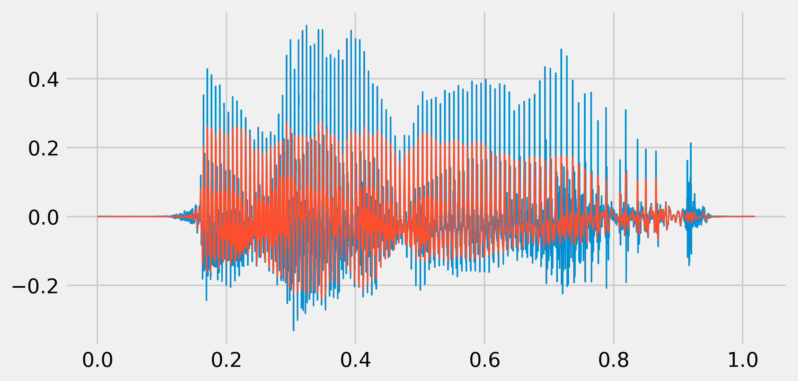

<a href="https://github.com/ipython-books/cookbook-2nd"></a> *This is one of the 100+ free recipes of the [IPython Cookbook, Second Edition](https://github.com/ipython-books/cookbook-2nd), by [Cyrille Rossant](http://cyrille.rossant.net), a guide to numerical computing and data science in the Jupyter Notebook. The ebook and printed book are available for purchase at [Packt Publishing](https://www.packtpub.com/big-data-and-business-intelligence/ipython-interactive-computing-and-visualization-cookbook-second-e).*

▶ *[Text on GitHub](https://github.com/ipython-books/cookbook-2nd) with a [CC-BY-NC-ND license](https://creativecommons.org/licenses/by-nc-nd/3.0/us/legalcode)*  
▶ *[Code on GitHub](https://github.com/ipython-books/cookbook-2nd-code) with a [MIT license](https://opensource.org/licenses/MIT)*

[*Chapter 11 : Image and Audio Processing*](./)

# 11.6. Applying digital filters to speech sounds

In this recipe, we will show how to play sounds in the Notebook. We will also illustrate the effect of simple digital filters on speech sounds.

## Getting ready

You need the pydub package. You can install it with `pip install pydub` or download it from https://github.com/jiaaro/pydub/.

This package requires the open source multimedia library FFmpeg for the decompression of MP3 files, available at http://www.ffmpeg.org.

## How to do it

1. Let's import the packages:

```python
from io import BytesIO
import tempfile
import requests
import numpy as np
import scipy.signal as sg
import pydub
import matplotlib.pyplot as plt
from IPython.display import Audio, display
%matplotlib inline
```

2. We create a Python function that loads a MP3 sound and returns a NumPy array with the raw sound data:

```python
def speak(data):
    # We convert the mp3 bytes to wav.
    audio = pydub.AudioSegment.from_mp3(BytesIO(data))
    with tempfile.TemporaryFile() as fn:
        wavef = audio.export(fn, format='wav')
        wavef.seek(0)
        wave = wavef.read()
    # We get the raw data by removing the 24 first
    # bytes of the header.
    x = np.frombuffer(wave, np.int16)[24:] / 2.**15
    return x, audio.frame_rate
```

3. We create a function that plays a sound (represented by a NumPy vector) in the Notebook, using IPython's `Audio` class:

```python
def play(x, fr, autoplay=False):
    display(Audio(x, rate=fr, autoplay=autoplay))
```

4. Let's play a sound that had been obtained from http://www.fromtexttospeech.com:

```python
url = ('https://github.com/ipython-books/'
       'cookbook-2nd-data/blob/master/'
       'voice.mp3?raw=true')
voice = requests.get(url).content
```

```python
x, fr = speak(voice)
play(x, fr)
fig, ax = plt.subplots(1, 1, figsize=(8, 4))
t = np.linspace(0., len(x) / fr, len(x))
ax.plot(t, x, lw=1)
```



5. Now, we will hear the effect of a Butterworth low-pass filter applied to this sound (500 Hz cutoff frequency):

```python
b, a = sg.butter(4, 500. / (fr / 2.), 'low')
x_fil = sg.filtfilt(b, a, x)
```

```python
play(x_fil, fr)
fig, ax = plt.subplots(1, 1, figsize=(8, 4))
ax.plot(t, x, lw=1)
ax.plot(t, x_fil, lw=1)
```



We hear a muffled voice.

6. Now, with a high-pass filter (1000 Hz cutoff frequency):

```python
b, a = sg.butter(4, 1000. / (fr / 2.), 'high')
x_fil = sg.filtfilt(b, a, x)
```

```python
play(x_fil, fr)
fig, ax = plt.subplots(1, 1, figsize=(6, 3))
ax.plot(t, x, lw=1)
ax.plot(t, x_fil, lw=1)
```


It sounds like a phone call.

7. Finally, we can create a simple widget to quickly test the effect of a high-pass filter with an arbitrary cutoff frequency: We get a slider that lets us change the cutoff frequency and hear the effect in real-time.

```python
from ipywidgets import widgets

@widgets.interact(t=(100., 5000., 100.))
def highpass(t):
    b, a = sg.butter(4, t / (fr / 2.), 'high')
    x_fil = sg.filtfilt(b, a, x)
    play(x_fil, fr, autoplay=True)
```


## How it works...

The human ear can hear frequencies up to 20 kHz. The human voice frequency band ranges from approximately 300 Hz to 3000 Hz.

Digital filters were described in *Chapter 10, Signal Processing*. The example given here allows us to hear the effect of low- and high-pass filters on sounds.

## There's more...

Here are a few references:

* Audio signal processing on Wikipedia, available at https://en.wikipedia.org/wiki/Audio_signal_processing
* Audio filters on Wikipedia, available at https://en.wikipedia.org/wiki/Audio_filter
* Voice frequency on Wikipedia, available at https://en.wikipedia.org/wiki/Voice_frequency
* PyAudio, an audio Python package that uses the PortAudio library, available at http://people.csail.mit.edu/hubert/pyaudio/

## See also

* Creating a sound synthesizer in the Notebook
