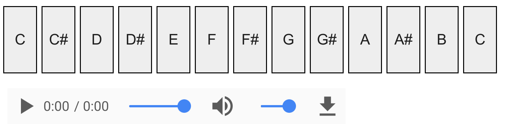

<a href="https://github.com/ipython-books/cookbook-2nd"></a> *This is one of the 100+ free recipes of the [IPython Cookbook, Second Edition](https://github.com/ipython-books/cookbook-2nd), by [Cyrille Rossant](http://cyrille.rossant.net), a guide to numerical computing and data science in the Jupyter Notebook. The ebook and printed book are available for purchase at [Packt Publishing](https://www.packtpub.com/big-data-and-business-intelligence/ipython-interactive-computing-and-visualization-cookbook-second-e).*

▶ *[Text on GitHub](https://github.com/ipython-books/cookbook-2nd) with a [CC-BY-NC-ND license](https://creativecommons.org/licenses/by-nc-nd/3.0/us/legalcode)*  
▶ *[Code on GitHub](https://github.com/ipython-books/cookbook-2nd-code) with a [MIT license](https://opensource.org/licenses/MIT)*

[*Chapter 11 : Image and Audio Processing*](./)

# 11.7. Creating a sound synthesizer in the Notebook

In this recipe, we will create a small electronic piano in the Notebook. We will synthesize sinusoidal sounds with NumPy instead of using recorded tones.

## How to do it...

1. We import the modules:

```python
import numpy as np
import matplotlib.pyplot as plt
from IPython.display import (
    Audio, display, clear_output)
from ipywidgets import widgets
from functools import partial
%matplotlib inline
```

2. We define the sampling rate and the duration of the notes:

```python
rate = 16000.
duration = .25
t = np.linspace(
    0., duration, int(rate * duration))
```

3. We create a function that generates and plays the sound of a note (sine function) at a given frequency, using NumPy and IPython's Audio class:

```python
def synth(f):
    x = np.sin(f * 2. * np.pi * t)
    display(Audio(x, rate=rate, autoplay=True))
```

4. Here is the fundamental 440 Hz note:

```python
synth(440)
```


5. Now, we generate the note frequencies of our piano. The chromatic scale is obtained by a geometric progression with the common ratio $2^{1/12}$:

```python
notes = 'C,C#,D,D#,E,F,F#,G,G#,A,A#,B,C'.split(',')
freqs = 440. * 2**(np.arange(3, 3 + len(notes)) / 12.)
notes = list(zip(notes, freqs))
```

6. Finally, we create the piano with the Notebook widgets. Each note is a button, and all buttons are contained in a horizontal box container. Clicking on one note plays a sound at the corresponding frequency.

```python
layout = widgets.Layout(
    width='30px', height='60px',
    border='1px solid black')

buttons = []
for note, f in notes:
    button = widgets.Button(
        description=note, layout=layout)

    def on_button_clicked(f, b):
        # When a button is clicked, we play the sound
        # in a dedicated Output widget.
        with widgets.Output():
            synth(f)

    button.on_click(partial(on_button_clicked, f))
    buttons.append(button)

# We place all buttons horizontally.
widgets.Box(children=buttons)
```



## How it works...

A **pure tone** is a tone with a sinusoidal waveform. It is the simplest way of representing a musical note. A note generated by a musical instrument is typically much more complex. Although the sound contains many frequencies, we generally perceive a musical tone (**fundamental frequency**).

By generating another periodic function instead of a sinusoidal waveform, we would hear the same tone, but a different **timbre**. Electronic music synthesizers are based on this idea.

## There's more...

Here are a few references:

* Synthesizer on Wikipedia, available at https://en.wikipedia.org/wiki/Synthesizer
* Equal temperament on Wikipedia, available at https://en.wikipedia.org/wiki/Equal_temperament
* Chromatic scale on Wikipedia, available at https://en.wikipedia.org/wiki/Chromatic_scale

## See also

* Applying digital filters to speech sounds
