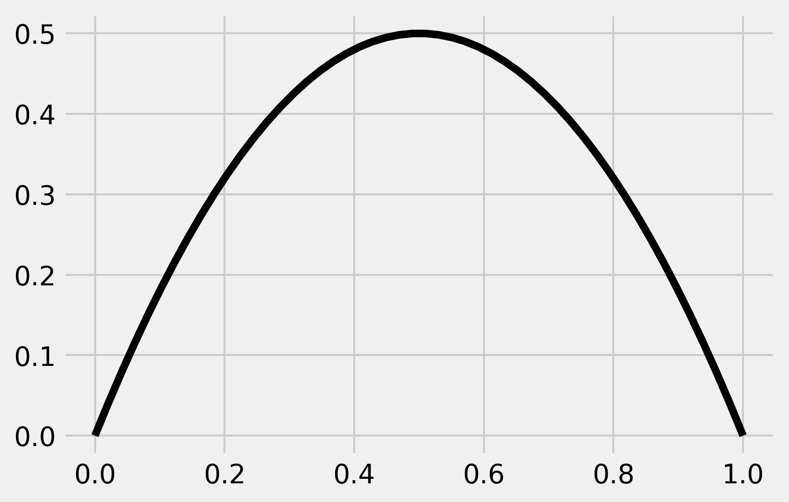
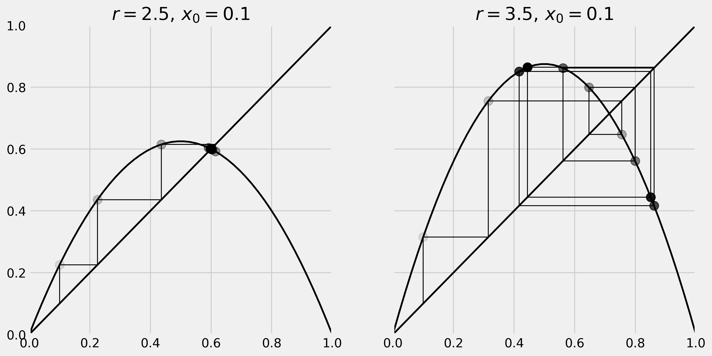
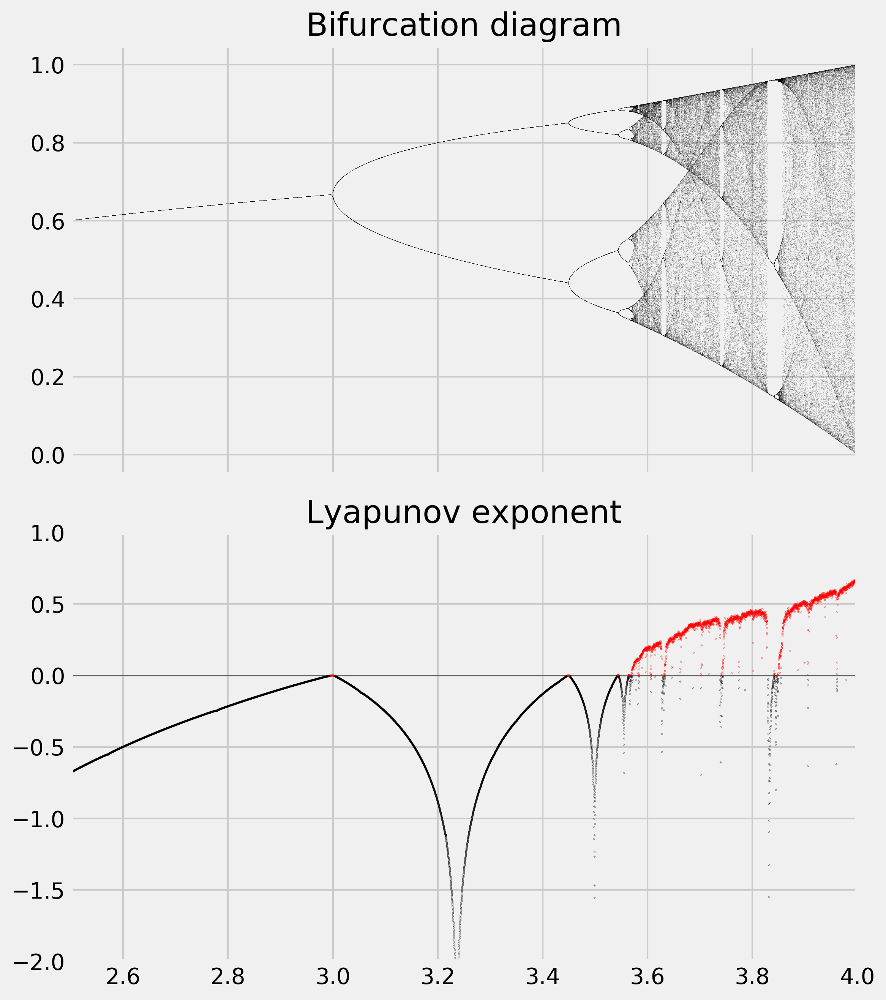

<a href="https://github.com/ipython-books/cookbook-2nd"></a> *This is one of the 100+ free recipes of the [IPython Cookbook, Second Edition](https://github.com/ipython-books/cookbook-2nd), by [Cyrille Rossant](http://cyrille.rossant.net), a guide to numerical computing and data science in the Jupyter Notebook. The ebook and printed book are available for purchase at [Packt Publishing](https://www.packtpub.com/big-data-and-business-intelligence/ipython-interactive-computing-and-visualization-cookbook-second-e).*

▶ *[Text on GitHub](https://github.com/ipython-books/cookbook-2nd) with a [CC-BY-NC-ND license](https://creativecommons.org/licenses/by-nc-nd/3.0/us/legalcode)*  
▶ *[Code on GitHub](https://github.com/ipython-books/cookbook-2nd-code) with a [MIT license](https://opensource.org/licenses/MIT)*

[*Chapter 12 : Deterministic Dynamical Systems*](./)

# 12.1. Plotting the bifurcation diagram of a chaotic dynamical system

A **chaotic dynamical system** is highly sensitive to initial conditions; small perturbations at any given time yield completely different trajectories. The trajectories of a chaotic system tend to have complex and unpredictable behaviors.

Many real-world phenomena are chaotic, particularly those that involve nonlinear interactions among many agents (complex systems). Examples can be found in meteorology, economics, biology, and other disciplines.

In this recipe, we will simulate a famous chaotic system: the **logistic map**. This is an archetypal example of how chaos can arise from a very simple nonlinear equation. The logistic map models the evolution of a population, taking into account both reproduction and density-dependent mortality (starvation).

We will draw the system's **bifurcation diagram**, which shows the possible long-term behaviors (equilibria, fixed points, periodic orbits, and chaotic trajectories) as a function of the system's parameter. We will also compute an approximation of the system's **Lyapunov exponent**, characterizing the model's sensitivity to initial conditions.

## How to do it...

1. Let's import NumPy and matplotlib:

```python
import numpy as np
import matplotlib.pyplot as plt
%matplotlib inline
```

2. We define the logistic function by:

$$f_r(x) = rx(1-x)$$

Here is the implementation of this function in Python:

```python
def logistic(r, x):
    return r * x * (1 - x)
```

3. Here is a graphic representation of this function

```python
x = np.linspace(0, 1)
fig, ax = plt.subplots(1, 1)
ax.plot(x, logistic(2, x), 'k')
```



4. Our discrete dynamical system is defined by the recursive application of the logistic function:

$$x_{n+1}^{(r)} = f_r(x_n^{(r)}) = rx_n^{(r)}(1-x_n^{(r)})$$

Let's simulate a few iterations of this system with two different values of $r$:

```python
def plot_system(r, x0, n, ax=None):
    # Plot the function and the
    # y=x diagonal line.
    t = np.linspace(0, 1)
    ax.plot(t, logistic(r, t), 'k', lw=2)
    ax.plot([0, 1], [0, 1], 'k', lw=2)

    # Recursively apply y=f(x) and plot two lines:
    # (x, x) -> (x, y)
    # (x, y) -> (y, y)
    x = x0
    for i in range(n):
        y = logistic(r, x)
        # Plot the two lines.
        ax.plot([x, x], [x, y], 'k', lw=1)
        ax.plot([x, y], [y, y], 'k', lw=1)
        # Plot the positions with increasing
        # opacity.
        ax.plot([x], [y], 'ok', ms=10,
                alpha=(i + 1) / n)
        x = y

    ax.set_xlim(0, 1)
    ax.set_ylim(0, 1)
    ax.set_title(f"$r={r:.1f}, \, x_0={x0:.1f}$")


fig, (ax1, ax2) = plt.subplots(1, 2, figsize=(12, 6),
                               sharey=True)
plot_system(2.5, .1, 10, ax=ax1)
plot_system(3.5, .1, 10, ax=ax2)
```



On the left panel, we can see that our system converges to the intersection point of the curve and the diagonal line (fixed point). On the right panel however, using a different value for $r$, we observe a seemingly chaotic behavior of the system.

5. Now, we simulate this system for 10000 values of $r$ linearly spaced between 2.5 and 4, and vectorize the simulation with NumPy by considering a vector of independent systems (one dynamical system per parameter value):

```python
n = 10000
r = np.linspace(2.5, 4.0, n)
```

6. We use 1000 iterations of the logistic map and keep the last 100 iterations to display the bifurcation diagram:

```python
iterations = 1000
last = 100
```

7. We initialize our system with the same initial condition $x_0 = 0.00001$:

```python
x = 1e-5 * np.ones(n)
```

8. We also compute an approximation of the Lyapunov exponent for every value of $r$. The Lyapunov exponent is defined by:

$$\lambda(r) = \lim_{n \to \infty} \frac{1}{n} \sum_{i=0}^{n-1} \log\left| \frac{df_r}{dx}\left(x_i^{(r)}\right) \right|$$

We first initialize the `lyapunov` vector:

```python
lyapunov = np.zeros(n)
```

9. Now, we simulate the system and plot the bifurcation diagram. The simulation only involves the iterative evaluation of the `logistic()` function on our vector `x`. Then, to display the bifurcation diagram, we draw one pixel per point $x_n^{(r)}$ during the last 100 iterations:

```python
fig, (ax1, ax2) = plt.subplots(2, 1, figsize=(8, 9),
                               sharex=True)
for i in range(iterations):
    x = logistic(r, x)
    # We compute the partial sum of the
    # Lyapunov exponent.
    lyapunov += np.log(abs(r - 2 * r * x))
    # We display the bifurcation diagram.
    if i >= (iterations - last):
        ax1.plot(r, x, ',k', alpha=.25)
ax1.set_xlim(2.5, 4)
ax1.set_title("Bifurcation diagram")

# We display the Lyapunov exponent.
# Horizontal line.
ax2.axhline(0, color='k', lw=.5, alpha=.5)
# Negative Lyapunov exponent.
ax2.plot(r[lyapunov < 0],
         lyapunov[lyapunov < 0] / iterations,
         '.k', alpha=.5, ms=.5)
# Positive Lyapunov exponent.
ax2.plot(r[lyapunov >= 0],
         lyapunov[lyapunov >= 0] / iterations,
         '.r', alpha=.5, ms=.5)
ax2.set_xlim(2.5, 4)
ax2.set_ylim(-2, 1)
ax2.set_title("Lyapunov exponent")
plt.tight_layout()
```



The bifurcation diagram brings out the existence of a fixed point for $r<3$, then two and four equilibria, and a chaotic behavior when $r$ belongs to certain areas of the parameter space.

We observe an important property of the Lyapunov exponent: it is positive when the system is chaotic (in red here).

## There's more...

Here are some references:

* Chaos theory on Wikipedia, available at https://en.wikipedia.org/wiki/Chaos_theory
* Complex systems on Wikipedia, available at https://en.wikipedia.org/wiki/Complex_system
* The logistic map on Wikipedia, available at https://en.wikipedia.org/wiki/Logistic_map
* Iterated functions (discrete dynamical systems) on Wikipedia, available at https://en.wikipedia.org/wiki/Iterated_function
* Bifurcation diagrams on Wikipedia, available at https://en.wikipedia.org/wiki/Bifurcation_diagram
* Lyapunov exponent on Wikipedia, available at https://en.wikipedia.org/wiki/Lyapunov_exponent

## See also

* Simulating an ordinary differential equation with SciPy
