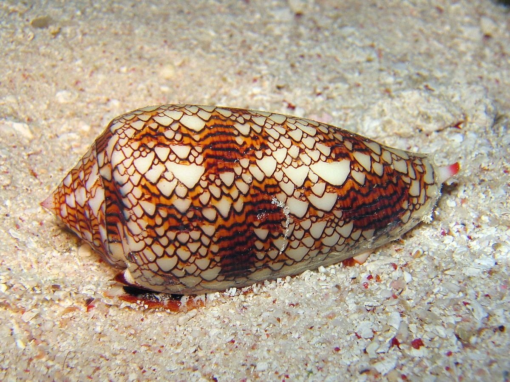
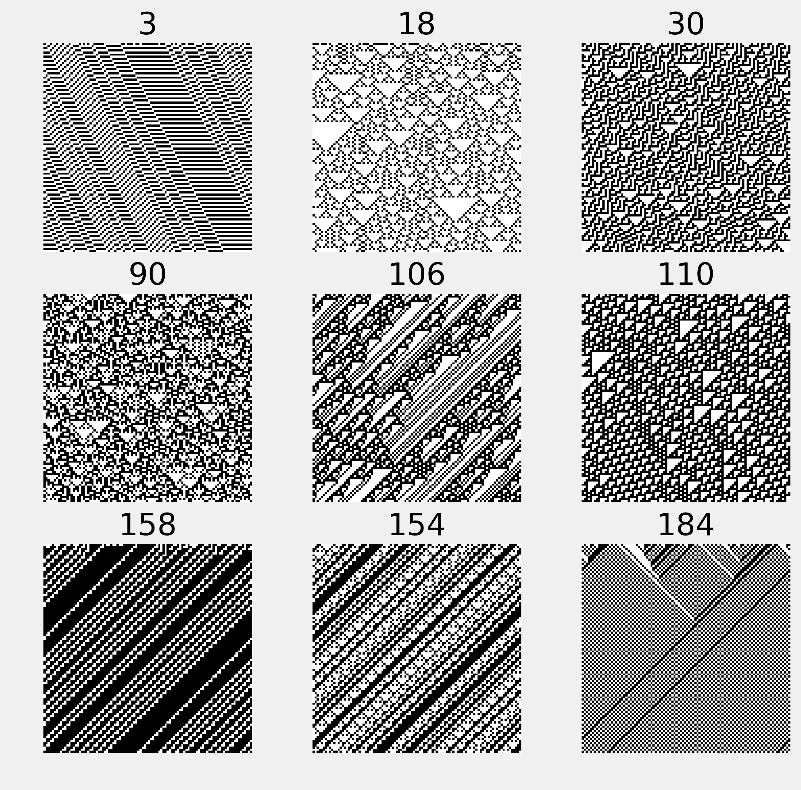

<a href="https://github.com/ipython-books/cookbook-2nd"></a> *This is one of the 100+ free recipes of the [IPython Cookbook, Second Edition](https://github.com/ipython-books/cookbook-2nd), by [Cyrille Rossant](http://cyrille.rossant.net), a guide to numerical computing and data science in the Jupyter Notebook. The ebook and printed book are available for purchase at [Packt Publishing](https://www.packtpub.com/big-data-and-business-intelligence/ipython-interactive-computing-and-visualization-cookbook-second-e).*

▶ *[Text on GitHub](https://github.com/ipython-books/cookbook-2nd) with a [CC-BY-NC-ND license](https://creativecommons.org/licenses/by-nc-nd/3.0/us/legalcode)*  
▶ *[Code on GitHub](https://github.com/ipython-books/cookbook-2nd-code) with a [MIT license](https://opensource.org/licenses/MIT)*

[*Chapter 12 : Deterministic Dynamical Systems*](./)

# 12.2. Simulating an elementary cellular automaton

Cellular automata are discrete dynamical systems evolving on a grid of cells. These cells can be in a finite number of states (for example, on/off). The evolution of a cellular automaton is governed by a set of rules, describing how the state of a cell changes according to the state of its neighbors.

Although extremely simple, these models can initiate highly complex and chaotic behaviors. Cellular automata can model real-world phenomena such as car traffic, chemical reactions, propagation of fire in a forest, epidemic propagations, and much more. Cellular automata are also found in nature. For example, the patterns of some seashells are generated by natural cellular automata.



An **elementary cellular automaton** is a binary, one-dimensional automaton, where the rules concern the immediate left and right neighbors of every cell.

In this recipe, we will simulate elementary cellular automata with NumPy using their Wolfram code.

## How to do it...

1. We import NumPy and matplotlib:

```python
import numpy as np
import matplotlib.pyplot as plt
%matplotlib inline
```

2. We will use the following vector to obtain numbers written in binary representation:

```python
u = np.array([[4], [2], [1]])
```

3. Let's write a function that performs an iteration on the grid, updating all cells at once according to the given rule in binary representation (we will give all explanations in the *How it works...* section). The first step consists of stacking circularly-shifted versions of the grid to get the LCR (left, center, right) triplets of each cell (`y`). Then, we convert these triplets into 3-bit numbers (`z`). Finally, we compute the next state of every cell using the specified rule:

```python
def step(x, rule_b):
    """Compute a single stet of an elementary cellular
    automaton."""
    # The columns contains the L, C, R values
    # of all cells.
    y = np.vstack((np.roll(x, 1), x,
                   np.roll(x, -1))).astype(np.int8)
    # We get the LCR pattern numbers between 0 and 7.
    z = np.sum(y * u, axis=0).astype(np.int8)
    # We get the patterns given by the rule.
    return rule_b[7 - z]
```

4. We now write a function that simulates any elementary cellular automaton. First, we compute the binary representation of the rule (**Wolfram Code**). Then, we initialize the first row of the grid with random values. Finally, we apply the function `step()` iteratively on the grid:

```python
def generate(rule, size=100, steps=100):
    """Simulate an elementary cellular automaton given
    its rule (number between 0 and 255)."""
    # Compute the binary representation of the rule.
    rule_b = np.array(
        [int(_) for _ in np.binary_repr(rule, 8)],
        dtype=np.int8)
    x = np.zeros((steps, size), dtype=np.int8)
    # Random initial state.
    x[0, :] = np.random.rand(size) < .5
    # Apply the step function iteratively.
    for i in range(steps - 1):
        x[i + 1, :] = step(x[i, :], rule_b)
    return x
```

5. Now, we simulate and display nine different automata:

```python
fig, axes = plt.subplots(3, 3, figsize=(8, 8))
rules = [3, 18, 30,
         90, 106, 110,
         158, 154, 184]
for ax, rule in zip(axes.flat, rules):
    x = generate(rule)
    ax.imshow(x, interpolation='none',
              cmap=plt.cm.binary)
    ax.set_axis_off()
    ax.set_title(str(rule))
```



## How it works...

Let's consider an elementary cellular automaton in one dimension. Every cell $C$ has two neighbors ($L$ and $R$), and it can be either off (0) or on (1). Therefore, the future state of a cell depends on the current state of $L$, $C$, and $R$. This triplet can be encoded as a number between 0 and 7 (three digits in binary representation).

A particular elementary cellular automaton is entirely determined by the outcome of each of these eight configurations. Therefore, there are 256 different elementary cellular automata ($2^8$). Each of these automata is identified by a number between 0 and 255.

We consider all eight LCR states in order: 111, 110, 101, ..., 001, 000. Each of the eight digits in the binary representation of the automaton's number corresponds to a LCR state (using the same order). For example, in the **Rule 110 automaton** (`01101110` in binary representation), the state 111 yields a new state of 0 for the center cell, 110 yields 1, 101 yields 1, and so on. It has been shown that this particular automaton is **Turing complete** (or **universal**); it can theoretically simulate any computer program.

## There's more...

Other types of cellular automata include **Conway's Game of Life**, in two dimensions. This famous system yields various dynamic patterns. It is also Turing complete.

Here are a few references:

* Cellular automata on Wikipedia, available at https://en.wikipedia.org/wiki/Cellular_automaton
* Elementary cellular automata on Wikipedia, available at https://en.wikipedia.org/wiki/Elementary_cellular_automaton
* Rule 110, described at https://en.wikipedia.org/wiki/Rule_110
* The Wolfram code, explained at https://en.wikipedia.org/wiki/Wolfram_code, assigns a 1D elementary cellular automaton to any number between 0 and 255
* Conway's Game of Life on Wikipedia, available at https://en.wikipedia.org/wiki/Conway's_Game_of_Life
* A computer implemented in Conway's Game of Life, at https://codegolf.stackexchange.com/questions/11880/build-a-working-game-of-tetris-in-conways-game-of-life
