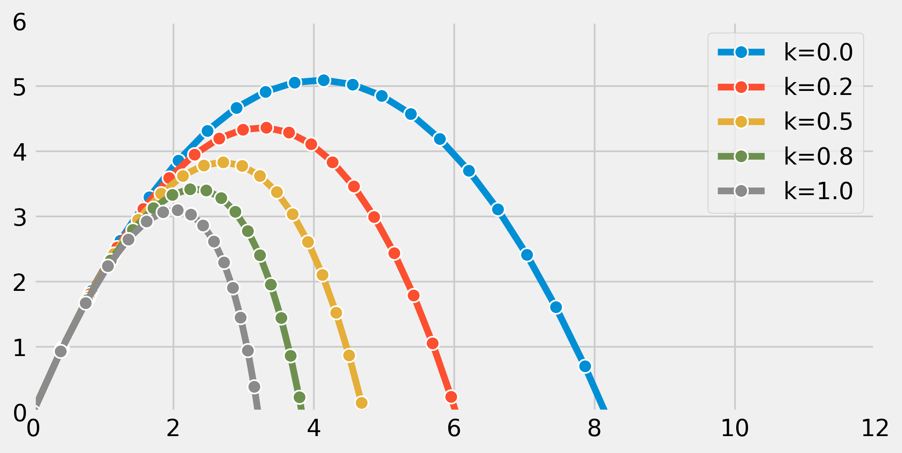

<a href="https://github.com/ipython-books/cookbook-2nd"></a> *This is one of the 100+ free recipes of the [IPython Cookbook, Second Edition](https://github.com/ipython-books/cookbook-2nd), by [Cyrille Rossant](http://cyrille.rossant.net), a guide to numerical computing and data science in the Jupyter Notebook. The ebook and printed book are available for purchase at [Packt Publishing](https://www.packtpub.com/big-data-and-business-intelligence/ipython-interactive-computing-and-visualization-cookbook-second-e).*

▶ *[Text on GitHub](https://github.com/ipython-books/cookbook-2nd) with a [CC-BY-NC-ND license](https://creativecommons.org/licenses/by-nc-nd/3.0/us/legalcode)*  
▶ *[Code on GitHub](https://github.com/ipython-books/cookbook-2nd-code) with a [MIT license](https://opensource.org/licenses/MIT)*

[*Chapter 12 : Deterministic Dynamical Systems*](./)

# 12.3. Simulating an ordinary differential equation with SciPy

**Ordinary Differential Equations (ODEs)** describe the evolution of a system subject to internal and external dynamics. Specifically, an ODE links a quantity depending on a single independent variable (time, for example) to its derivatives. In addition, the system can be under the influence of external factors. A first-order ODE can typically be written as:

$$y'(t)=f(t,y(t))$$

More generally, an $n$-th order ODE involves successive derivatives of $y$ until the order $n$. The ODE is said to be linear or nonlinear depending on whether $f$ is linear in $y$ or not.

ODEs naturally appear when the rate of change of a quantity depends on its value. Therefore, ODEs are found in many scientific disciplines such as mechanics (evolution of a body subject to dynamic forces), chemistry (concentration of reacting products), biology (spread of an epidemic), ecology (growth of a population), economics, and finance, among others.

Whereas simple ODEs can be solved analytically, many ODEs require a numerical treatment. In this recipe, we will simulate a simple linear second-order autonomous ODE, describing the evolution of a particle in the air subject to gravity and viscous resistance. Although this equation could be solved analytically, here we will use SciPy to simulate it numerically.

## How to do it...

1. Let's import NumPy, SciPy (the `integrate` package), and matplotlib:

```python
import numpy as np
import scipy.integrate as spi
import matplotlib.pyplot as plt
%matplotlib inline
```

2. We define a few parameters appearing in our model:

```python
m = 1.  # particle's mass
k = 1.  # drag coefficient
g = 9.81  # gravity acceleration
```

3. We have two variables: $x$ and $y$ (two dimensions). We note $u=(x,y)$. The ODE that we are going to simulate is:

$$u'' = -\frac{k}{m} u' + g$$

Here, $g$ is the gravity acceleration vector.

In order to simulate this second-order ODE with SciPy, we can convert it to a first-order ODE (another option would be to solve $u'$ first before integrating the solution). To do this, we consider two 2D variables: $u$ and $u'$. We note $v = (u, u')$. We can express $v'$ as a function of $v$. Now, we create the initial vector $v_0$ at time $t=0$: it has four components.

```python
# The initial position is (0, 0).
v0 = np.zeros(4)
# The initial speed vector is oriented
# to the top right.
v0[2] = 4.
v0[3] = 10.
```

4. Let's create a Python function $f$ that takes the current vector $v(t_0)$ and a time $t_0$ as arguments (with optional parameters) and that returns the derivative $v'(t_0)$:

```python
def f(v, t0, k):
    # v has four components: v=[u, u'].
    u, udot = v[:2], v[2:]
    # We compute the second derivative u'' of u.
    udotdot = -k / m * udot
    udotdot[1] -= g
    # We return v'=[u', u''].
    return np.r_[udot, udotdot]
```

5. Now, we simulate the system for different values of $k$. We use the SciPy `odeint()` function, defined in the `scipy.integrate` package.

> Starting with SciPy 1.0, the generic `scipy.integrate.solve_ivp()` function can be used instead of the old function `odeint()`:

```python
fig, ax = plt.subplots(1, 1, figsize=(8, 4))

# We want to evaluate the system on 30 linearly
# spaced times between t=0 and t=3.
t = np.linspace(0., 3., 30)

# We simulate the system for different values of k.
for k in np.linspace(0., 1., 5):
    # We simulate the system and evaluate $v$ on the
    # given times.
    v = spi.odeint(f, v0, t, args=(k,))
    # We plot the particle's trajectory.
    ax.plot(v[:, 0], v[:, 1], 'o-', mew=1, ms=8,
            mec='w', label=f'k={k:.1f}')
ax.legend()
ax.set_xlim(0, 12)
ax.set_ylim(0, 6)
```



In the preceding figure, the most outward trajectory (blue) corresponds to drag-free motion (without air resistance). It is a parabola. In the other trajectories, we can observe the increasing effect of air resistance, parameterized with $k$.

## How it works...

Let's explain how we obtained the differential equation from our model. Let $u = (x,y)$ encode the 2D position of our particle with mass $m$. This particle is subject to two forces: gravity $mg = (0, -9.81 \cdot m)$ and air drag $F = -ku'$. This last term depends on the particle's speed and is only valid at low speed. With higher speeds, we need to use more complex nonlinear expressions.

Now, we use **Newton's second law of motion** in classical mechanics. This law states that, in an inertial reference frame, the mass multiplied by the acceleration of the particle is equal to the sum of all forces applied to that particle. Here, we obtain:

$$m \cdot u'' = F + mg$$

We immediately obtain our second-order ODE:

$$u'' = -\frac{k}{m} u' + g$$

We transform it into a single-order system of ODEs, with $v=(u, u')$:

$$v' = (u', u'') = (u',  -\frac{k}{m} u' + g)$$

The last term can be expressed as a function of $v$ only.

The SciPy `odeint()` function is a black-box solver; we simply specify the function that describes the system, and SciPy solves it automatically. This function leverages the FORTRAN library ODEPACK, which contains well-tested code that has been used for decades by many scientists and engineers.

The newer `solve_ivb()` function offers a common API for Python implementations of various ODE solvers.

An example of a simple numerical solver is the **Euler method**. To numerically solve the autonomous ODE $y'=f(y)$, the method consists of discretizing time with a time step $dt$ and replacing $y'$ with a first-order approximation:

$$y'(t) \simeq \frac{y(t+dt)-y(t)}{dt}$$

Then, starting from an initial condition $y_0 = y(t_0)$, the method evaluates $y$ successively with the following recurrence relation:

$$y_{n+1} = y_n + dt \cdot f(y_n) \qquad \textrm{with} \quad t = n \cdot dt, \quad y_n = y(n \cdot dt)$$

## There's more...

Here are a few references:

* The documentation of the integrate package in SciPy available at http://docs.scipy.org/doc/scipy/reference/integrate.html
* The new `solve_ivp()` function, available in SciPy 1.0 and later, at https://docs.scipy.org/doc/scipy/reference/generated/scipy.integrate.solve_ivp.html
* ODEs on Wikipedia, available at https://en.wikipedia.org/wiki/Ordinary_differential_equation
* ODEs lectures on Awesome Math, at https://github.com/rossant/awesome-math/#ordinary-differential-equations
* Newton's laws of motion on Wikipedia, available at https://en.wikipedia.org/wiki/Newton's_laws_of_motion
* Air resistance on Wikipedia, available at https://en.wikipedia.org/wiki/Drag_%28physics%29
* Some numerical methods for ODEs described at https://en.wikipedia.org/wiki/Numerical_methods_for_ordinary_differential_equations
* The Euler method on Wikipedia, available at https://en.wikipedia.org/wiki/Euler_method
* Documentation of the ODEPACK package in FORTRAN available at http://www.netlib.org/odepack/opks-sum

## See also

* Plotting the bifurcation diagram of a chaotic dynamical system
