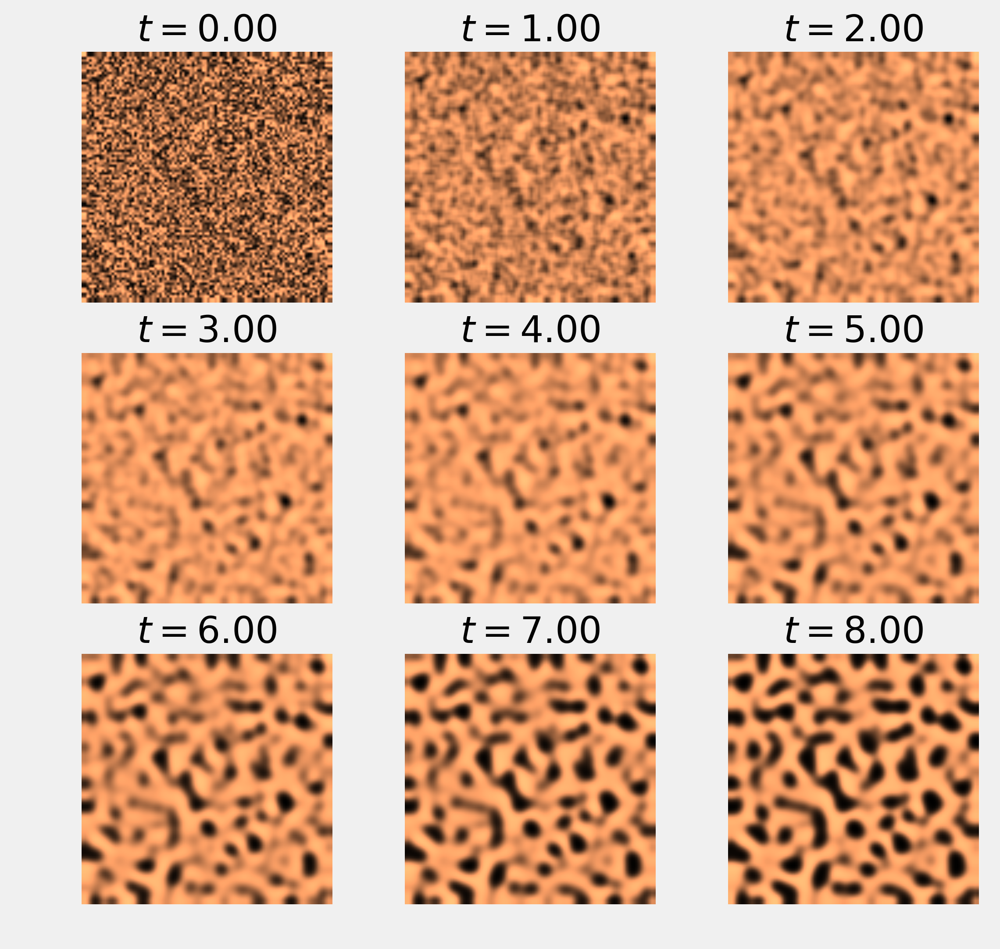
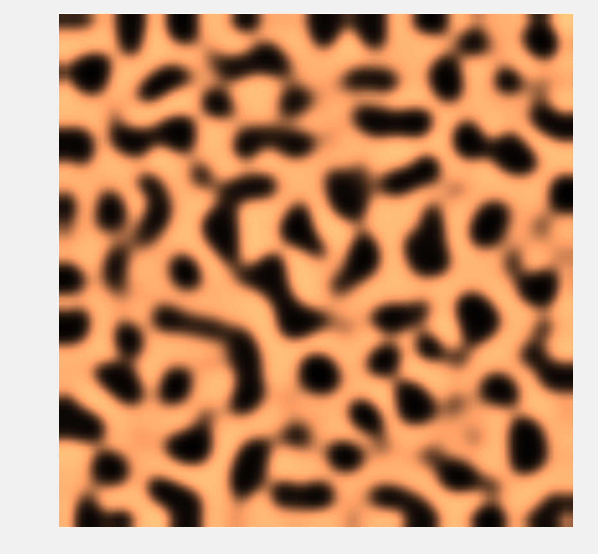

<a href="https://github.com/ipython-books/cookbook-2nd"></a> *This is one of the 100+ free recipes of the [IPython Cookbook, Second Edition](https://github.com/ipython-books/cookbook-2nd), by [Cyrille Rossant](http://cyrille.rossant.net), a guide to numerical computing and data science in the Jupyter Notebook. The ebook and printed book are available for purchase at [Packt Publishing](https://www.packtpub.com/big-data-and-business-intelligence/ipython-interactive-computing-and-visualization-cookbook-second-e).*

▶ *[Text on GitHub](https://github.com/ipython-books/cookbook-2nd) with a [CC-BY-NC-ND license](https://creativecommons.org/licenses/by-nc-nd/3.0/us/legalcode)*  
▶ *[Code on GitHub](https://github.com/ipython-books/cookbook-2nd-code) with a [MIT license](https://opensource.org/licenses/MIT)*

[*Chapter 12 : Deterministic Dynamical Systems*](./)

# 12.4. Simulating a partial differential equation — reaction-diffusion systems and Turing patterns

**Partial Differential Equations (PDEs)** describe the evolution of dynamical systems involving both time and space. Examples in physics include sound, heat, electromagnetism, fluid flow, and elasticity, among others. Examples in biology include tumor growth, population dynamics, and epidemic propagations.

PDEs are hard to solve analytically. Therefore, PDEs are often studied via numerical simulations.

In this recipe, we will illustrate how to simulate a **reaction-diffusion system** described by a PDE called the **FitzHugh–Nagumo equation**. A reaction-diffusion system models the evolution of one or several variables subject to two processes: reaction (transformation of the variables into each other) and diffusion (spreading across a spatial region). Some chemical reactions can be described by this type of model, but there are other applications in physics, biology, ecology, and other disciplines.

Here, we simulate a system that has been proposed by Alan Turing as a model of animal coat pattern formation. Two chemical substances influencing skin pigmentation interact according to a reaction-diffusion model. This system is responsible for the formation of patterns that are reminiscent of the pelage of zebras, jaguars, and giraffes.

We will simulate this system with the finite difference method. This method consists of discretizing time and space and replacing the derivatives with their discrete equivalents.

## How to do it...

1. Let's import the packages:

```python
import numpy as np
import matplotlib.pyplot as plt
%matplotlib inline
```

2. We will simulate the following system of partial differential equations on the domain $E=[-1,1]^2$:

$$\begin{align*}
\frac{\partial u}{\partial t} &= a \Delta u + u - u^3 - v + k\\
\tau\frac{\partial v}{\partial t} &= b \Delta v + u - v
\end{align*}$$

The variable $u$ represents the concentration of a substance favoring skin pigmentation, whereas $v$ represents another substance that reacts with the first and impedes pigmentation.

At initialization time, we assume that $u$ and $v$ contain independent random numbers on every grid point. We also take Neumann boundary conditions: we require the spatial derivatives of the variables with respect to the normal vectors to be null on the domain's boundaries.

3. Let's define the four parameters of the model:

```python
a = 2.8e-4
b = 5e-3
tau = .1
k = -.005
```

4. We discretize time and space. The time step *dt* must be small enough to ensure the stability of the numerical simulation:

```python
size = 100  # size of the 2D grid
dx = 2. / size  # space step
```

```python
T = 9.0  # total time
dt = .001  # time step
n = int(T / dt)  # number of iterations
```

5. We initialize the variables $u$ and $v$. The matrices $U$ and $V$ contain the values of these variables on the vertices of the 2D grid. These variables are initialized with a uniform noise between 0 and 1:

```python
U = np.random.rand(size, size)
V = np.random.rand(size, size)
```

6. Now, we define a function that computes the discrete Laplace operator of a 2D variable on the grid, using a five-point stencil finite difference method. This operator is defined by:

$$\Delta u(x,y) \simeq \frac{u(x+h,y)+u(x-h,y)+u(x,y+h)+u(x,y-h)-4u(x,y)}{dx^2}$$

We can compute the values of this operator on the grid using vectorized matrix operations. Because of side effects on the edges of the matrix, we need to remove the borders of the grid in the computation:

```python
def laplacian(Z):
    Ztop = Z[0:-2, 1:-1]
    Zleft = Z[1:-1, 0:-2]
    Zbottom = Z[2:, 1:-1]
    Zright = Z[1:-1, 2:]
    Zcenter = Z[1:-1, 1:-1]
    return (Ztop + Zleft + Zbottom + Zright -
            4 * Zcenter) / dx**2
```

7. We define a function that displays the matrix:

```python
def show_patterns(U, ax=None):
    ax.imshow(U, cmap=plt.cm.copper,
              interpolation='bilinear',
              extent=[-1, 1, -1, 1])
    ax.set_axis_off()
```

8. Now, we simulate the system of equations using the finite difference method. At each time step, we compute the right-hand sides of the two equations on the grid using discrete spatial derivatives (Laplacians). Then, we update the variables using a discrete time derivative. We also show the evolution of the system at 9 different steps:

```python
fig, axes = plt.subplots(3, 3, figsize=(8, 8))
step_plot = n // 9
# We simulate the PDE with the finite difference
# method.
for i in range(n):
    # We compute the Laplacian of u and v.
    deltaU = laplacian(U)
    deltaV = laplacian(V)
    # We take the values of u and v inside the grid.
    Uc = U[1:-1, 1:-1]
    Vc = V[1:-1, 1:-1]
    # We update the variables.
    U[1:-1, 1:-1], V[1:-1, 1:-1] = \
        Uc + dt * (a * deltaU + Uc - Uc**3 - Vc + k),\
        Vc + dt * (b * deltaV + Uc - Vc) / tau
    # Neumann conditions: derivatives at the edges
    # are null.
    for Z in (U, V):
        Z[0, :] = Z[1, :]
        Z[-1, :] = Z[-2, :]
        Z[:, 0] = Z[:, 1]
        Z[:, -1] = Z[:, -2]

    # We plot the state of the system at
    # 9 different times.
    if i % step_plot == 0 and i < 9 * step_plot:
        ax = axes.flat[i // step_plot]
        show_patterns(U, ax=ax)
        ax.set_title(f'$t={i * dt:.2f}$')
```



9. Finally, we show the state of the system at the end of the simulation:

```python
fig, ax = plt.subplots(1, 1, figsize=(8, 8))
show_patterns(U, ax=ax)
```



Whereas the variables were completely random at initialization time, we observe the formation of patterns after a sufficiently long simulation time.

## How it works...

Let's explain how the finite difference method allowed us to implement the update step. We start from the following system of equations:

$$\begin{align*}
\frac{\partial u}{\partial t}(t;x,y) &= a \Delta u(t;x,y) + u(t;x,y) - u(t;x,y)^3 - v(t;x,y) + k\\
\tau\frac{\partial v}{\partial t}(t;x,y) &= b \Delta v(t;x,y) + u(t;x,y) - v(t;x,y)\
\end{align*}$$

We first use the following scheme for the discrete Laplace operator:

$$\Delta u(x,y) \simeq \frac{u(x+h,y)+u(x-h,y)+u(x,y+h)+u(x,y-h)-4u(x,y)}{dx^2}$$

We also use this scheme for the time derivative of $u$ and $v$:

$$\frac{\partial u}{\partial t}(t;x,y) \simeq \frac{u(t+dt;x,y)-u(t;x,y)}{dt}$$

We end up with the following iterative update step:

$$\begin{align*}
u(t+dt;x,y) &= u(t;x,y) + dt \left( a \Delta u(t;x,y) + u(t;x,y) - u(t;x,y)^3 - v(t;x,y) + k \right)\\
v(t+dt;x,y) &= v(t;x,y) + \frac{dt}{\tau} \left( b \Delta v(t;x,y) + u(t;x,y) - v(t;x,y) \right)
\end{align*}$$

Here, our Neumann boundary conditions state that the spatial derivatives with respect to the normal vectors are null on the boundaries of the domain $E$:

$$\begin{align*}
\forall w \in \{u, v\}, \, \forall t \geq 0, \, \forall x, y \in \partial E : \\
\frac{\partial w}{\partial x}(t; -1, y) = \frac{\partial w}{\partial x}(t; 1, y) = \frac{\partial w}{\partial y}(t; x, -1) = \frac{\partial w}{\partial y}(t; x, 1) = 0
\end{align*}$$

We implement these boundary conditions by duplicating values in matrices $U$ and $V$ on the edges (see the preceding code).

## There's more...

Here are further references on partial differential equations, reaction-diffusion systems, and numerical simulations of those systems:

* Partial differential equations on Wikipedia, available at https://en.wikipedia.org/wiki/Partial_differential_equation
* Partial differential equations lectures on Awesome Math, at https://github.com/rossant/awesome-math/#partial-differential-equations
* Reaction-diffusion systems on Wikipedia, available at https://en.wikipedia.org/wiki/Reaction%E2%80%93diffusion_system
* FitzHugh-Nagumo system on Wikipedia, available at https://en.wikipedia.org/wiki/FitzHugh%E2%80%93Nagumo_equation
* Neumann boundary conditions on Wikipedia, available at https://en.wikipedia.org/wiki/Neumann_boundary_condition
* A course on Computational Fluid Dynamics by Prof. Lorena Barba, written in the Jupyter Notebook, available at https://github.com/barbagroup/CFDPython
