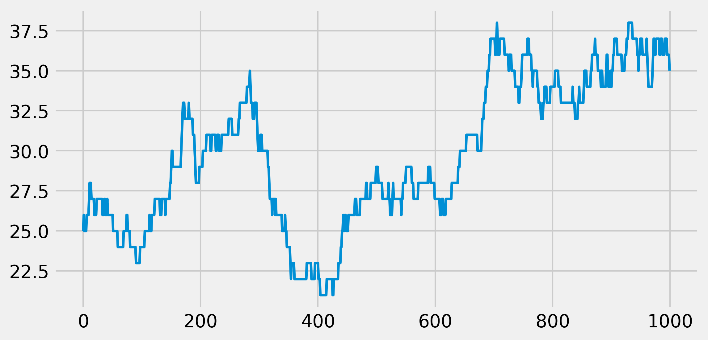
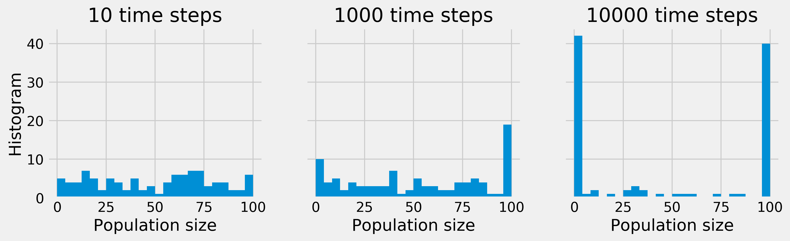

<a href="https://github.com/ipython-books/cookbook-2nd"></a> *This is one of the 100+ free recipes of the [IPython Cookbook, Second Edition](https://github.com/ipython-books/cookbook-2nd), by [Cyrille Rossant](http://cyrille.rossant.net), a guide to numerical computing and data science in the Jupyter Notebook. The ebook and printed book are available for purchase at [Packt Publishing](https://www.packtpub.com/big-data-and-business-intelligence/ipython-interactive-computing-and-visualization-cookbook-second-e).*

▶ *[Text on GitHub](https://github.com/ipython-books/cookbook-2nd) with a [CC-BY-NC-ND license](https://creativecommons.org/licenses/by-nc-nd/3.0/us/legalcode)*  
▶ *[Code on GitHub](https://github.com/ipython-books/cookbook-2nd-code) with a [MIT license](https://opensource.org/licenses/MIT)*

[*Chapter 13 : Stochastic Dynamical Systems*](./)

# 13.1. Simulating a discrete-time Markov chain

Discrete-time Markov chains are stochastic processes that undergo transitions from one state to another in a state space. Transitions occur at every time step. Markov chains are characterized by their lack of memory in that the probability to undergo a transition from the current state to the next depends only on the current state, not the previous ones. These models are widely used in scientific and engineering applications.

Continuous-time Markov processes also exist and we will cover particular instances later in this chapter.

Markov chains are relatively easy to study mathematically and to simulate numerically. In this recipe, we will simulate a simple Markov chain modeling the evolution of a population.

## How to do it...

1. Let's import NumPy and matplotlib:

```python
import numpy as np
import matplotlib.pyplot as plt
%matplotlib inline
```

2. We consider a population that cannot comprise more than $N=100$ individuals, and define the birth and death rates:

```python
N = 100  # maximum population size
a = .5 / N  # birth rate
b = .5 / N  # death rate
```

3. We simulate a Markov chain on the finite space ${0, 1, ..., N}$. Each state represents a population size. The `x` vector will contain the population size at each time step. We set the initial state to $x_0=25$ (that is, there are 25 individuals in the population at initialization time):

```python
nsteps = 1000
x = np.zeros(nsteps)
x[0] = 25
```

4. Now we simulate our chain. At each time step $t$, there is a new birth with probability $ax_t$, and independently, there is a new death with probability $bx_t$. These probabilities are proportional to the size of the population at that time. If the population size reaches 0 or N, the evolution stops:

```python
for t in range(nsteps - 1):
    if 0 < x[t] < N - 1:
        # Is there a birth?
        birth = np.random.rand() <= a * x[t]
        # Is there a death?
        death = np.random.rand() <= b * x[t]
        # We update the population size.
        x[t + 1] = x[t] + 1 * birth - 1 * death
    # The evolution stops if we reach $0$ or $N$.
    else:
        x[t + 1] = x[t]
```

5. Let's look at the evolution of the population size:

```python
fig, ax = plt.subplots(1, 1, figsize=(8, 4))
ax.plot(x, lw=2)
```



We see that, at every time step, the population size can stay stable, increase, or decrease by 1.

6. Now, we will simulate many independent trials of this Markov chain. We could run the previous simulation with a loop, but it would be very slow (two nested `for` loops). Instead, we *vectorize* the simulation by considering all independent trials at once. There is a single loop over time. At every time step, we update all trials simultaneously with vectorized operations on vectors. The `x` vector now contains the population size of all trials, at a particular time. At initialization time, the population sizes are set to random numbers between 0 and N:

```python
ntrials = 100
x = np.random.randint(size=ntrials,
                      low=0, high=N)
```

7. We define a function that performs the simulation. At every time step, we find the trials that undergo births and deaths by generating random vectors, and we update the population sizes with vector operations:

```python
def simulate(x, nsteps):
    """Run the simulation."""
    for _ in range(nsteps - 1):
        # Which trials to update?
        upd = (0 < x) & (x < N - 1)
        # In which trials do births occur?
        birth = 1 * (np.random.rand(ntrials) <= a * x)
        # In which trials do deaths occur?
        death = 1 * (np.random.rand(ntrials) <= b * x)
        # We update the population size for all trials
        x[upd] += birth[upd] - death[upd]
```

8. Now, let's look at the histograms of the population size at different times. These histograms represent the probability distribution of the Markov chain, estimated with independent trials (the Monte Carlo method):

```python
bins = np.linspace(0, N, 25)
```

```python
nsteps_list = [10, 1000, 10000]
fig, axes = plt.subplots(1, len(nsteps_list),
                         figsize=(12, 3),
                         sharey=True)
for i, nsteps in enumerate(nsteps_list):
    ax = axes[i]
    simulate(x, nsteps)
    ax.hist(x, bins=bins)
    ax.set_xlabel("Population size")
    if i == 0:
        ax.set_ylabel("Histogram")
    ax.set_title(f"{nsteps} time steps")
```



Whereas, initially, the population sizes look uniformly distributed between 0 and $N$, they appear to converge to 0 or $N$ after a sufficiently long time. This is because the states 0 and $N$ are **absorbing**; once reached, the chain cannot leave these states. Furthermore, these states can be reached from any other state.

## How it works...

Mathematically, a discrete-time Markov chain on a space $E$ is a sequence of random variables $X_1, X_2, ...$ that satisfy the Markov property:

$$\forall n \geq 1, \quad P(X_{n+1} \mid X_1, X_2, \ldots, X_n) = P(X_{n+1} \mid X_n)$$

A (stationary) Markov chain is characterized by the probability of transitions $P(X_j \mid X_i)$. These values form a matrix called the **transition matrix**. This matrix is the adjacency matrix of a directed graph called the **state diagram**. Every node is a state, and the node $i$ is connected to the node $j$ if the chain has a non-zero probability of transition between these nodes.

## There's more...

Simulating a single Markov chain in Python is not particularly efficient because we need a `for` loop. However, simulating many independent chains following the same process can be made efficient with vectorization and parallelization (all tasks are independent, thus the problem is **embarrassingly parallel**). This is useful when we are interested in statistical properties of the chain (example of the Monte Carlo method).

There is a vast literature on Markov chains. Many theoretical results can be established with linear algebra and probability theory.

Many generalizations of discrete-time Markov chains exist. Markov chains can be defined on infinite state spaces, or with a continuous time. Also, the Markov property is important in a broad class of stochastic processes.

Here are a few references:

* Markov chains on Wikipedia, available at https://en.wikipedia.org/wiki/Markov_chain
* Absorbing Markov chains on Wikipedia, available at https://en.wikipedia.org/wiki/Absorbing_Markov_chain
* Monte-Carlo methods on Wikipedia, available at https://en.wikipedia.org/wiki/Monte_Carlo_method

## See also

* Simulating a Brownian motion
