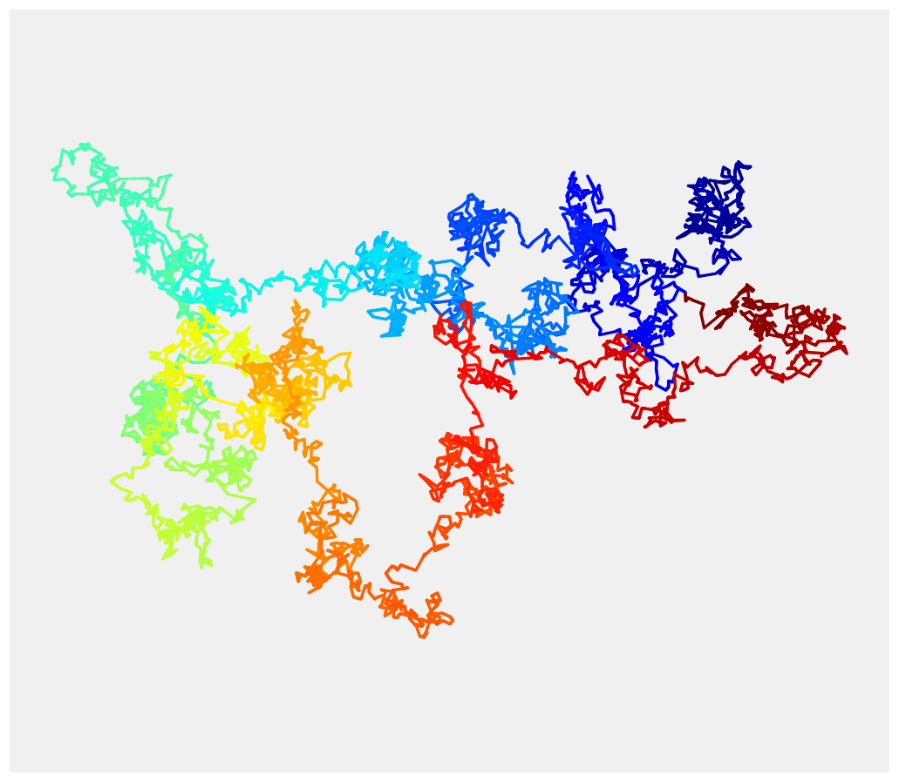

<a href="https://github.com/ipython-books/cookbook-2nd"></a> *This is one of the 100+ free recipes of the [IPython Cookbook, Second Edition](https://github.com/ipython-books/cookbook-2nd), by [Cyrille Rossant](http://cyrille.rossant.net), a guide to numerical computing and data science in the Jupyter Notebook. The ebook and printed book are available for purchase at [Packt Publishing](https://www.packtpub.com/big-data-and-business-intelligence/ipython-interactive-computing-and-visualization-cookbook-second-e).*

▶ *[Text on GitHub](https://github.com/ipython-books/cookbook-2nd) with a [CC-BY-NC-ND license](https://creativecommons.org/licenses/by-nc-nd/3.0/us/legalcode)*  
▶ *[Code on GitHub](https://github.com/ipython-books/cookbook-2nd-code) with a [MIT license](https://opensource.org/licenses/MIT)*

[*Chapter 13 : Stochastic Dynamical Systems*](./)

# 13.3. Simulating a Brownian motion

The **Brownian motion** (or **Wiener process**) is a fundamental object in mathematics, physics, and many other scientific and engineering disciplines. This model describes the movement of a particle suspended in a fluid resulting from random collisions with the quick molecules in the fluid (diffusion). More generally, the Brownian motion models a continuous-time random walk, where a particle evolves in space by making independent random steps in all directions.

Mathematically, the Brownian motion is a particular Markov continuous stochastic process. The Brownian motion is at the core of mathematical domains such as stochastic calculus and the theory of stochastic processes, but it is also central in applied fields such as quantitative finance, ecology, and neuroscience.

In this recipe, we will show how to simulate and plot a Brownian motion in two dimensions.

## How to do it...

1. Let's import NumPy and matplotlib:

```python
import numpy as np
import matplotlib.pyplot as plt
%matplotlib inline
```

2. We simulate Brownian motions with 5000 time steps:

```python
n = 5000
```

3. We simulate two independent one-dimensional Brownian processes to form a single two-dimensional Brownian process. The (discrete) Brownian motion makes independent Gaussian jumps at each time step. Therefore, we merely have to compute the cumulative sum of independent normal random variables (one for each time step):

```python
x = np.cumsum(np.random.randn(n))
y = np.cumsum(np.random.randn(n))
```

4. Now, to display the Brownian motion, we could just use `plot(x, y)`. However, the result would be monochromatic and a bit boring. We would like to use a gradient of color to illustrate the progression of the motion in time (the hue is a function of time). matplotlib does not support this feature natively, so we rather us `scatter()`. This function allows us to assign a different color to each point at the expense of dropping out line segments between points. To work around this issue, we linearly interpolate the process to give the illusion of a continuous line:

```python
# We add 10 intermediary points between two
# successive points. We interpolate x and y.
k = 10
x2 = np.interp(np.arange(n * k), np.arange(n) * k, x)
y2 = np.interp(np.arange(n * k), np.arange(n) * k, y)
```

```python
fig, ax = plt.subplots(1, 1, figsize=(8, 8))
# Now, we draw our points with a gradient of colors.
ax.scatter(x2, y2, c=range(n * k), linewidths=0,
           marker='o', s=3, cmap=plt.cm.jet,)
ax.axis('equal')
ax.set_axis_off()
```



## How it works...

The Brownian motion $W(t)$ has several important properties. First, it gives rise (almost surely) to continuous trajectories. Second, its increments $W(t+\tau)-W(t)$ are independent on non-overlapping intervals. Third, these increments are Gaussian random variables. More precisely:

$$\forall t, \tau>0, \quad W(t+\tau)-W(t) \sim \mathcal{N}(0, \tau)$$

In particular, the density of $W(t)$ is a normal distribution with variance $t$.

Additionally, the Brownian motion, and stochastic processes in general, have deep connections with partial differential equations. Here, the density of $W(t)$ is a solution of the **heat equation**, a particular diffusion equation. More generally, the **Fokker-Planck equation** is a partial differential equation satisfied by the density of solutions of a stochastic differential equation.

## There's more...

The Brownian motion is a limit of a random walk with an infinitesimal step size. We used this property here to simulate the process.

Here are a few references:

* The Brownian motion (physical phenomenon) described at https://en.wikipedia.org/wiki/Brownian_motion
* The Wiener process (mathematical object) explained at https://en.wikipedia.org/wiki/Wiener_process
* The Brownian motion is a particular type of the Lévy process; refer to https://en.wikipedia.org/wiki/L%C3%A9vy_process
* The Fokker-Planck equation links stochastic processes to partial differential equations; refer to https://en.wikipedia.org/wiki/Fokker%E2%80%93Planck_equation

## See also

* Simulating a stochastic differential equation
