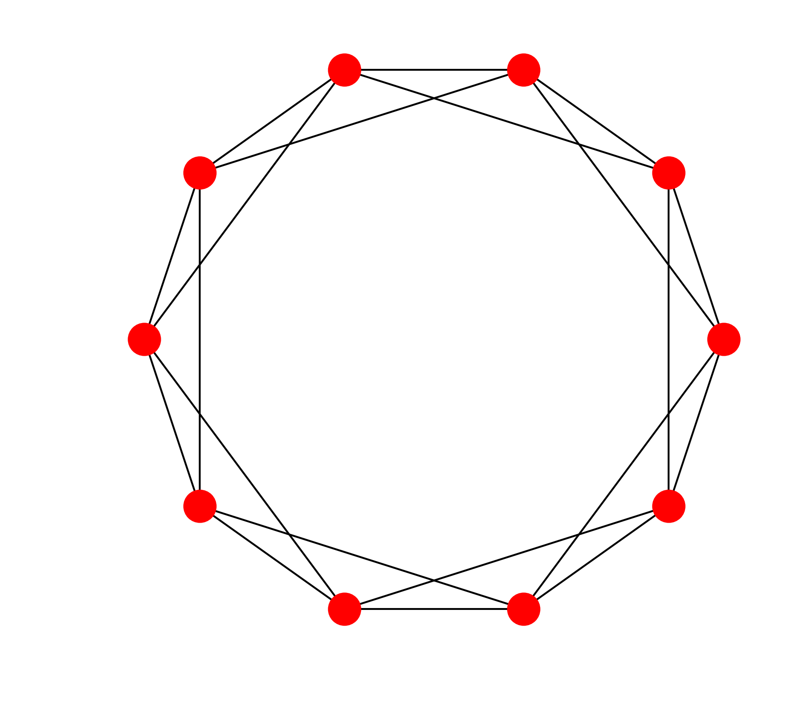
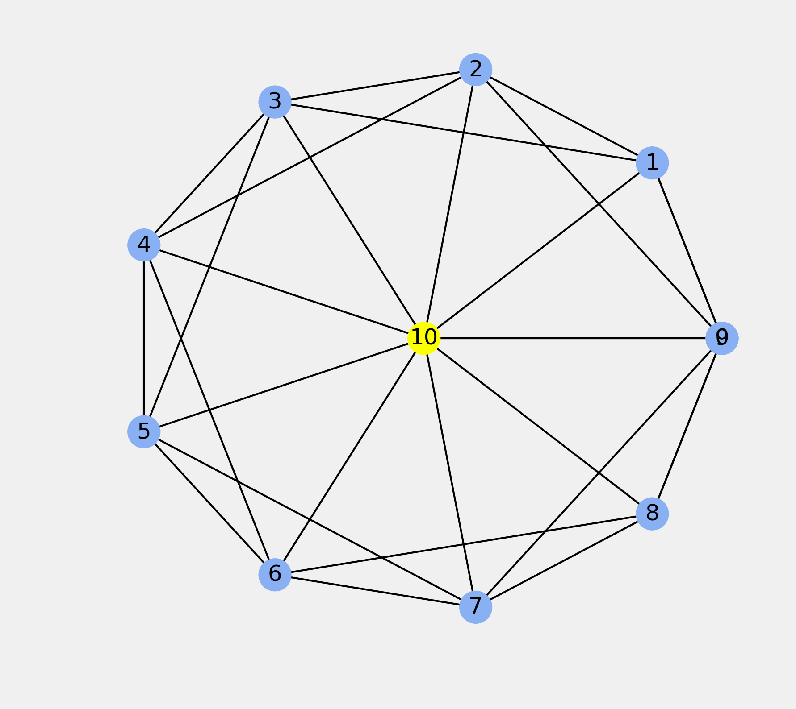
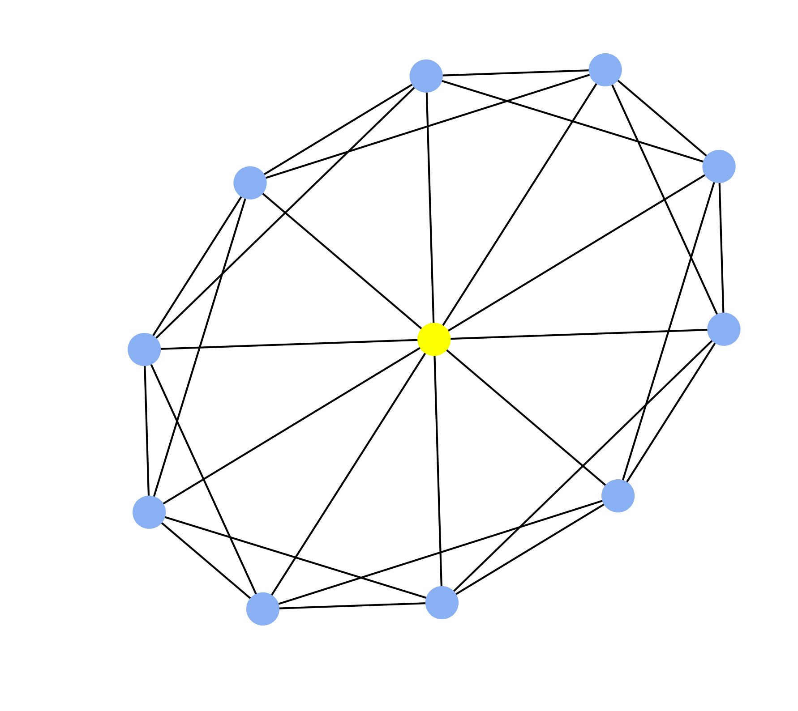

<a href="https://github.com/ipython-books/cookbook-2nd"></a> *This is one of the 100+ free recipes of the [IPython Cookbook, Second Edition](https://github.com/ipython-books/cookbook-2nd), by [Cyrille Rossant](http://cyrille.rossant.net), a guide to numerical computing and data science in the Jupyter Notebook. The ebook and printed book are available for purchase at [Packt Publishing](https://www.packtpub.com/big-data-and-business-intelligence/ipython-interactive-computing-and-visualization-cookbook-second-e).*

▶ *[Text on GitHub](https://github.com/ipython-books/cookbook-2nd) with a [CC-BY-NC-ND license](https://creativecommons.org/licenses/by-nc-nd/3.0/us/legalcode)*  
▶ *[Code on GitHub](https://github.com/ipython-books/cookbook-2nd-code) with a [MIT license](https://opensource.org/licenses/MIT)*

[*Chapter 14 : Graphs, Geometry, and Geographic Information Systems*](./)

# 14.1. Manipulating and visualizing graphs with NetworkX

[The recipe is available in the book, to be purchased on Packt.](https://www.packtpub.com/big-data-and-business-intelligence/ipython-interactive-computing-and-visualization-cookbook-second-e)

<!-- REMOVE AS PER PACKT AGREEMENT

In this recipe, we will show how to create, manipulate, and visualize graphs with NetworkX.

## Getting ready

NetworkX is installed by default in Anaconda. If needed, you can also install it manually with `conda install networkx`.

## How to do it...

1. Let's import NumPy, NetworkX, and matplotlib:

```python
import numpy as np
import networkx as nx
import matplotlib.pyplot as plt
%matplotlib inline
```

2. There are many ways of creating a graph. Here, we create a list of edges (pairs of node indices):

```python
n = 10  # Number of nodes in the graph.
# Each node is connected to the two next nodes,
# in a circular fashion.
adj = [(i, (i + 1) % n) for i in range(n)]
adj += [(i, (i + 2) % n) for i in range(n)]
```

3. We instantiate a `Graph` object with our list of edges:

```python
g = nx.Graph(adj)
```

4. Let's check the list of nodes and edges of the graph, and its adjacency matrix:

```python
print(g.nodes())
```

```{output:stdout}
[0, 1, 2, 3, 4, 5, 6, 7, 8, 9]
```

```python
print(g.edges())
```

```{output:stdout}
[(0, 1), (0, 9), (0, 2), (0, 8), (1, 2), ...,
 (6, 8), (7, 8), (7, 9), (8, 9)]
```

```python
print(nx.adjacency_matrix(g))
```

```{output:stdout}
  (0, 1)    1
  (0, 2)    1
  (0, 8)    1
  (0, 9)    1
  (1, 0)    1
  ...
  (8, 9)    1
  (9, 0)    1
  (9, 1)    1
  (9, 7)    1
  (9, 8)    1
```

5. Let's display this graph. NetworkX comes with a variety of drawing functions. We can either specify the nodes' positions explicitly, or we can use an algorithm to automatically compute an interesting layout. Here, we use the `draw_circular()` function that simply positions nodes linearly on a circle:

```python
fig, ax = plt.subplots(1, 1, figsize=(6, 6))
nx.draw_circular(g, ax=ax)
```



6. Graphs can be modified easily. Here, we add a new node connected to all existing nodes. We also specify a `color` attribute to this node. In NetworkX, every node and edge comes with a Python dictionary containing arbitrary attributes.

```python
g.add_node(n, color='#fcff00')
# We add an edge from every existing
# node to the new node.
for i in range(n):
    g.add_edge(i, n)
```

7. Now, let's draw the modified graph again. This time, we specify the nodes' positions and colors explicitly:

```python
# We define custom node positions on a circle
# except the last node which is at the center.
t = np.linspace(0., 2 * np.pi, n)
pos = np.zeros((n + 1, 2))
pos[:n, 0] = np.cos(t)
pos[:n, 1] = np.sin(t)

# A node's color is specified by its 'color'
# attribute, or a default color if this attribute
# doesn't exist.
color = [g.node[i].get('color', '#88b0f3')
         for i in range(n + 1)]

# We now draw the graph with matplotlib.
fig, ax = plt.subplots(1, 1, figsize=(6, 6))
nx.draw_networkx(g, pos=pos, node_color=color, ax=ax)
ax.set_axis_off()
```



8. Let's also use an automatic layout algorithm:

```python
fig, ax = plt.subplots(1, 1, figsize=(6, 6))
nx.draw_spectral(g, node_color=color, ax=ax)
ax.set_axis_off()
```



## There's more...

In NetworkX, nodes are not necessarily integers. They can be numbers, strings, tuples, or instances of any hashable Python class.

In addition, every node and edge comes with optional attributes (which form a dictionary).

A few layout algorithms are implemented in NetworkX. The `draw_spectral()` function uses the eigenvectors of the graph's **Laplacian matrix**.

The `draw_spring()` function implements the **Fruchterman-Reingold force-directed algorithm**. Nodes are considered as masses subject to edge-dependent forces. A force-directed graph drawing algorithm minimizes the system's energy so as to find an equilibrium configuration. This results in an aesthetically appealing layout with as few crossing edges as possible.

Here are a few references:

* Graph drawing, described at https://en.wikipedia.org/wiki/Graph_drawing
* Laplacian matrix on Wikipedia, available at https://en.wikipedia.org/wiki/Laplacian_matrix
* Force-directed graph drawing, described at https://en.wikipedia.org/wiki/Force-directed_graph_drawing

## See also

* Drawing flight routes with NetworkX

-->
