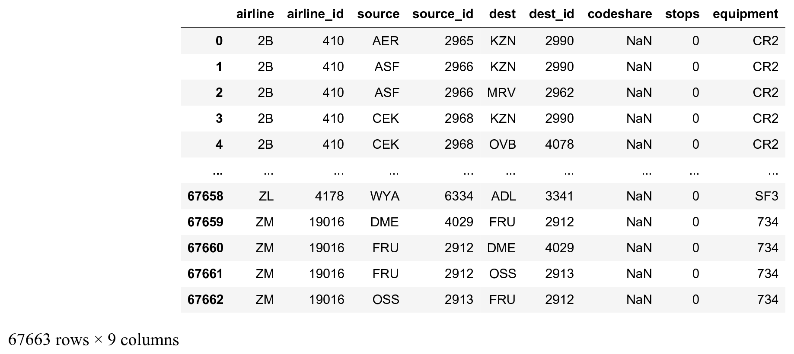
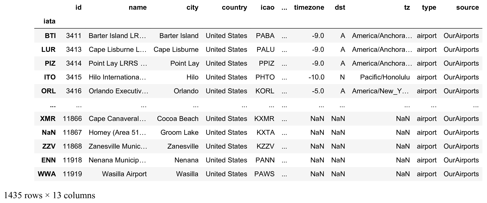
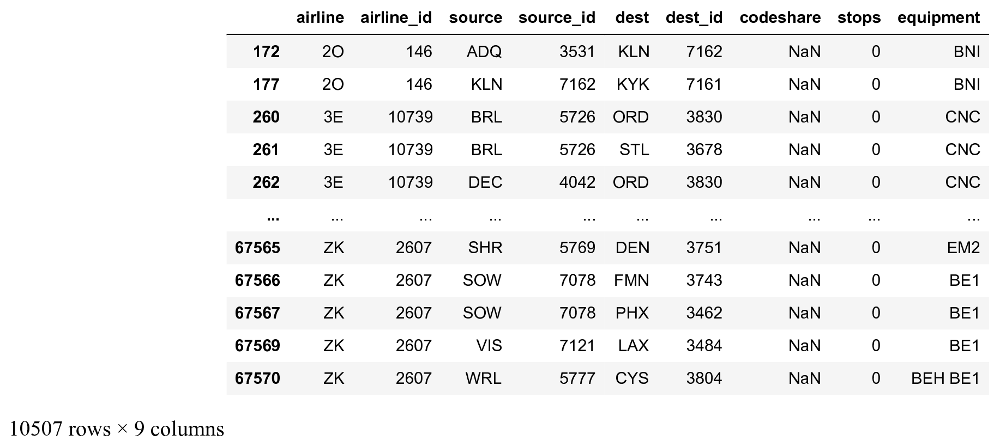
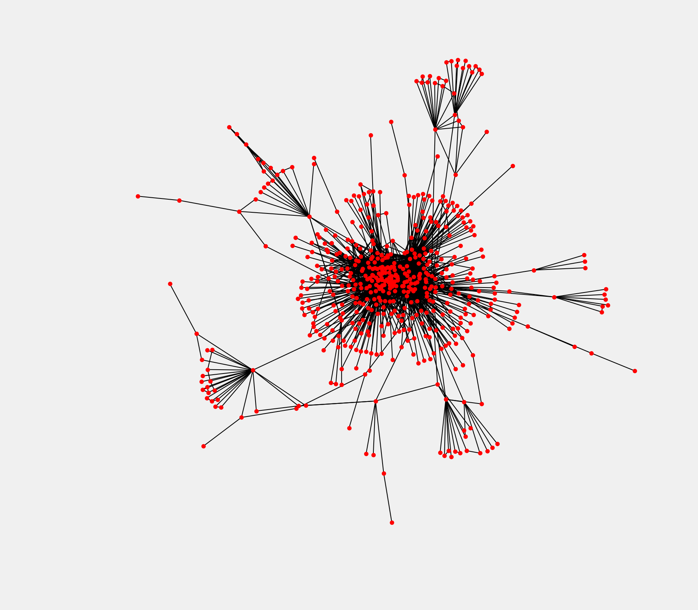
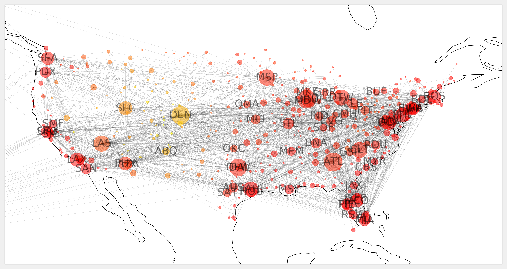

<a href="https://github.com/ipython-books/cookbook-2nd"></a> *This is one of the 100+ free recipes of the [IPython Cookbook, Second Edition](https://github.com/ipython-books/cookbook-2nd), by [Cyrille Rossant](http://cyrille.rossant.net), a guide to numerical computing and data science in the Jupyter Notebook. The ebook and printed book are available for purchase at [Packt Publishing](https://www.packtpub.com/big-data-and-business-intelligence/ipython-interactive-computing-and-visualization-cookbook-second-e).*

▶ *[Text on GitHub](https://github.com/ipython-books/cookbook-2nd) with a [CC-BY-NC-ND license](https://creativecommons.org/licenses/by-nc-nd/3.0/us/legalcode)*  
▶ *[Code on GitHub](https://github.com/ipython-books/cookbook-2nd-code) with a [MIT license](https://opensource.org/licenses/MIT)*

[*Chapter 14 : Graphs, Geometry, and Geographic Information Systems*](./)

# 14.2. Drawing flight routes with NetworkX

In this recipe, we load and visualize a dataset containing many flight routes and airports around the world (obtained from the OpenFlights website at https://openflights.org/data.html).

## Getting ready

To draw the graph on a map, you need **cartopy**, available at http://scitools.org.uk/cartopy/. You can install it with `conda install -c conda-forge cartopy`.

## How to do it...

1. Let's import a few packages:

```python
import math
import json
import numpy as np
import pandas as pd
import networkx as nx
import cartopy.crs as ccrs
import matplotlib.pyplot as plt
from IPython.display import Image
%matplotlib inline
```

2. We load the first dataset containing many flight routes:

```python
names = ('airline,airline_id,'
         'source,source_id,'
         'dest,dest_id,'
         'codeshare,stops,equipment').split(',')
```

```python
routes = pd.read_csv(
    'https://github.com/ipython-books/'
    'cookbook-2nd-data/blob/master/'
    'routes.dat?raw=true',
    names=names,
    header=None)
routes
```



3. We load the second dataset with details about the airports, and we only keep the airports from the United States:

```python
names = ('id,name,city,country,iata,icao,lat,lon,'
         'alt,timezone,dst,tz,type,source').split(',')
```

```python
airports = pd.read_csv(
    'https://github.com/ipython-books/'
    'cookbook-2nd-data/blob/master/'
    'airports.dat?raw=true',
    header=None,
    names=names,
    index_col=4,
    na_values='\\N')
airports_us = airports[airports['country'] ==
                       'United States']
airports_us
```



The DataFrame index is the IATA code, a 3-characters code identifying the airports.

4. Let's keep all national US flight routes, that is, those for which the source and the destination airports belong to the list of US airports:

```python
routes_us = routes[
    routes['source'].isin(airports_us.index) &
    routes['dest'].isin(airports_us.index)]
routes_us
```



5. We construct the list of edges representing our graph, where nodes are airports, and two airports are connected if there exists a route between them (flight network):

```python
edges = routes_us[['source', 'dest']].values
edges
```

```{output:result}
array([['ADQ', 'KLN'],
       ['KLN', 'KYK'],
       ['BRL', 'ORD'],
       ...,
       ['SOW', 'PHX'],
       ['VIS', 'LAX'],
       ['WRL', 'CYS']], dtype=object)
```

6. We create the networkX graph from the `edges` array:

```python
g = nx.from_edgelist(edges)
```

7. Let's take a look at the graph's statistics:

```python
len(g.nodes()), len(g.edges())
```

```{output:result}
(546, 2781)
```

There are 546 US airports and 2781 routes in the dataset.

8. Let's plot the graph:

```python
fig, ax = plt.subplots(1, 1, figsize=(6, 6))
nx.draw_networkx(g, ax=ax, node_size=5,
                 font_size=6, alpha=.5,
                 width=.5)
ax.set_axis_off()
```


9. There are a few airports that are not connected to the rest of the airports. We keep the largest connected component of the graph as follows (the subgraphs returned by `connected_component_subgraphs()` are sorted by decreasing size):

```python
sg = next(nx.connected_component_subgraphs(g))
```

10. Now, we plot the largest connected component subgraph:

```python
fig, ax = plt.subplots(1, 1, figsize=(6, 6))
nx.draw_networkx(sg, ax=ax, with_labels=False,
                 node_size=5, width=.5)
ax.set_axis_off()
```



The graph encodes only the *topology* (connections between the airports) and not the *geometry* (actual positions of the airports on a map). Airports at the center of the graph are the largest US airports.

11. We're going to draw the graph on a map, using the geographical coordinates of the airports. First, we need to create a dictionary where the keys are the airports IATA codes, and the values are the coordinates:

```python
pos = {airport: (v['lon'], v['lat'])
       for airport, v in
       airports_us.to_dict('index').items()}
```

12. The node sizes will depend on the degree of the nodes, that is, the number of airports connected to every node:

```python
deg = nx.degree(sg)
sizes = [5 * deg[iata] for iata in sg.nodes]
```

13. We will also show the airport altitude as the node color:

```python
altitude = airports_us['alt']
altitude = [altitude[iata] for iata in sg.nodes]
```

14. We will display the labels of the largest airports only (at least 20 connections to other US airports):

```python
labels = {iata: iata if deg[iata] >= 20 else ''
          for iata in sg.nodes}
```

15. Finally, we use cartopy to project the points on the map:

```python
# Map projection
crs = ccrs.PlateCarree()
fig, ax = plt.subplots(
    1, 1, figsize=(12, 8),
    subplot_kw=dict(projection=crs))
ax.coastlines()
# Extent of continental US.
ax.set_extent([-128, -62, 20, 50])
nx.draw_networkx(sg, ax=ax,
                 font_size=16,
                 alpha=.5,
                 width=.075,
                 node_size=sizes,
                 labels=labels,
                 pos=pos,
                 node_color=altitude,
                 cmap=plt.cm.autumn)
```



## See also

* Manipulating and visualize graphs with NetworkX
* Manipulating geospatial data with Cartopy
