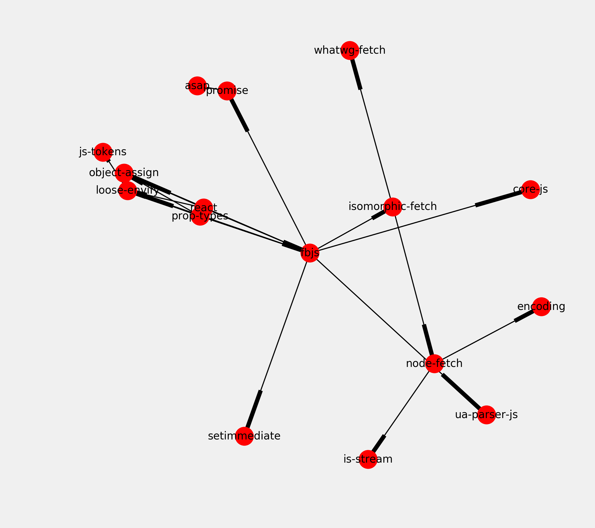
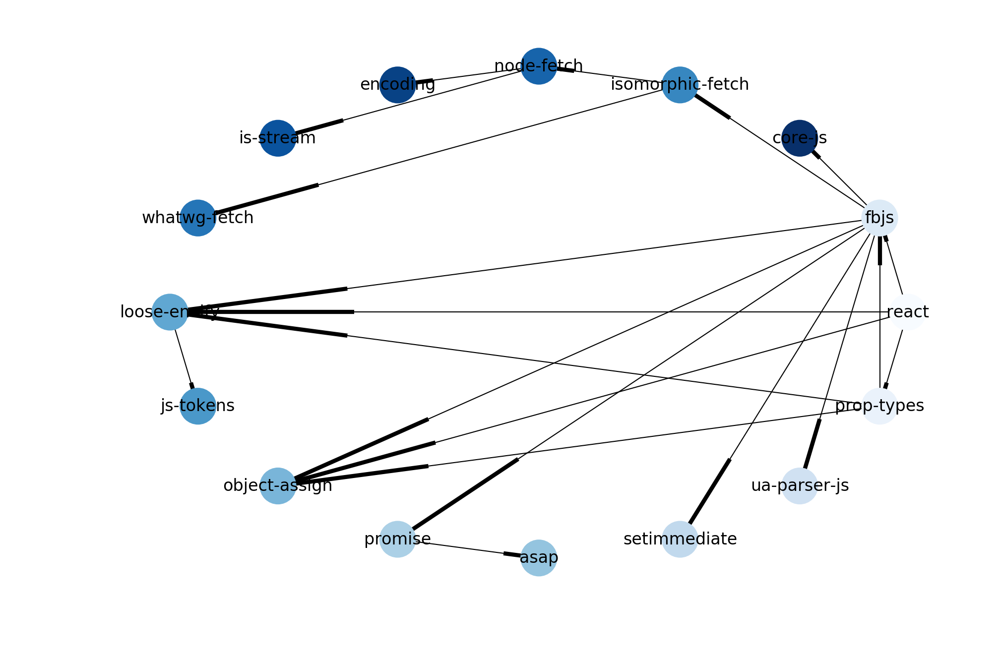

<a href="https://github.com/ipython-books/cookbook-2nd"></a> *This is one of the 100+ free recipes of the [IPython Cookbook, Second Edition](https://github.com/ipython-books/cookbook-2nd), by [Cyrille Rossant](http://cyrille.rossant.net), a guide to numerical computing and data science in the Jupyter Notebook. The ebook and printed book are available for purchase at [Packt Publishing](https://www.packtpub.com/big-data-and-business-intelligence/ipython-interactive-computing-and-visualization-cookbook-second-e).*

▶ *[Text on GitHub](https://github.com/ipython-books/cookbook-2nd) with a [CC-BY-NC-ND license](https://creativecommons.org/licenses/by-nc-nd/3.0/us/legalcode)*  
▶ *[Code on GitHub](https://github.com/ipython-books/cookbook-2nd-code) with a [MIT license](https://opensource.org/licenses/MIT)*

[*Chapter 14 : Graphs, Geometry, and Geographic Information Systems*](./)

# 14.3. Resolving dependencies in a directed acyclic graph with a topological sort

In this recipe, we will show an application of a well-known graph algorithm: **topological sorting**. Let's consider a directed graph describing dependencies between items. For example, in a package manager, before we can install a given package *P*, we may need to install *dependent* packages.

The set of dependencies forms a directed graph. With topological sorting, the package manager can resolve the dependencies and find the right installation order of the packages.

Topological sorting has many other applications. Here, we will illustrate this notion on real data from the JavaScript package manager **npm**. We will find the installation order of the required packages for the `react` JavaScript package.

## How to do it...

1. We import a few packages:

```python
import io
import json
import requests
import numpy as np
import networkx as nx
import matplotlib.pyplot as plt
%matplotlib inline
```

2. We download the dataset (a GraphML file stored on GitHub, that we created using a script at https://github.com/graphcommons/npm-dependency-network) and we load it with the NetworkX function `read_graphml()`:

```python
url = ('https://github.com/ipython-books/'
       'cookbook-2nd-data/blob/master/'
       'react.graphml?raw=true')
f = io.BytesIO(requests.get(url).content)
graph = nx.read_graphml(f)
```

3. The graph is a directed graph (`DiGraph`) with few nodes and edges:

```python
graph
```

```{output:result}
<networkx.classes.digraph.DiGraph at 0x7f69ac6dfdd8>
```

```python
len(graph.nodes), len(graph.edges)
```

```{output:result}
(16, 20)
```

4. Let's draw this graph:

```python
fig, ax = plt.subplots(1, 1, figsize=(8, 8))
nx.draw_networkx(graph, ax=ax, font_size=10)
ax.set_axis_off()
```



5. A topological sort only exists when the graph is a **directed acyclic graph (DAG)**. This means that there is no cycle in the graph, that is, no circular dependency. Is our graph a DAG? Let's see:

```python
nx.is_directed_acyclic_graph(graph)
```

```{output:result}
True
```

6. We can perform the topological sort, thereby obtaining a linear installation order satisfying all dependencies:

```python
ts = list(nx.topological_sort(graph))
ts
```

```{output:result}
['react',
 'prop-types',
 'fbjs',
 'ua-parser-js',
 'setimmediate',
 'promise',
 'asap',
 'object-assign',
 'loose-envify',
 'js-tokens',
 'isomorphic-fetch',
 'whatwg-fetch',
 'node-fetch',
 'is-stream',
 'encoding',
 'core-js']
```

Since we used the convention that A directs to B if B needs to be installed *before* A (A depends on B), the installation order is the reversed order here.

7. Finally, we draw our graph with a shell layout algorithm, and we display the dependence order using the node colors (darker nodes need to be installed before lighter ones):

```python
# Each node's color is the index of the node in the
# topological sort.
colors = [ts.index(node) for node in graph.nodes]
```

```python
nx.draw_shell(graph,
              node_color=colors,
              cmap=plt.cm.Blues,
              font_size=8,
              width=.5
              )
```



## How it works...

We used the following code (adapted from https://github.com/graphcommons/npm-dependency-network) to obtain the dependency graph of the react npm package:

```python
from lxml.html import fromstring
import cssselect  # Need to do: pip install cssselect
from requests.packages import urllib3

urllib3.disable_warnings()
fetched_packages = set()

def import_package_dependencies(graph, pkg_name,
                                max_depth=3, depth=0):
    if pkg_name in fetched_packages:
        return
    if depth > max_depth:
        return
    fetched_packages.add(pkg_name)
    url = f'https://www.npmjs.com/package/{pkg_name}'
    response = requests.get(url, verify=False)
    doc = fromstring(response.content)
    graph.add_node(pkg_name)
    for h3 in doc.cssselect('h3'):
        content = h3.text_content()
        if content.startswith('Dependencies'):
            for dep in h3.getnext().cssselect('a'):
                dep_name = dep.text_content()
                print('-' * depth * 2, dep_name)
                graph.add_node(dep_name)
                graph.add_edge(pkg_name, dep_name)
                import_package_dependencies(
                    graph,
                    dep_name,
                    depth=depth + 1
                )

graph = nx.DiGraph()
import_package_dependencies(graph, 'react')
nx.write_graphml(graph, 'react.graphml')
```

You can use that code to obtain the dependency graph of any other npm package. The script may take a few minutes to complete.

## There's more...

Directed acyclic graphs are found in many applications. They can represent causal relations, influence diagrams, dependencies, and other concepts. For example, the version history of a distributed revision control system such as Git is described with a DAG.

Topological sorting is useful in any scheduling task in general (project management and instruction scheduling).

Here are a few references:

* Directed acyclic graphs on NetworkX, at https://networkx.github.io/documentation/latest/reference/algorithms/dag.html
* Topological sort documentation on NetworkX, available at https://networkx.github.io/documentation/latest/reference/algorithms/generated/networkx.algorithms.dag.topological_sort.html
* Topological sorting on Wikipedia, available at https://en.wikipedia.org/wiki/Topological_sorting
* Directed acyclic graphs, described at https://en.wikipedia.org/wiki/Directed_acyclic_graph
