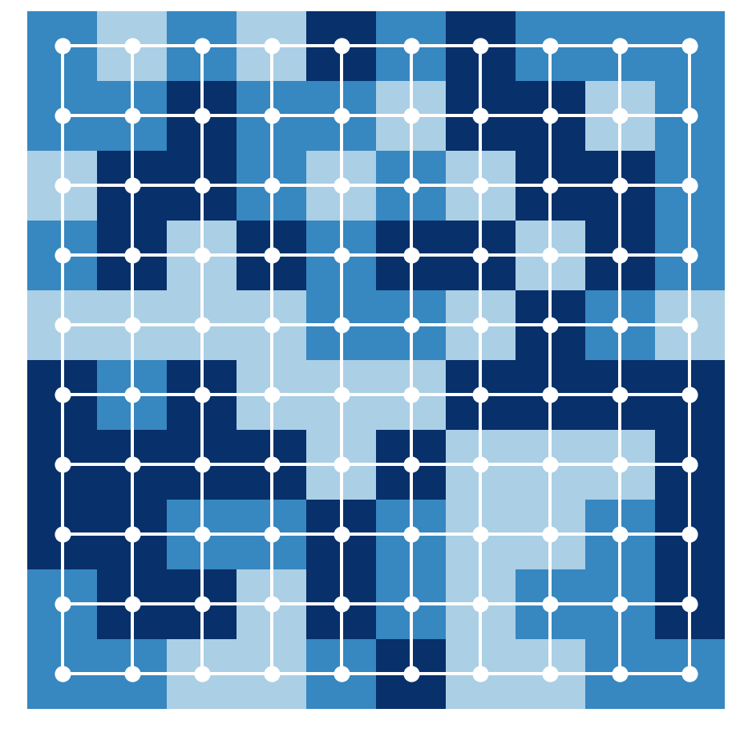
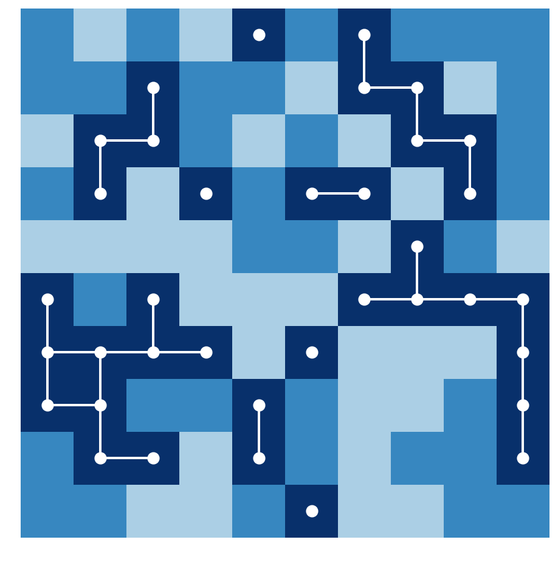
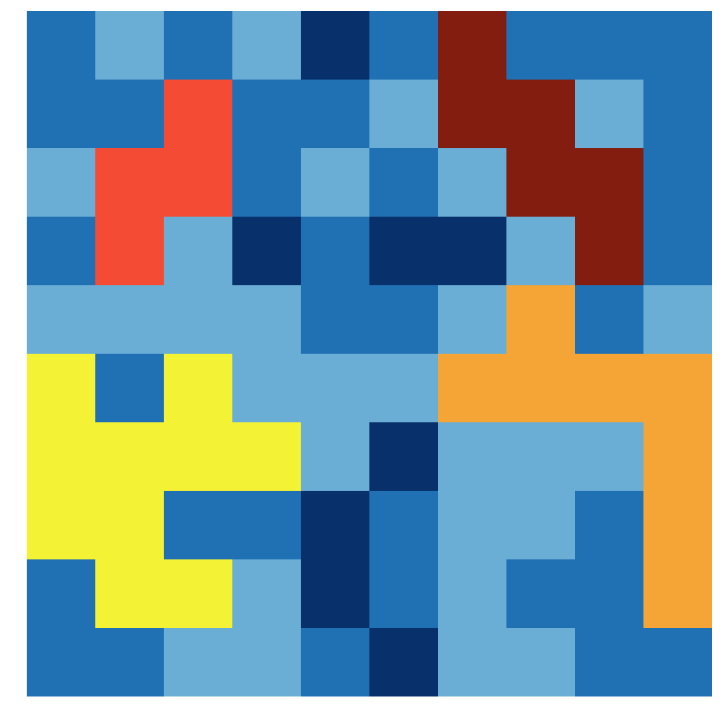

<a href="https://github.com/ipython-books/cookbook-2nd"></a> *This is one of the 100+ free recipes of the [IPython Cookbook, Second Edition](https://github.com/ipython-books/cookbook-2nd), by [Cyrille Rossant](http://cyrille.rossant.net), a guide to numerical computing and data science in the Jupyter Notebook. The ebook and printed book are available for purchase at [Packt Publishing](https://www.packtpub.com/big-data-and-business-intelligence/ipython-interactive-computing-and-visualization-cookbook-second-e).*

▶ *[Text on GitHub](https://github.com/ipython-books/cookbook-2nd) with a [CC-BY-NC-ND license](https://creativecommons.org/licenses/by-nc-nd/3.0/us/legalcode)*  
▶ *[Code on GitHub](https://github.com/ipython-books/cookbook-2nd-code) with a [MIT license](https://opensource.org/licenses/MIT)*

[*Chapter 14 : Graphs, Geometry, and Geographic Information Systems*](./)

# 14.4. Computing connected components in an image

In this recipe, we will show an application of graph theory in image processing. We will compute **connected components** in an image. This method will allow us to label contiguous regions of an image, similar to the bucket fill tool of paint programs.

Finding connected components is also useful in many puzzle video games such as Minesweeper, bubble shooters, and others. In these games, contiguous sets of items with the same color need to be automatically detected.

## How to do it...

1. Let's import the packages:

```python
import itertools
import numpy as np
import networkx as nx
import matplotlib.colors as col
import matplotlib.pyplot as plt
%matplotlib inline
```

2. We create a 10 x 10 image where each pixel can take one of three possible labels (or colors):

```python
n = 10
```

```python
img = np.random.randint(size=(n, n),
                        low=0, high=3)
```

3. Now, we create the underlying 2D grid graph encoding the structure of the image. Each node is a pixel, and a node is connected to its nearest neighbors. NetworkX defines a `grid_2d_graph()` function to generate this graph:

```python
g = nx.grid_2d_graph(n, n)
```

4. Let's create two functions to display the image and the corresponding graph:

```python
def show_image(img, ax=None, **kwargs):
    ax.imshow(img, origin='lower',
              interpolation='none',
              **kwargs)
    ax.set_axis_off()
```

```python
def show_graph(g, ax=None, **kwargs):
    pos = {(i, j): (j, i) for (i, j) in g.nodes()}
    node_color = [img[i, j] for (i, j) in g.nodes()]
    nx.draw_networkx(g,
                     ax=ax,
                     pos=pos,
                     node_color='w',
                     linewidths=3,
                     width=2,
                     edge_color='w',
                     with_labels=False,
                     node_size=50,
                     **kwargs)
```

```python
cmap = plt.cm.Blues
```

5. Here is the original image superimposed with the underlying graph:

```python
fig, ax = plt.subplots(1, 1, figsize=(8, 8))
show_image(img, ax=ax, cmap=cmap, vmin=-1)
show_graph(g, ax=ax, cmap=cmap, vmin=-1)
```



6. Now, we are going to find all contiguous dark blue regions containing more than three pixels. First, we consider the *subgraph* corresponding to all dark blue pixels:

```python
g2 = g.subgraph(zip(*np.nonzero(img == 2)))
```

```python
fig, ax = plt.subplots(1, 1, figsize=(8, 8))
show_image(img, ax=ax, cmap=cmap, vmin=-1)
show_graph(g2, ax=ax, cmap=cmap, vmin=-1)
```



7. The requested contiguous regions correspond to the *connected components* containing more than three nodes in the subgraph. We can use the `connected_components()` function of NetworkX to find those components:

```python
components = [np.array(list(comp))
              for comp in nx.connected_components(g2)
              if len(comp) >= 3]
len(components)
```

```{output:result}
4
```

8. Finally, we assign a new color to each of these components, and we display the new image:

```python
# We copy the image, and assign a new label
# to each found component.
img_bis = img.copy()
for i, comp in enumerate(components):
    img_bis[comp[:, 0], comp[:, 1]] = i + 3
```

```python
# We create a new discrete color map extending
# the previous map with new colors.
colors = [cmap(.5), cmap(.75), cmap(1.),
          '#f4f235', '#f4a535', '#f44b35',
          '#821d10']
cmap2 = col.ListedColormap(colors, 'indexed')
```

```python
fig, ax = plt.subplots(1, 1, figsize=(8, 8))
show_image(img_bis, ax=ax, cmap=cmap2)
```



## How it works...

The problem we solved is called **connected-component labeling**. It is also closely related to the **flood-fill algorithm**.

The idea to associate a grid graph to an image is quite common in image processing. Here, contiguous color regions correspond to **connected components** of subgraphs. A connected component can be defined as an equivalence class of the **reachability** relation. Two nodes are connected in the graph if there is a path from one node to the other. An equivalence class contains nodes that can be reached from one another.

Finally, the simple approach described here is only adapted to basic tasks on small images. More advanced algorithms are covered in *Chapter 11, Image and Audio Processing*.

## There's more...

Here are a few references:

* Connected components on Wikipedia, available at https://en.wikipedia.org/wiki/Connected_component_%28graph_theory%29
* Connected-component labeling on Wikipedia, at https://en.wikipedia.org/wiki/Connected-component_labeling
* Flood-fill algorithm on Wikipedia, available at https://en.wikipedia.org/wiki/Flood_fill
