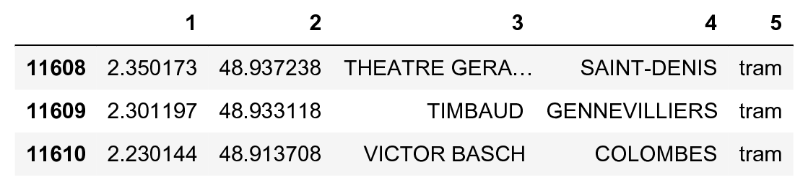
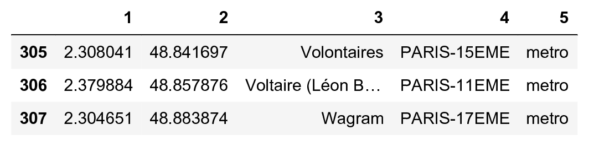
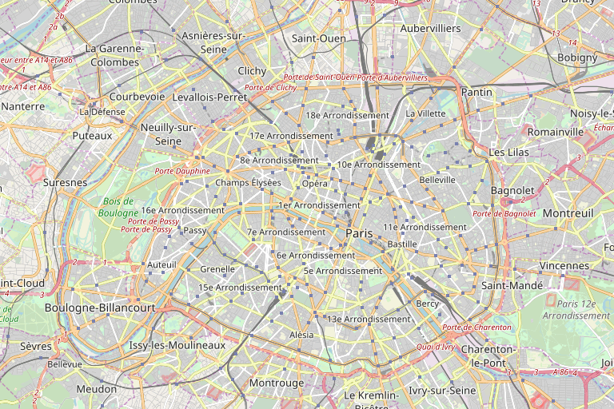
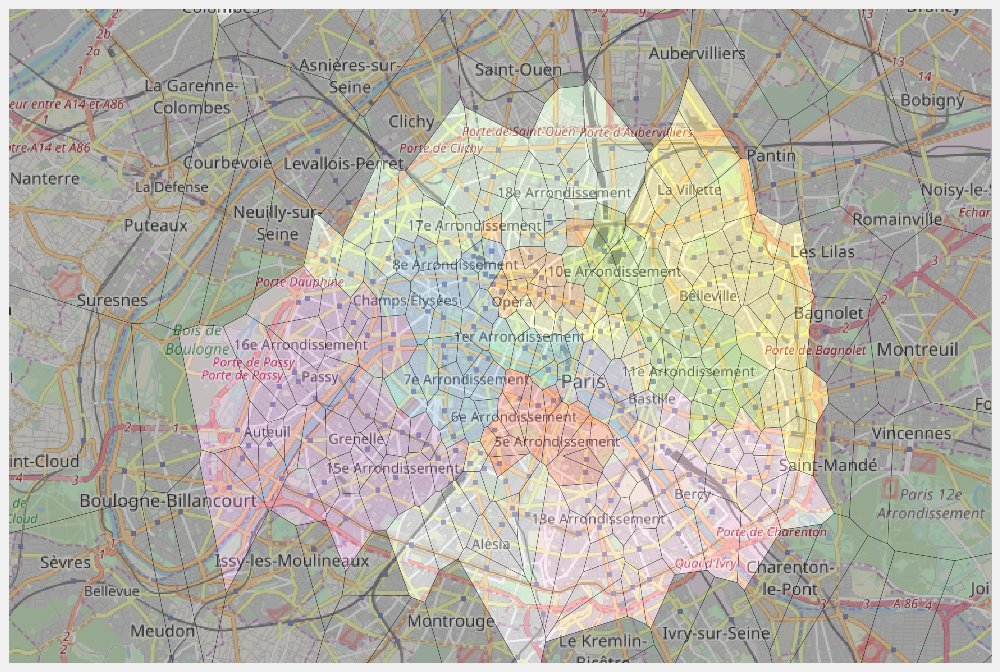

<a href="https://github.com/ipython-books/cookbook-2nd"></a> *This is one of the 100+ free recipes of the [IPython Cookbook, Second Edition](https://github.com/ipython-books/cookbook-2nd), by [Cyrille Rossant](http://cyrille.rossant.net), a guide to numerical computing and data science in the Jupyter Notebook. The ebook and printed book are available for purchase at [Packt Publishing](https://www.packtpub.com/big-data-and-business-intelligence/ipython-interactive-computing-and-visualization-cookbook-second-e).*

▶ *[Text on GitHub](https://github.com/ipython-books/cookbook-2nd) with a [CC-BY-NC-ND license](https://creativecommons.org/licenses/by-nc-nd/3.0/us/legalcode)*  
▶ *[Code on GitHub](https://github.com/ipython-books/cookbook-2nd-code) with a [MIT license](https://opensource.org/licenses/MIT)*

[*Chapter 14 : Graphs, Geometry, and Geographic Information Systems*](./)

# 14.5. Computing the Voronoi diagram of a set of points

The **Voronoi diagram** of a set of seed points divides space into several regions. Each region contains all points closer to one seed point than to any other seed point.

The Voronoi diagram is a fundamental structure in computational geometry. It is widely used in computer science, robotics, geography, and other disciplines. For example, the Voronoi diagram of a set of metro stations gives us the closest station from any point in the city.

In this recipe, we compute the Voronoi diagram of the set of metro stations in Paris using SciPy.

## Getting ready

You need the Smopy module to display the OpenStreetMap map of Paris. You can install this package with `pip install git+https://github.com/rossant/smopy.git`.

## How to do it...

1. Let's import the packages:

```python
import numpy as np
import pandas as pd
import scipy.spatial as spatial
import matplotlib.pyplot as plt
import matplotlib.path as path
import matplotlib as mpl
import smopy
%matplotlib inline
```

2. Let's load the dataset with pandas (which had been obtained on the RATP open data website, the public transport operator in Paris, at http://data.ratp.fr):

```python
df = pd.read_csv('https://github.com/ipython-books/'
                 'cookbook-2nd-data/blob/master/'
                 'ratp.csv?raw=true',
                 sep='#', header=None)
```

```python
df[df.columns[1:]].tail(3)
```



3. The `DataFrame` object contains the coordinates, name, city, district, and type of station. Let's select all metro stations:

```python
metro = df[(df[5] == 'metro')]
```

```python
metro[metro.columns[1:]].tail(3)
```



4. We are going to extract the district number of Paris' stations. With pandas, we can use vectorized string operations using the str attribute of the corresponding column.

```python
# We only extract the district from stations in Paris.
paris = metro[4].str.startswith('PARIS').values
```

```python
# We create a vector of integers with the district
# number of the corresponding station, or 0 if the
# station is not in Paris.
districts = np.zeros(len(paris), dtype=np.int32)
districts[paris] = metro[4][paris].str.slice(6, 8) \
    .astype(np.int32)
districts[~paris] = 0
ndistricts = districts.max() + 1
```

5. We also extract the coordinates of all metro stations:

```python
lon = metro[1]
lat = metro[2]
```

6. Now, let's retrieve Paris' map with OpenStreetMap. We specify the map's boundaries with the extreme latitude and longitude coordinates of all our metro stations. We use Smopy to generate the map:

```python
box = (lat[paris].min(), lon[paris].min(),
       lat[paris].max(), lon[paris].max())
m = smopy.Map(box, z=12)
m.show_ipython()
```



7. We now compute the Voronoi diagram of the stations using SciPy. A `Voronoi` object is created with the points coordinates. It contains several attributes we will use for display:

```python
vor = spatial.Voronoi(np.c_[lat, lon])
```

8. We create a generic function to display a Voronoi diagram. SciPy already implements such a function, but this function does not take infinite points into account. The implementation we will use is available at http://stackoverflow.com/a/20678647/1595060:

```python
def voronoi_finite_polygons_2d(vor, radius=None):
    """Reconstruct infinite Voronoi regions in a
    2D diagram to finite regions.
    Source:
    https://stackoverflow.com/a/20678647/1595060
    """
    if vor.points.shape[1] != 2:
        raise ValueError("Requires 2D input")
    new_regions = []
    new_vertices = vor.vertices.tolist()
    center = vor.points.mean(axis=0)
    if radius is None:
        radius = vor.points.ptp().max()
    # Construct a map containing all ridges for a
    # given point
    all_ridges = {}
    for (p1, p2), (v1, v2) in zip(vor.ridge_points,
                                  vor.ridge_vertices):
        all_ridges.setdefault(
            p1, []).append((p2, v1, v2))
        all_ridges.setdefault(
            p2, []).append((p1, v1, v2))
    # Reconstruct infinite regions
    for p1, region in enumerate(vor.point_region):
        vertices = vor.regions[region]
        if all(v >= 0 for v in vertices):
            # finite region
            new_regions.append(vertices)
            continue
        # reconstruct a non-finite region
        ridges = all_ridges[p1]
        new_region = [v for v in vertices if v >= 0]
        for p2, v1, v2 in ridges:
            if v2 < 0:
                v1, v2 = v2, v1
            if v1 >= 0:
                # finite ridge: already in the region
                continue
            # Compute the missing endpoint of an
            # infinite ridge
            t = vor.points[p2] - \
                vor.points[p1]  # tangent
            t /= np.linalg.norm(t)
            n = np.array([-t[1], t[0]])  # normal
            midpoint = vor.points[[p1, p2]]. \
                mean(axis=0)
            direction = np.sign(
                np.dot(midpoint - center, n)) * n
            far_point = vor.vertices[v2] + \
                direction * radius
            new_region.append(len(new_vertices))
            new_vertices.append(far_point.tolist())
        # Sort region counterclockwise.
        vs = np.asarray([new_vertices[v]
                         for v in new_region])
        c = vs.mean(axis=0)
        angles = np.arctan2(
            vs[:, 1] - c[1], vs[:, 0] - c[0])
        new_region = np.array(new_region)[
            np.argsort(angles)]
        new_regions.append(new_region.tolist())
    return new_regions, np.asarray(new_vertices)
```

9. The `voronoi_finite_polygons_2d()` function returns a list of regions and a list of vertices. Every region is a list of vertex indices. The coordinates of all vertices are stored in `vertices`. From these structures, we can create a list of cells. Every cell represents a polygon as an array of vertex coordinates. We also use the `to_pixels()` method of the `smopy.Map` instance. This function converts latitude and longitude geographical coordinates to pixels in the image.

```python
regions, vertices = voronoi_finite_polygons_2d(vor)
```

```python
cells = [m.to_pixels(vertices[region])
         for region in regions]
```

10. Now, we compute the color of every polygon:

```python
cmap = plt.cm.Set3
# We generate colors for districts using a color map.
colors_districts = cmap(
    np.linspace(0., 1., ndistricts))[:, :3]
# The color of every polygon, grey by default.
colors = .25 * np.ones((len(districts), 3))
# We give each polygon in Paris the color of
# its district.
colors[paris] = colors_districts[districts[paris]]
```

11. Finally, we display the map with the Voronoi diagram, using the `show_mpl()` method of the Map instance:

```python
ax = m.show_mpl(figsize=(12, 8))
ax.add_collection(
    mpl.collections.PolyCollection(
        cells, facecolors=colors,
        edgecolors='k', alpha=.35))
```



## How it works...

Let's give the mathematical definition of the Voronoi diagram in a Euclidean space. If $(x_i)$ is a set of points, the Voronoi diagram of this set of points is the collection of subsets $V_i$ (called **cells** or **regions**) defined by:

$$V_i = \{\mathbf{x} \in \mathbb{R}^d \mid \forall j \neq i, \quad ||\mathbf{x} - \mathbf{x}_i|| \leq ||\mathbf{x} - \mathbf{x}_j|| \}$$

The dual graph of the Voronoi diagram is the **Delaunay triangulation**. This geometrical object covers the convex hull of the set of points with triangles.

SciPy computes Voronoi diagrams with **Qhull**, a computational geometry library in C++.

## There's more...

Here are further references:

* Voronoi diagram on Wikipedia, available at https://en.wikipedia.org/wiki/Voronoi_diagram
* Delaunay triangulation on Wikipedia, available at https://en.wikipedia.org/wiki/Delaunay_triangulation
* The documentation of scipy.spatial.voronoi available at http://docs.scipy.org/doc/scipy-dev/reference/generated/scipy.spatial.Voronoi.html
* The Qhull library available at http://www.qhull.org

## See also

* Manipulating geospatial data with Cartopy
