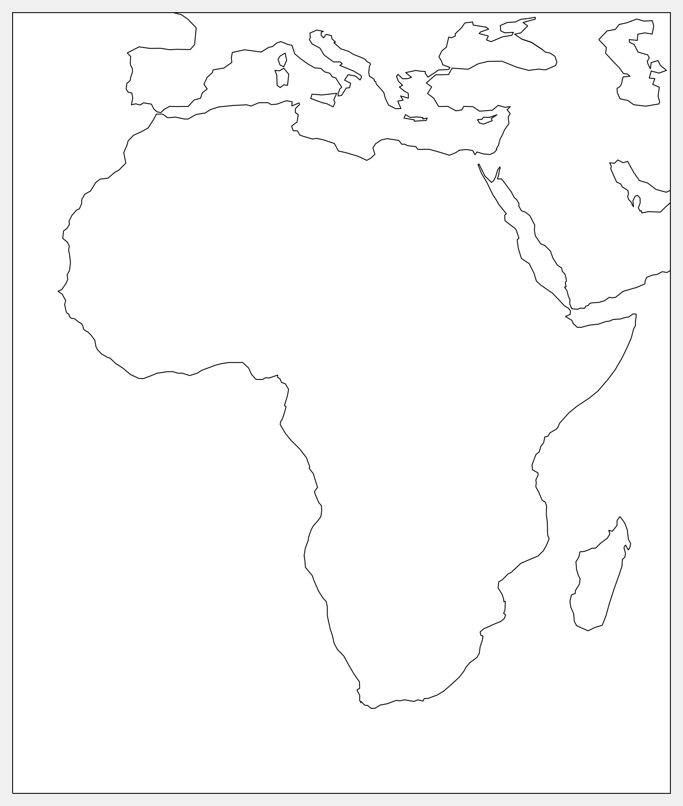
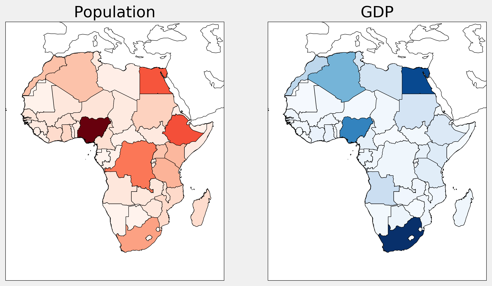

<a href="https://github.com/ipython-books/cookbook-2nd"></a> *This is one of the 100+ free recipes of the [IPython Cookbook, Second Edition](https://github.com/ipython-books/cookbook-2nd), by [Cyrille Rossant](http://cyrille.rossant.net), a guide to numerical computing and data science in the Jupyter Notebook. The ebook and printed book are available for purchase at [Packt Publishing](https://www.packtpub.com/big-data-and-business-intelligence/ipython-interactive-computing-and-visualization-cookbook-second-e).*

▶ *[Text on GitHub](https://github.com/ipython-books/cookbook-2nd) with a [CC-BY-NC-ND license](https://creativecommons.org/licenses/by-nc-nd/3.0/us/legalcode)*  
▶ *[Code on GitHub](https://github.com/ipython-books/cookbook-2nd-code) with a [MIT license](https://opensource.org/licenses/MIT)*

[*Chapter 14 : Graphs, Geometry, and Geographic Information Systems*](./)

# 14.6. Manipulating geospatial data with Cartopy

In this recipe, we will show how to load and display geographical data in the Shapefile format. Specifically, we will use data from **Natural Earth** (http://www.naturalearthdata.com) to display the countries of Africa, color coded with their population and Gross Domestic Product (GDP). This type of graph is called a **choropleth map**.

**Shapefile** (https://en.wikipedia.org/wiki/Shapefile) is a popular geospatial vector data format for GIS software. It can be read by **cartopy**, a GIS package in Python.

## Getting ready

You need **cartopy**, available at http://scitools.org.uk/cartopy/. You can install it with `conda install -c conda-forge cartopy`.

## How to do it...

1. Let's import the packages:

```python
import io
import requests
import zipfile
import numpy as np
import matplotlib.pyplot as plt
import matplotlib.collections as col
from matplotlib.colors import Normalize
import cartopy.crs as ccrs
from cartopy.feature import ShapelyFeature
import cartopy.io.shapereader as shpreader
%matplotlib inline
```

2. We download and load the Shapefile that contains geometric and administrative information about all countries in the world (it had been obtained from Natural Earth's website at http://www.naturalearthdata.com/downloads/10m-cultural-vectors/10m-admin-0-countries/):

```python
url = ('https://github.com/ipython-books/'
       'cookbook-2nd-data/blob/master/'
       'africa.zip?raw=true')
r = io.BytesIO(requests.get(url).content)
zipfile.ZipFile(r).extractall('data')
countries = shpreader.Reader(
    'data/ne_10m_admin_0_countries.shp')
```

3. We keep the African countries:

```python
africa = [c for c in countries.records()
          if c.attributes['CONTINENT'] == 'Africa']
```

4. Let's write a function that draws the borders of Africa:

```python
crs = ccrs.PlateCarree()
extent = [-23.03, 55.20, -37.72, 40.58]
```

```python
def draw_africa(ax):
    ax.set_extent(extent)
    ax.coastlines()
```

```python
fig, ax = plt.subplots(
    1, 1, figsize=(6, 8),
    subplot_kw=dict(projection=crs))
draw_africa(ax)
```



5. Now, we write a function that displays the countries of Africa with a color that depends on a specific attribute, like the population or GDP:

```python
def choropleth(ax, attr, cmap_name):
    # We need to normalize the values before we can
    # use the colormap.
    values = [c.attributes[attr] for c in africa]
    norm = Normalize(
        vmin=min(values), vmax=max(values))
    cmap = plt.cm.get_cmap(cmap_name)
    for c in africa:
        v = c.attributes[attr]
        sp = ShapelyFeature(c.geometry, crs,
                            edgecolor='k',
                            facecolor=cmap(norm(v)))
        ax.add_feature(sp)
```

6. Finally, we display two choropleth maps with the population and GDP of all African countries:

```python
fig, (ax1, ax2) = plt.subplots(
    1, 2, figsize=(10, 16),
    subplot_kw=dict(projection=crs))
draw_africa(ax1)
choropleth(ax1, 'POP_EST', 'Reds')
ax1.set_title('Population')

draw_africa(ax2)
choropleth(ax2, 'GDP_MD_EST', 'Blues')
ax2.set_title('GDP')
```



## There's more...

The geoplot package, available at https://github.com/ResidentMario/geoplot, provides high-level tools to draw choropleth maps and other geospatial figures.

## See also

* Creating a route planner for a road network
