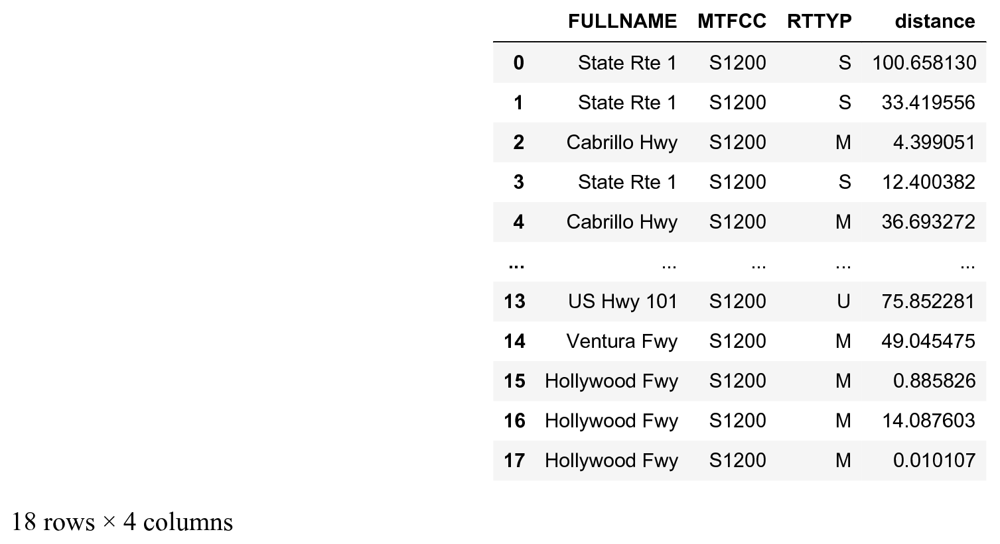

<a href="https://github.com/ipython-books/cookbook-2nd"></a> *This is one of the 100+ free recipes of the [IPython Cookbook, Second Edition](https://github.com/ipython-books/cookbook-2nd), by [Cyrille Rossant](http://cyrille.rossant.net), a guide to numerical computing and data science in the Jupyter Notebook. The ebook and printed book are available for purchase at [Packt Publishing](https://www.packtpub.com/big-data-and-business-intelligence/ipython-interactive-computing-and-visualization-cookbook-second-e).*

▶ *[Text on GitHub](https://github.com/ipython-books/cookbook-2nd) with a [CC-BY-NC-ND license](https://creativecommons.org/licenses/by-nc-nd/3.0/us/legalcode)*  
▶ *[Code on GitHub](https://github.com/ipython-books/cookbook-2nd-code) with a [MIT license](https://opensource.org/licenses/MIT)*

[*Chapter 14 : Graphs, Geometry, and Geographic Information Systems*](./)

# 14.7. Creating a route planner for a road network

In this recipe, we build upon several techniques described in the previous recipes in order to create a simple GPS-like route planner in Python. We will retrieve California's road network data from the United States Census Bureau in order to find shortest paths in the road network graph. This will allow us to display road itineraries between any two locations in California.

## Getting ready

You need Smopy for this recipe. You can install it with `pip install git+https://github.com/rossant/smopy`. In order for NetworkX to read Shapefile datasets, you also need GDAL/OGR. You can install it with `conda install gdal`.

> At the time of this writing, gdal does not appear to work well with conda and Python 3.6. You may need to downgrade Python to Python 3.5 with `conda install python=3.5`.

## How to do it...

1. Let's import the packages:

```python
import io
import zipfile
import requests
import networkx as nx
import numpy as np
import pandas as pd
import json
import smopy
import matplotlib.pyplot as plt
%matplotlib inline
```

2. We load the data (a Shapefile dataset) with NetworkX. This dataset contains detailed information about the primary roads in California. NetworkX's `read_shp()` function returns a graph, where each node is a geographical position, and each edge contains information about the road linking the two nodes. The data comes from the United States Census Bureau website at http://www.census.gov/geo/maps-data/data/tiger.html.

```python
url = ('https://github.com/ipython-books/'
       'cookbook-2nd-data/blob/master/'
       'road.zip?raw=true')
r = io.BytesIO(requests.get(url).content)
zipfile.ZipFile(r).extractall('data')
g = nx.read_shp('data/tl_2013_06_prisecroads.shp')
```

3. This graph is not necessarily connected, but we need a connected graph in order to compute shortest paths. Here, we take the largest connected subgraph using the `connected_component_subgraphs()` function:

```python
sgs = list(nx.connected_component_subgraphs(
    g.to_undirected()))
i = np.argmax([len(sg) for sg in sgs])
sg = sgs[i]
len(sg)
```

```{output:result}
464
```

4. We define two positions (with the latitude and longitude) and find the shortest path between these two positions:

```python
pos0 = (36.6026, -121.9026)
pos1 = (34.0569, -118.2427)
```

5. Each edge in the graph contains information about the road, including a list of points along this road. We first create a function that returns this array of coordinates, for any edge in the graph:

```python
def get_path(n0, n1):
    """If n0 and n1 are connected nodes in the graph,
    this function returns an array of point
    coordinates along the road linking these two
    nodes."""
    return np.array(json.loads(sg[n0][n1]['Json'])
                    ['coordinates'])
```

6. We can notably use the road path to compute its length. We first need to define a function that computes the distance between any two points in geographical coordinates:

```python
# from https://stackoverflow.com/a/8859667/1595060
EARTH_R = 6372.8

def geocalc(lat0, lon0, lat1, lon1):
    """Return the distance (in km) between two points
    in geographical coordinates."""
    lat0 = np.radians(lat0)
    lon0 = np.radians(lon0)
    lat1 = np.radians(lat1)
    lon1 = np.radians(lon1)
    dlon = lon0 - lon1
    y = np.sqrt((np.cos(lat1) * np.sin(dlon)) ** 2 +
        (np.cos(lat0) * np.sin(lat1) - np.sin(lat0) *
         np.cos(lat1) * np.cos(dlon)) ** 2)
    x = np.sin(lat0) * np.sin(lat1) + \
        np.cos(lat0) * np.cos(lat1) * np.cos(dlon)
    c = np.arctan2(y, x)
    return EARTH_R * c
```

7. Now, we define a function computing a path's length:

```python
def get_path_length(path):
    return np.sum(geocalc(path[1:, 1], path[1:, 0],
                          path[:-1, 1], path[:-1, 0]))
```

8. We update our graph by computing the distance between any two connected nodes. We add this information with the `distance` attribute of the edges:

```python
# Compute the length of the road segments.
for n0, n1 in sg.edges:
    path = get_path(n0, n1)
    distance = get_path_length(path)
    sg.edges[n0, n1]['distance'] = distance
```

9. The last step before we can find the shortest path in the graph is to find the two nodes in the graph that are closest to the two requested positions:

```python
nodes = np.array(sg.nodes())
# Get the closest nodes in the graph.
pos0_i = np.argmin(
    np.sum((nodes[:, ::-1] - pos0)**2, axis=1))
pos1_i = np.argmin(
    np.sum((nodes[:, ::-1] - pos1)**2, axis=1))
```

10. Now, we use NetworkX's `shortest_path()` function to compute the shortest path between our two positions. We specify that the weight of every edge is the length of the road between them:

```python
# Compute the shortest path.
path = nx.shortest_path(
    sg,
    source=tuple(nodes[pos0_i]),
    target=tuple(nodes[pos1_i]),
    weight='distance')
len(path)
```

```{output:result}
19
```

11. The itinerary has been computed. The `path` variable contains the list of edges that form the shortest path between our two positions. Now, we can get information about the itinerary with pandas. The dataset has a few fields of interest, including the name and type (State, Interstate, and so on) of the roads:

```python
roads = pd.DataFrame(
    [sg.edges[path[i], path[i + 1]]
     for i in range(len(path) - 1)],
    columns=['FULLNAME', 'MTFCC',
             'RTTYP', 'distance'])
roads
```



Here is the total length of this itinerary:

```python
roads['distance'].sum()
```

```{output:result}
508.664
```

12. Finally, let's display the itinerary on the map. We first retrieve the map with Smopy:

```python
m = smopy.Map(pos0, pos1, z=7, margin=.1)
```

13. Our path contains connected nodes in the graph. Every edge between two nodes is characterized by a list of points (constituting a part of the road). Therefore, we need to define a function that concatenates the positions along every edge in the path. We have to concatenate the positions in the right order along our path. We choose the order based on the fact that the last point in an edge needs to be close to the first point in the next edge:

```python
def get_full_path(path):
    """Return the positions along a path."""
    p_list = []
    curp = None
    for i in range(len(path) - 1):
        p = get_path(path[i], path[i + 1])
        if curp is None:
            curp = p
        if (np.sum((p[0] - curp) ** 2) >
                np.sum((p[-1] - curp) ** 2)):
            p = p[::-1, :]
        p_list.append(p)
        curp = p[-1]
    return np.vstack(p_list)
```

14. We convert the path in pixels in order to display it on the Smopy map:

```python
linepath = get_full_path(path)
x, y = m.to_pixels(linepath[:, 1], linepath[:, 0])
```

15. Finally, let's display the map, with our two positions and the computed itinerary between them:

```python
ax = m.show_mpl(figsize=(8, 8))
# Plot the itinerary.
ax.plot(x, y, '-k', lw=3)
# Mark our two positions.
ax.plot(x[0], y[0], 'ob', ms=20)
ax.plot(x[-1], y[-1], 'or', ms=20)
```


## How it works...

We computed the shortest path with NetworkX's `shortest_path()` function. Here, this function used **Dijkstra's algorithm**. This algorithm has a wide variety of applications, for example in network routing protocols.

There are different ways to compute the geographical distance between two points. Here, we used a relatively precise formula: the **orthodromic distance** (also called **great-circle distance**), which assumes that the Earth is a perfect sphere. We could also have used a simpler formula since the distance between two successive points on a road is small.

## There's more...

You can find more information about shortest path problems and Dijkstra's algorithm in the following references:

* Shortest paths in the NetworkX documentation, https://networkx.github.io/documentation/stable/reference/algorithms/shortest_paths.html
* *What algorithms compute directions from point A to point B on a map?* on StackOverflow, at https://stackoverflow.com/q/430142/1595060
* Shortest paths on Wikipedia, available at https://en.wikipedia.org/wiki/Shortest_path_problem
* Dijkstra's algorithm, described at https://en.wikipedia.org/wiki/Dijkstra%27s_algorithm

Here are a few references about geographical distances:

* Geographical distance on Wikipedia, at https://en.wikipedia.org/wiki/Geographical_distance
* Great circles on Wikipedia, at https://en.wikipedia.org/wiki/Great_circle
* Great-circle distance on Wikipedia, at https://en.wikipedia.org/wiki/Great-circle_distance
