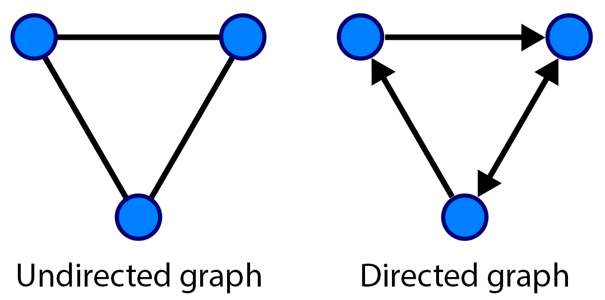

# Chapter 14 : Graphs, Geometry, and Geographic Information Systems

In this chapter, we will cover the following topics:

* [14.1. Manipulating and visualizing graphs with NetworkX](01_networkx.md) *
* [14.2. Drawing flight routes with NetworkX](02_airports.md)
* [14.3. Resolving dependencies in a directed acyclic graph with a topological sort](03_dag.md)
* [14.4. Computing connected components in an image](04_connected.md)
* [14.5. Computing the Voronoi diagram of a set of points](05_voronoi.md)
* [14.6. Manipulating geospatial data with Cartopy](06_gis.md)
* [14.7. Creating a route planner for a road network](07_gps.md)

In this chapter, we will cover Python's capabilities in graph theory, geometry, and geography.

**Graphs** are mathematical objects describing relations between items. They are ubiquitous in science and engineering, as they can represent many kinds of real-world relations: friends in a social network, atoms in a molecule, website links, cells in a neural network, neighboring pixels in an image, and so on. Graphs are also classical data structures in computer science. Finally, many domain-specific problems may be re-expressed as graph problems, and then solved with well-known algorithms.

We will also see a few recipes related to **geometry** and **Geographic Information Systems (GIS)**, which refers to the processing and analysis of any kind of spatial, geographical, or topographical data.

In this introduction, we will give a brief overview of these topics.

## Graphs

Mathematically, a **graph** $G = (V, E)$ is defined by a set $V$ of **vertices** or **nodes**, and a set $E$ of **edges** (two-element subsets of $V$). Two nodes $v$ and $v'$ are said to be **connected** if $(v, v')$ is an edge (element of $E$).

* If the edges are *unordered* (meaning that $(v,v') = (v',v)$), the graph is said to be **undirected**
* If the edges are *ordered* (meaning that $(v,v') \neq (v',v)$), the graph is said to be **directed**

An edge in an undirected graph is represented by a line segment between the two nodes. In a directed graph, it is represented by an arrow.

A graph can be represented by different data structures, such as an **adjacency list** (for each vertex, a list of adjacent vertices) or an **adjacency matrix** (matrix of connections between vertices).

### Problems in graph theory

Here are a few examples of classical graph problems:

* **Graph traversal**: How to walk through a graph, discussed at https://en.wikipedia.org/wiki/Graph_traversal
* **Graph coloring**: How to color nodes in a graph such that no two adjacent vertices share the same color, discussed at https://en.wikipedia.org/wiki/Graph_coloring
* **Connected components**: How to find connected components in a graph, explained at https://en.wikipedia.org/wiki/Connected_component_%28graph_theory%29
* **Shortest paths**: What is the shortest path from one node to another in a given graph?, discussed at https://en.wikipedia.org/wiki/Shortest_path_problem
* **Hamiltonian paths**: Does a graph include a Hamiltonian path, visiting every vertex exactly once?, explained at https://en.wikipedia.org/wiki/Hamiltonian_path
* **Eulerian paths**: Does a graph include an Eulerian path, visiting every edge exactly once?, discussed at https://en.wikipedia.org/wiki/Eulerian_path
* **Traveling Salesman Problem**: What is the shortest route visiting every node exactly once (Hamiltonian path)?, explained at https://en.wikipedia.org/wiki/Traveling_salesman_problem

### Random graphs

**Random graphs** are particular kinds of graphs defined with probabilistic rules. They are useful for understanding the structure of large real-world graphs such as social graphs.

In particular, **small-world networks** have sparse connections, but most nodes can be reached from every other node in a small number of steps. This property is due to the existence of a small number of **hubs** that have a high number of connections.

### Graphs in Python

Although graphs can be manipulated with native Python structures, it is more convenient to use a dedicated library implementing specific data structures and manipulation routines. In this chapter, we will use **NetworkX**, a pure Python library. An alternative library is **graph-tool**, largely written in C++.

NetworkX implements a flexible data structure for graphs, and it contains many algorithms. NetworkX also lets us draw graphs easily with matplotlib.

## Geometry in Python

**Shapely** is a Python library used to manipulate 2D geometrical shapes such as points, lines, and polygons. It is most notably useful in Geographic Information Systems.

## Geographical Information Systems in Python

There are several Python modules used to manipulate geographical data and plotting maps.

In this chapter, we will use cartopy and Shapely to handle GIS files.

The ESRI **shapefile** is a popular geospatial vector data format. It can be read by cartopy and NetworkX.

**Cartopy** is a Python library that provides cartographic tools for Python. We can use it to perform map projections and draw maps with matplotlib. It relies on Shapely.

**geoplot** is a young high-level geospatial data visualization library in Python that builds on top of cartopy and matplotlib.

We will also use the **OpenStreetMap** service, a free, open source, collaborative service providing maps of the world.

Other GIS/mapping systems in Python that we couldn't cover in this chapter include GeoPandas and Kartograph.

## References

Here are a few references about graphs:

* Graph theory on Wikipedia, available at https://en.wikipedia.org/wiki/Graph_theory
* Graph theory lectures on Awesome Math, available at https://github.com/rossant/awesome-math/#graph-theory
* Data structures for graphs, described at https://en.wikipedia.org/wiki/Graph_%28abstract_data_type%29
* Random graphs on Wikipedia, available at https://en.wikipedia.org/wiki/Random_graph
* Small-world graphs on Wikipedia, available at https://en.wikipedia.org/wiki/Small-world_network
* NetworkX package, available at http://networkx.github.io
* The graph-tool package, available at http://graph-tool.skewed.de

Here are a few references about geometry and maps in Python:

* cartopy at http://scitools.org.uk/cartopy/
* Shapely at https://github.com/Toblerity/Shapely
* Shapefile at https://en.wikipedia.org/wiki/Shapefile
* geoplot at https://github.com/ResidentMario/geoplot
* Folium at https://github.com/wrobstory/folium
* GeoPandas at http://geopandas.org
* Kartograph at http://kartograph.org
* OpenStreetMap at http://www.openstreetmap.org
