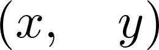
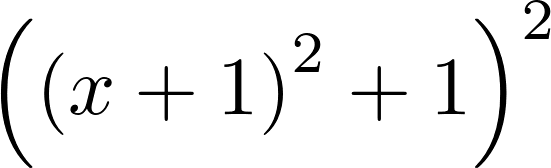
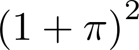
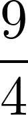
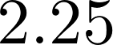

<a href="https://github.com/ipython-books/cookbook-2nd"></a> *This is one of the 100+ free recipes of the [IPython Cookbook, Second Edition](https://github.com/ipython-books/cookbook-2nd), by [Cyrille Rossant](http://cyrille.rossant.net), a guide to numerical computing and data science in the Jupyter Notebook. The ebook and printed book are available for purchase at [Packt Publishing](https://www.packtpub.com/big-data-and-business-intelligence/ipython-interactive-computing-and-visualization-cookbook-second-e).*

▶ *[Text on GitHub](https://github.com/ipython-books/cookbook-2nd) with a [CC-BY-NC-ND license](https://creativecommons.org/licenses/by-nc-nd/3.0/us/legalcode)*  
▶ *[Code on GitHub](https://github.com/ipython-books/cookbook-2nd-code) with a [MIT license](https://opensource.org/licenses/MIT)*

[*Chapter 15 : Symbolic and Numerical Mathematics*](./)

# 15.1. Diving into symbolic computing with SymPy

In this recipe, we will give a brief introduction to symbolic computing with SymPy. We will see more advanced features of SymPy in the next recipes.

## Getting ready

Anaconda should come with SymPy by default, but you can always install it with `conda install sympy`.

## How to do it...

SymPy can be used from a Python module, or interactively in Jupyter/IPython. In the Notebook, all mathematical expressions are displayed with LaTeX, thanks to the MathJax JavaScript library.

Here is an introduction to SymPy:

1. First, we import SymPy and enable LaTeX printing in the Jupyter Notebook:

```python
from sympy import *
init_printing()
```

2. To deal with symbolic variables, we first need to declare them:

```python
var('x y')
```



3. The `var()` function creates symbols and injects them into the namespace. This function should only be used in the interactive mode. In a Python module, it is better to use the `symbols()` function that returns the symbols:

```python
x, y = symbols('x y')
```

4. We can create mathematical expressions with these symbols:

```python
expr1 = (x + 1) ** 2
expr2 = x**2 + 2 * x + 1
```

5. Are these expressions equal?

```python
expr1 == expr2
```

```{output:result}
False
```

6. These expressions are mathematically equal, but not syntactically identical. To test whether they are mathematically equal, we can ask SymPy to simplify the difference algebraically:

```python
simplify(expr1 - expr2)
```


7. A very common operation with symbolic expressions is the substitution of a symbol by another symbol, expression, or a number, using the subs() method of a symbolic expression:

```python
expr1.subs(x, expr1)
```



```python
expr1.subs(x, pi)
```



8. A rational number cannot be written simply as `1/2` as this Python expression evaluates to 0.5. A possibility is to convert the number `1` into a SymPy integer object, for example by using the `S()` function:

```python
expr1.subs(x, S(1) / 2)
```



9. Exactly represented numbers can be evaluated numerically with `evalf()`:

```python
_.evalf()
```



10. We can easily create a Python function from a SymPy symbolic expression using the `lambdify()` function. The resulting function can notably be evaluated on NumPy arrays. This is quite convenient when we need to go from the symbolic world to the numerical world:

```python
f = lambdify(x, expr1)
```

```python
import numpy as np
f(np.linspace(-2., 2., 5))
```

```{output:result}
array([ 1.,  0.,  1.,  4.,  9.])
```

## How it works...

A core idea in SymPy is to use the standard Python syntax to manipulate exact expressions. Although this is very convenient and natural, there are a few caveats. Symbols such as `x`, which represent mathematical variables, cannot be used in Python before being instantiated (otherwise, a `NameError` exception is thrown by the interpreter). This is in contrast to most other computer algebra systems. For this reason, SymPy offers ways to declare symbolic variables beforehand.

Another example is integer division; as `1/2` evaluates to `0.5` (or 0 in Python 2), SymPy has no way to know that the user intended to write a fraction instead. We need to convert the numerical integer 1 to the symbolic integer `1` before dividing it by 2.

Also, the Python equality refers to the equality between syntax trees rather than between mathematical expressions.

## See also

* Solving equations and inequalities
* Getting started with Sage
