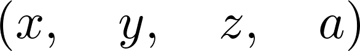
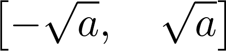
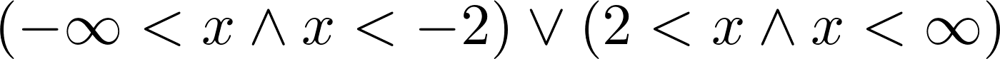
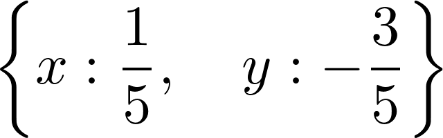
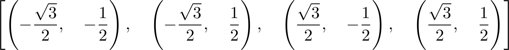
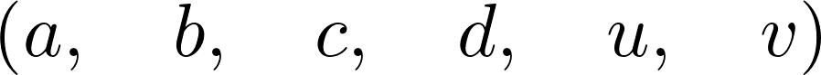
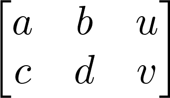
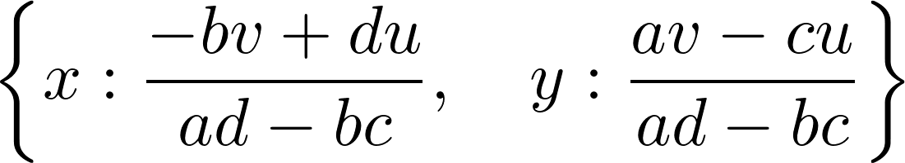

<a href="https://github.com/ipython-books/cookbook-2nd"></a> *This is one of the 100+ free recipes of the [IPython Cookbook, Second Edition](https://github.com/ipython-books/cookbook-2nd), by [Cyrille Rossant](http://cyrille.rossant.net), a guide to numerical computing and data science in the Jupyter Notebook. The ebook and printed book are available for purchase at [Packt Publishing](https://www.packtpub.com/big-data-and-business-intelligence/ipython-interactive-computing-and-visualization-cookbook-second-e).*

▶ *[Text on GitHub](https://github.com/ipython-books/cookbook-2nd) with a [CC-BY-NC-ND license](https://creativecommons.org/licenses/by-nc-nd/3.0/us/legalcode)*  
▶ *[Code on GitHub](https://github.com/ipython-books/cookbook-2nd-code) with a [MIT license](https://opensource.org/licenses/MIT)*

[*Chapter 15 : Symbolic and Numerical Mathematics*](./)

# 15.2. Solving equations and inequalities

SymPy offers several ways to solve linear and nonlinear equations and systems of equations. Of course, these functions do not always succeed in finding closed-form exact solutions. In this case, we can fall back to numerical solvers and obtain approximate solutions.

## How to do it...

1. Let's define a few symbols:

```python
from sympy import *
init_printing()
```

```python
var('x y z a')
```



2. We use the `solve()` function to solve equations (the right-hand side is 0 by default):

```python
solve(x**2 - a, x)
```



3. We can also solve inequalities. Here, we need to use the `solve_univariate_inequality()` function to solve this univariate inequality in the real domain:

```python
x = Symbol('x')
solve_univariate_inequality(x**2 > 4, x)
```



4. The `solve()` function also accepts systems of equations (here, a linear system):

```python
solve([x + 2*y + 1, x - 3*y - 2], x, y)
```



5. Nonlinear systems are also handled:

```python
solve([x**2 + y**2 - 1, x**2 - y**2 - S(1) / 2], x, y)
```



6. Singular linear systems can also be solved (here, there is an infinite number of solutions because the two equations are collinear):

```python
solve([x + 2*y + 1, -x - 2*y - 1], x, y)
```


7. Now, let's solve a linear system using matrices containing symbolic variables:

```python
var('a b c d u v')
```



8. We create the **augmented matrix**, which is the horizontal concatenation of the system's matrix with the linear coefficients and the right-hand side vector. This matrix corresponds to the following system in $x, y$: $ax+by=u, cx+dy=v$:

```python
M = Matrix([[a, b, u], [c, d, v]])
M
```



```python
solve_linear_system(M, x, y)
```



9. This system needs to be nonsingular in order to have a unique solution, which is equivalent to saying that the determinant of the system's matrix needs to be nonzero (otherwise the denominators in the preceding fractions are equal to zero):

```python
det(M[:2, :2])
```


## There's more...

Matrix support in SymPy is quite rich; we can perform a large number of operations and decompositions (see the reference guide at http://docs.sympy.org/latest/modules/matrices/matrices.html).

Here are more references about linear algebra:

* Linear algebra on Wikipedia, at https://en.wikipedia.org/wiki/Linear_algebra#Further_reading
* Linear algebra on Wikibooks, at http://en.wikibooks.org/wiki/Linear_Algebra
* Linear algebra lectures on Awesome Math, at https://github.com/rossant/awesome-math/#linear-algebra
