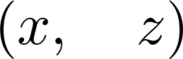
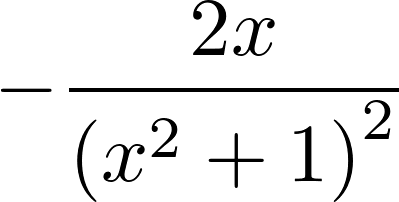
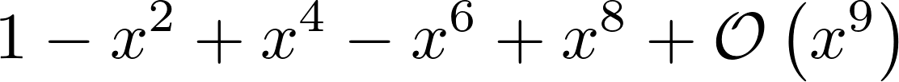
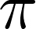
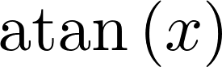
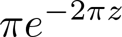

<a href="https://github.com/ipython-books/cookbook-2nd"></a> *This is one of the 100+ free recipes of the [IPython Cookbook, Second Edition](https://github.com/ipython-books/cookbook-2nd), by [Cyrille Rossant](http://cyrille.rossant.net), a guide to numerical computing and data science in the Jupyter Notebook. The ebook and printed book are available for purchase at [Packt Publishing](https://www.packtpub.com/big-data-and-business-intelligence/ipython-interactive-computing-and-visualization-cookbook-second-e).*

▶ *[Text on GitHub](https://github.com/ipython-books/cookbook-2nd) with a [CC-BY-NC-ND license](https://creativecommons.org/licenses/by-nc-nd/3.0/us/legalcode)*  
▶ *[Code on GitHub](https://github.com/ipython-books/cookbook-2nd-code) with a [MIT license](https://opensource.org/licenses/MIT)*

[*Chapter 15 : Symbolic and Numerical Mathematics*](./)

# 15.3. Analyzing real-valued functions

SymPy contains a rich calculus toolbox to analyze real-valued functions: limits, power series, derivatives, integrals, Fourier transforms, and so on. In this recipe, we will show the very basics of these capabilities.

## How to do it...

1. Let's define a few symbols and a function (which is just an expression depending on `x`):

```python
from sympy import *
init_printing()
```

```python
var('x z')
```



```python
f = 1 / (1 + x**2)
```

2. Let's evaluate this function at 1:

```python
f.subs(x, 1)
```


3. We can compute the derivative of this function:

```python
diff(f, x)
```



4. What is $f$'s limit to infinity? (Note the double o (`oo`) for the infinity symbol):

```python
limit(f, x, oo)
```


5. Here's how to compute a Taylor series (here, around 0, of order 9). The **Big O** can be removed with the `removeO()` method.

```python
series(f, x0=0, n=9)
```



6. We can compute definite integrals (here, over the entire real line):

```python
integrate(f, (x, -oo, oo))
```



7. SymPy can also compute indefinite integrals:

```python
integrate(f, x)
```



8. Finally, let's compute $f$'s Fourier transforms:

```python
fourier_transform(f, x, z)
```



## There's more...

SymPy includes a large number of other integral transforms besides the Fourier transform (http://docs.sympy.org/latest/modules/integrals/integrals.html). However, SymPy will not always be able to find closed-form solutions.

Here are a few general references about real analysis and calculus:

* Real analysis on Wikipedia, at https://en.wikipedia.org/wiki/Real_analysis#Bibliography
* Calculus on Wikibooks, at http://en.wikibooks.org/wiki/Calculus
* Real analysis on Awesome Math, at https://github.com/rossant/awesome-math/#real-analysis
