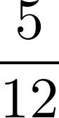
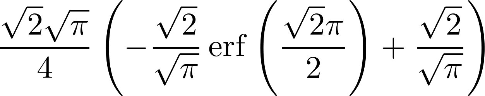
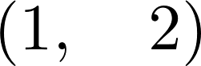
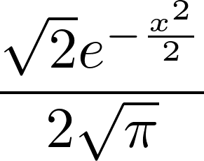
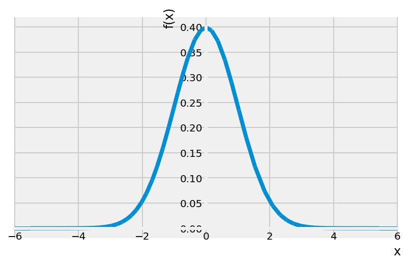
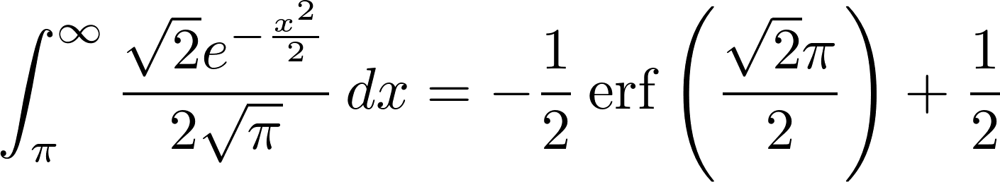

<a href="https://github.com/ipython-books/cookbook-2nd"></a> *This is one of the 100+ free recipes of the [IPython Cookbook, Second Edition](https://github.com/ipython-books/cookbook-2nd), by [Cyrille Rossant](http://cyrille.rossant.net), a guide to numerical computing and data science in the Jupyter Notebook. The ebook and printed book are available for purchase at [Packt Publishing](https://www.packtpub.com/big-data-and-business-intelligence/ipython-interactive-computing-and-visualization-cookbook-second-e).*

▶ *[Text on GitHub](https://github.com/ipython-books/cookbook-2nd) with a [CC-BY-NC-ND license](https://creativecommons.org/licenses/by-nc-nd/3.0/us/legalcode)*  
▶ *[Code on GitHub](https://github.com/ipython-books/cookbook-2nd-code) with a [MIT license](https://opensource.org/licenses/MIT)*

[*Chapter 15 : Symbolic and Numerical Mathematics*](./)

# 15.4. Computing exact probabilities and manipulating random variables

SymPy includes a module named `stats` that lets us create and manipulate random variables. This is useful when we work with probabilistic or statistical models; we can compute symbolic expectancies, variances probabilities, and densities of random variables.

## How to do it...

1. Let's import SymPy and the stats module:

```python
from sympy import *
from sympy.stats import *
init_printing()
```

2. Let's roll two dice, `X` and `Y`, with six faces each:

```python
X, Y = Die('X', 6), Die('Y', 6)
```

3. We can compute probabilities defined by equalities (with the `Eq` operator) or inequalities:

```python
P(Eq(X, 3))
```


```python
P(X > 3)
```


4. Conditions can also involve multiple random variables:

```python
P(X > Y)
```



5. We can compute conditional probabilities:

```python
P(X + Y > 6, X < 5)
```


6. We can also work with arbitrary discrete or continuous random variables:

```python
Z = Normal('Z', 0, 1)  # Gaussian variable
```

```python
P(Z > pi)
```



7. We can compute expectancies and variances:

```python
E(Z**2), variance(Z**2)
```



8. We can also compute densities:

```python
f = density(Z)
```

```python
var('x')
f(x)
```



9. We can plot these densities:

```python
%matplotlib inline
plot(f(x), (x, -6, 6))
```



## How it works...

SymPy's `stats` module contains many functions to define random variables with classical laws (binomial, exponential, and so on), discrete or continuous. It works by leveraging SymPy's powerful integration algorithms to compute exact probabilistic quantities as integrals of probability distributions. For example, $P(Z > \pi)$ is:

```python
Eq(Integral(f(x), (x, pi, oo)),
   simplify(integrate(f(x), (x, pi, oo))))
```



Note that the equality condition is written using the `Eq` operator rather than the more standard `==` Python syntax. This is a general feature in SymPy; `==` means equality between Python variables, whereas `Eq` is the mathematical operation between symbolic expressions.

## There's more...

Here are a few references:

* SymPy stats module documentation at http://docs.sympy.org/latest/modules/stats.html
* Probability lectures on Awesome Math, at https://github.com/rossant/awesome-math/#probability-theory
* Statistics lectures on Awesome Math, at https://github.com/rossant/awesome-math/#statistics
