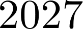
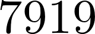
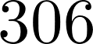
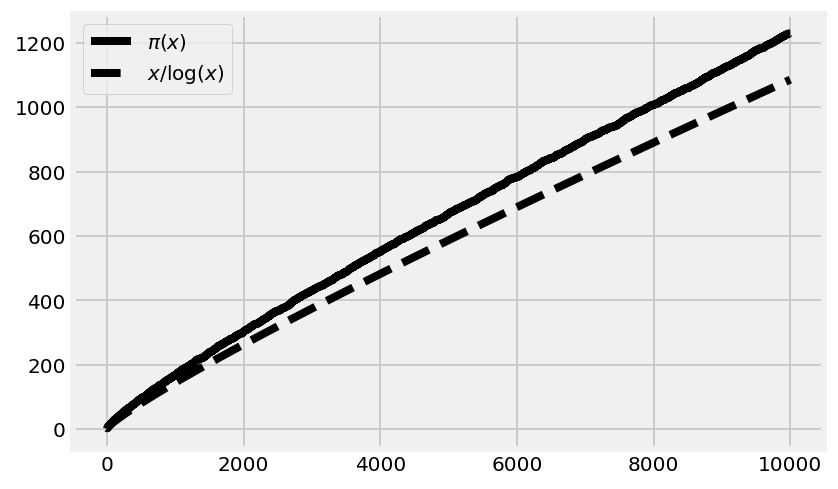
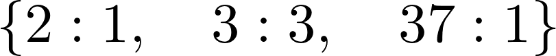
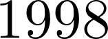
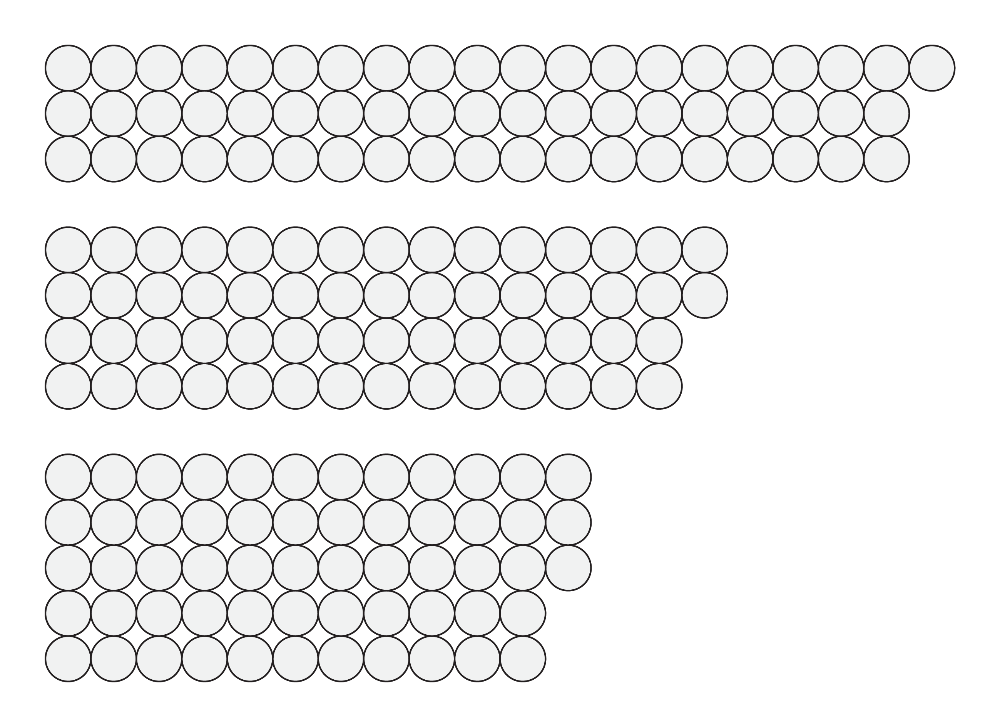

<a href="https://github.com/ipython-books/cookbook-2nd"></a> *This is one of the 100+ free recipes of the [IPython Cookbook, Second Edition](https://github.com/ipython-books/cookbook-2nd), by [Cyrille Rossant](http://cyrille.rossant.net), a guide to numerical computing and data science in the Jupyter Notebook. The ebook and printed book are available for purchase at [Packt Publishing](https://www.packtpub.com/big-data-and-business-intelligence/ipython-interactive-computing-and-visualization-cookbook-second-e).*

▶ *[Text on GitHub](https://github.com/ipython-books/cookbook-2nd) with a [CC-BY-NC-ND license](https://creativecommons.org/licenses/by-nc-nd/3.0/us/legalcode)*  
▶ *[Code on GitHub](https://github.com/ipython-books/cookbook-2nd-code) with a [MIT license](https://opensource.org/licenses/MIT)*

[*Chapter 15 : Symbolic and Numerical Mathematics*](./)

# 15.5. A bit of number theory with SymPy

SymPy contains many number-theory-related routines: obtaining prime numbers, integer decompositions, and much more. We will show a few examples here.

## Getting ready

To display legends using LaTeX in matplotlib, you will need an installation of LaTeX on your computer (see this chapter's introduction).

## How to do it...

1. Let's import SymPy and the number theory package:

```python
from sympy import *
import sympy.ntheory as nt
init_printing()
```

2. We can test whether a number is prime:

```python
nt.isprime(2017)
```

```{output:result}
True
```

3. We can find the next prime after a given number:

```python
nt.nextprime(2017)
```



4. What is the 1000th prime number?

```python
nt.prime(1000)
```



5. How many primes less than 2017 are there?

```python
nt.primepi(2017)
```



6. We can plot $\pi(x)$, the **prime-counting function** (the number of prime numbers less than or equal to some number $x$). The **prime number theorem** states that this function is asymptotically equivalent to $x/\log(x)$. This expression approximately quantifies the distribution of prime numbers among all integers:

```python
import numpy as np
import matplotlib.pyplot as plt
%matplotlib inline
x = np.arange(2, 10000)
fig, ax = plt.subplots(1, 1, figsize=(6, 4))
ax.plot(x, list(map(nt.primepi, x)), '-k',
        label='$\pi(x)$')
ax.plot(x, x / np.log(x), '--k',
        label='$x/\log(x)$')
ax.legend(loc=2)
```



7. Let's compute the integer factorization of a number:

```python
nt.factorint(1998)
```



```python
2 * 3**3 * 37
```



8. Finally, a small problem. A lazy mathematician is counting his marbles. When they are arranged in three rows, the last column contains one marble. When they form four rows, there are two marbles in the last column, and there are three with five rows. How many marbles are there? (Hint: The lazy mathematician has fewer than 100 marbles.)



The Chinese Remainder Theorem gives us the answer:

```python
from sympy.ntheory.modular import solve_congruence
solve_congruence((1, 3), (2, 4), (3, 5))
```


There are infinitely many solutions: 58 plus any multiple of 60. Since there are less than 100 marbles, 58 is the right answer.

## How it works...

SymPy contains many number-theory-related functions. Here, we used the **Chinese Remainder Theorem** to find the solutions of the following system of arithmetic equations:

$$\begin{align*}
n &\equiv a_1 \mod m_1\\
&\vdots\\
n &\equiv a_k \mod m_k\\
\end{align*}$$

The triple bar is the symbol for modular congruence. Here, it means that $m_i$ divides $a_i - n$. In other words, $n$ and $a_i$ are equal up to a multiple of $m_i$. Reasoning with congruences is very convenient when periodic scales are involved. For example, operations involving 12-hour clocks are done modulo 12. The numbers 11 and 23 are equivalent modulo 12 (they represent the same hour on the clock) because their difference is a multiple of 12.

In this recipe's example, three congruences have to be satisfied: the remainder of the number of marbles in the division with 3 is 1 (there's one extra marble in that arrangement), it is 2 in the division with 4, and 3 in the division with 5. With SymPy, we simply specify these values in the `solve_congruence()` function to get the solutions.

The theorem states that solutions exist as soon as the $m_i$ are pairwise co-prime (any two distinct numbers among them are co-prime). All solutions are congruent modulo the product of the $m_i$. This fundamental theorem in number theory has several applications, notably in cryptography.

## There's more...

Here are a few textbooks about number theory:

* Undergraduate level: Elementary Number Theory, Gareth A. Jones, Josephine M. Jones, Springer, (1998)
* Graduate level: A Classical Introduction to Modern Number Theory, Kenneth Ireland, Michael Rosen, Springer, (1982)

Here are a few references:

* Documentation on SymPy's number-theory module, available at http://docs.sympy.org/latest/modules/ntheory.html
* The Chinese Remainder Theorem on Wikipedia, at https://en.wikipedia.org/wiki/Chinese_remainder_theorem
* Applications of the Chinese Remainder Theorem, given at http://mathoverflow.net/questions/10014/applications-of-the-chinese-remainder-theorem
* Number theory lectures on Awesome Math, at https://github.com/rossant/awesome-math/#number-theory
