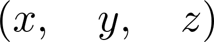
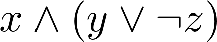
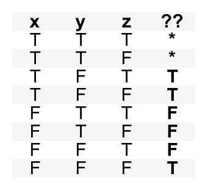
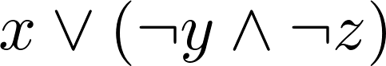
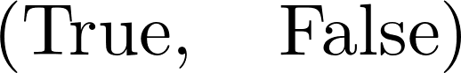

<a href="https://github.com/ipython-books/cookbook-2nd"></a> *This is one of the 100+ free recipes of the [IPython Cookbook, Second Edition](https://github.com/ipython-books/cookbook-2nd), by [Cyrille Rossant](http://cyrille.rossant.net), a guide to numerical computing and data science in the Jupyter Notebook. The ebook and printed book are available for purchase at [Packt Publishing](https://www.packtpub.com/big-data-and-business-intelligence/ipython-interactive-computing-and-visualization-cookbook-second-e).*

▶ *[Text on GitHub](https://github.com/ipython-books/cookbook-2nd) with a [CC-BY-NC-ND license](https://creativecommons.org/licenses/by-nc-nd/3.0/us/legalcode)*  
▶ *[Code on GitHub](https://github.com/ipython-books/cookbook-2nd-code) with a [MIT license](https://opensource.org/licenses/MIT)*

[*Chapter 15 : Symbolic and Numerical Mathematics*](./)

# 15.6. Finding a Boolean propositional formula from a truth table

The logic module in SymPy lets us manipulate complex Boolean expressions, also known as **propositional formulas**.

This recipe will show an example where this module can be useful. Let's suppose that, in a program, we need to write a complex `if` statement depending on three Boolean variables. We can think about each of the eight possible cases (true, true and false, and so on) and evaluate what the outcome should be. SymPy offers a function to generate a compact logic expression that satisfies our truth table.

## How to do it...

1. Let's import SymPy:

```python
from sympy import *
init_printing()
```

2. Let's define a few symbols:

```python
var('x y z')
```



3. We can define propositional formulas with symbols and a few operators:

```python
P = x & (y | ~z)
P
```



4. We can use `subs()` to evaluate a formula on actual Boolean values:

```python
P.subs({x: True, y: False, z: True})
```


5. Now, we want to find a propositional formula depending on x, y, and z, with the following truth table:



6. Let's write down all combinations that we want to evaluate to `True`, and those for which the outcome does not matter:

```python
minterms = [[1, 0, 1], [1, 0, 0], [0, 0, 0]]
dontcare = [[1, 1, 1], [1, 1, 0]]
```

7. Now, we use the `SOPform()` function to derive an adequate formula:

```python
Q = SOPform(['x', 'y', 'z'], minterms, dontcare)
Q
```



8. Let's test that this proposition works:

```python
Q.subs({x: True, y: False, z: False}), Q.subs(
    {x: False, y: True, z: True})
```



## How it works...

The `SOPform()` function generates a full expression corresponding to a truth table and simplifies it using the **Quine-McCluskey algorithm**. It returns the smallest *Sum of Products* form (or disjunction of conjunctions). Similarly, the `POSform()` function returns a Product of Sums.

The given truth table can occur in this case: suppose that we want to write a file if it doesn't already exist (`z`), or if the user wants to force the writing (`x`). In addition, the user can prevent the writing (`y`). The expression evaluates to `True` if the file is to be written. The resulting SOP formula works if we explicitly forbid `x` and `y` in the first place (forcing and preventing the writing at the same time is forbidden).

## There's more...

Here are a few references:

* SymPy logic module documentation at http://docs.sympy.org/latest/modules/logic.html
* The propositional formula on Wikipedia, at https://en.wikipedia.org/wiki/Propositional_formula
* Sum of Products on Wikipedia, at https://en.wikipedia.org/wiki/Canonical_normal_form
* The Quine–McCluskey algorithm on Wikipedia, at https://en.wikipedia.org/wiki/Quine%E2%80%93McCluskey_algorithm
* Logic lectures on Awesome Math, at https://github.com/rossant/awesome-math/#logic
