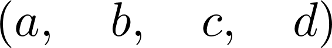
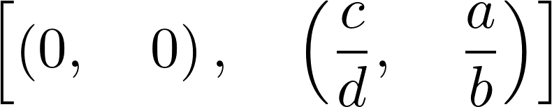
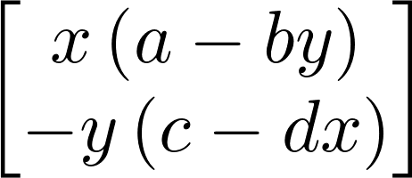
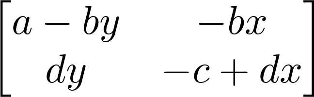
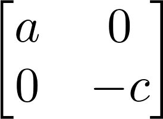
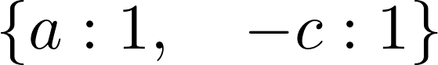
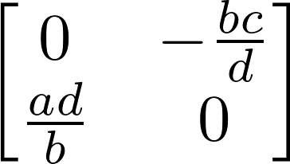
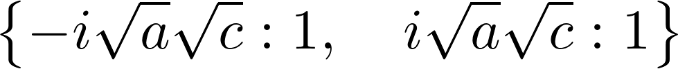

<a href="https://github.com/ipython-books/cookbook-2nd"></a> *This is one of the 100+ free recipes of the [IPython Cookbook, Second Edition](https://github.com/ipython-books/cookbook-2nd), by [Cyrille Rossant](http://cyrille.rossant.net), a guide to numerical computing and data science in the Jupyter Notebook. The ebook and printed book are available for purchase at [Packt Publishing](https://www.packtpub.com/big-data-and-business-intelligence/ipython-interactive-computing-and-visualization-cookbook-second-e).*

▶ *[Text on GitHub](https://github.com/ipython-books/cookbook-2nd) with a [CC-BY-NC-ND license](https://creativecommons.org/licenses/by-nc-nd/3.0/us/legalcode)*  
▶ *[Code on GitHub](https://github.com/ipython-books/cookbook-2nd-code) with a [MIT license](https://opensource.org/licenses/MIT)*

[*Chapter 15 : Symbolic and Numerical Mathematics*](./)

# 15.7. Analyzing a nonlinear differential system — Lotka-Volterra (predator-prey) equations

Here, we will conduct a brief analytical study of a famous nonlinear differential system: the **Lotka-Volterra equations**, also known as predator-prey equations. These equations are first-order differential equations that describe the evolution of two interacting populations (for example, sharks and sardines), where the predators eat the prey. This example illustrates how to obtain exact expressions and results about fixed points and their stability with SymPy.

## Getting ready

For this recipe, knowing the basics of linear and nonlinear systems of differential equations is recommended.

## How to do it...

1. Let's create some symbols:

```python
from sympy import *
init_printing(pretty_print=True)

var('x y')
var('a b c d', positive=True)
```



2. The variables $x$ and $y$ represent the populations of the prey and predators, respectively. The parameters $a$, $b$, $c$, and $d$ are strictly positive parameters (described more precisely in the *How it works...* section of this recipe). The equations are:

$$\begin{align}
\frac{dx}{dt} &= f(x) = x(a-by)\\
\frac{dy}{dt} &= g(x) = -y(c-dx)
\end{align}$$

```python
f = x * (a - b * y)
g = -y * (c - d * x)
```

3. Let's find the fixed points of the system (solving $f(x,y) = g(x,y) = 0$). We call them $(x_0, y_0)$ and $(x_1, y_1)$:

```python
solve([f, g], (x, y))
```



```python
(x0, y0), (x1, y1) = _
```

4. Let's write the 2D vector with the two equations:

```python
M = Matrix((f, g))
M
```



5. Now, we can compute the **Jacobian** of the system, as a function of $(x, y)$:

```python
J = M.jacobian((x, y))
J
```



6. Let's study the stability of the first fixed point by looking at the eigenvalues of the Jacobian at this point. The first fixed point corresponds to extinct populations:

```python
M0 = J.subs(x, x0).subs(y, y0)
M0
```



```python
M0.eigenvals()
```



The parameters $a$ and $c$ are strictly positive, so the eigenvalues are real and of opposite signs, and this fixed point is a saddle point. As this point is unstable, the extinction of both populations is unlikely in this model.

7. Let's consider the second fixed point now:

```python
M1 = J.subs(x, x1).subs(y, y1)
M1
```



```python
M1.eigenvals()
```



The eigenvalues are purely imaginary: thus, this fixed point is not hyperbolic. Therefore, we cannot draw conclusions from this linear analysis about the qualitative behavior of the system around this fixed point. However, we could show with other methods that oscillations occur around this point.

## How it works...

The Lotka-Volterra equations model the growth of the predator and prey populations, taking into account their interactions. In the first equation, the $ax$ term represents the exponential growth of the prey, and $-bxy$ represents death by predators. Similarly, in the second equation, $-yc$ represents the natural death of the predators, and $dxy$ represents their growth as they eat more and more prey.

To find the **equilibrium points** of the system, we need to find the values $x$, $y$ such that $dx/dt = dy/dt = 0$, that is, $f(x, y) = g(x, y) = 0$, so that the variables do not evolve anymore. Here, we were able to obtain analytical values for these equilibrium points with the `solve()` function.

To analyze their stability, we need to perform a linear analysis of the nonlinear equations, by taking the **Jacobian matrix** at these equilibrium points. This matrix represents the linearized system, and its eigenvalues tell us about the stability of the system near the equilibrium point. The **Hartman–Grobman theorem** states that the behavior of the original system qualitatively matches the behavior of the linearized system around an equilibrium point if this point is **hyperbolic** (meaning that no eigenvalues of the matrix have a real part equal to 0). Here, the first equilibrium point is hyperbolic as $a, c > 0$, but the second is not.

Here, we were able to compute symbolic expressions for the Jacobian matrix and its eigenvalues at the equilibrium points.

## There's more...

Even when a differential system is not solvable analytically (as is the case here), a mathematical analysis can still give us qualitative information about the behavior of the system's solutions. A purely numerical analysis is not always relevant when we are interested in qualitative results, as numerical errors and approximations can lead to wrong conclusions about the system's behavior.

Here are a few references:

* Matrix documentation in SymPy, available at http://docs.sympy.org/latest/modules/matrices/matrices.html
* Dynamical systems on Wikipedia, at https://en.wikipedia.org/wiki/Dynamical_system
* Equilibrium points on Scholarpedia, at http://www.scholarpedia.org/article/Equilibrium
* Bifurcation theory on Wikipedia, at https://en.wikipedia.org/wiki/Bifurcation_theory
* Chaos theory on Wikipedia, at https://en.wikipedia.org/wiki/Chaos_theory
* Further reading on dynamical systems, at https://en.wikipedia.org/wiki/Dynamical_system#Further_reading
* Lectures on ordinary differential equations on Awesome Math, at https://github.com/rossant/awesome-math/#ordinary-differential-equations
