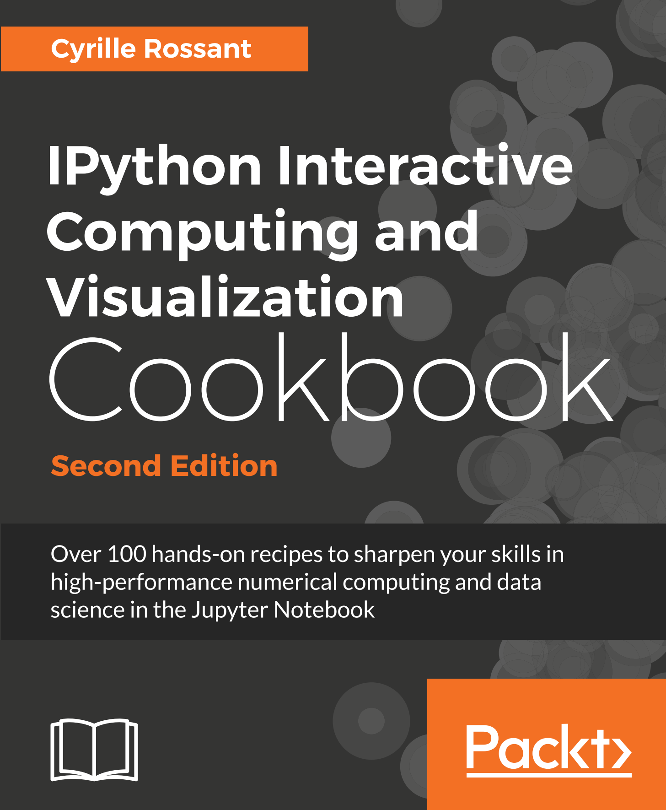
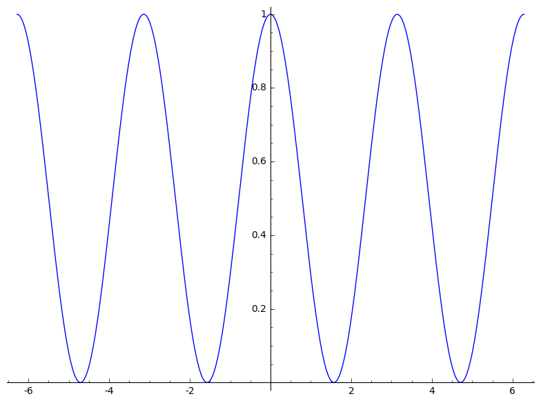

<a href="https://github.com/ipython-books/cookbook-2nd"></a> *This is one of the 100+ free recipes of the [IPython Cookbook, Second Edition](https://github.com/ipython-books/cookbook-2nd), by [Cyrille Rossant](http://cyrille.rossant.net), a guide to numerical computing and data science in the Jupyter Notebook. The ebook and printed book are available for purchase at [Packt Publishing](https://www.packtpub.com/big-data-and-business-intelligence/ipython-interactive-computing-and-visualization-cookbook-second-e).*

▶ *[Text on GitHub](https://github.com/ipython-books/cookbook-2nd) with a [CC-BY-NC-ND license](https://creativecommons.org/licenses/by-nc-nd/3.0/us/legalcode)*  
▶ *[Code on GitHub](https://github.com/ipython-books/cookbook-2nd-code) with a [MIT license](https://opensource.org/licenses/MIT)*

[*Chapter 15 : Symbolic and Numerical Mathematics*](./)

# 15.8. Getting started with Sage

[The recipe is available in the book, to be purchased on Packt.](https://www.packtpub.com/big-data-and-business-intelligence/ipython-interactive-computing-and-visualization-cookbook-second-e)

<!-- REMOVE AS PER PACKT AGREEMENT

Sage (http://www.sagemath.org) is a standalone mathematics software based on Python. It is an open source alternative to commercial products such as Mathematica, Maple, or MATLAB. Sage provides a unified interface to many open source mathematical libraries. These libraries include SciPy, SymPy, NetworkX, and other Python scientific packages, but also non-Python libraries such as ATLAS, BLAS, GSL, LAPACK, Singular, and many others.

In this recipe, we will give a brief introduction to Sage.

## Getting ready

You can either:

* Install Sage on your local computer (http://www.sagemath.org/doc/installation/)
* Create Sage notebooks remotely in the cloud (https://cloud.sagemath.com/)

Being based on so many libraries, Sage is heavy and hard to compile from source. On Ubuntu, you can use the system's package manager (see http://www.sagemath.org/download-linux.html). Binaries exist for most systems except Windows, where you generally have to use VirtualBox (a virtualization solution: http://www.virtualbox.org).

Alternatively, you can use Sage in a browser with a Jupyter notebook running in the cloud.

Once Sage is installed, you can use it with Jupyter by typing the following command in a terminal: `sage -n jupyter`.

## How to do it...

Here, we will create a new Sage notebook and introduce the most basic features:

1. Sage accepts mathematical expressions as we would expect:

```python
3 * 4
```

```{output:result}
12
```

2. Being based on Python, Sage's syntax is almost Python, but there are a few differences. For example, the power exponent is the more classical ^ symbol:

```python
2 ^ 3
```

```{output:result}
8
```

3. Like in SymPy, symbolic variables need to be declared beforehand with the `var()` function. However, the `x` variable is always predefined. Here, we define a new mathematical function:

```python
f = 1 - sin(x) ^ 2
```

4. Let's simplify the expression of f:

```python
f.simplify_trig()
```

```{output:result}
cos(x)^2
```

5. Let's evaluate `f` on a given point:

```python
f(x=pi)
```

```{output:result}
1
```

6. Functions can be differentiated and integrated:

```python
f.diff(x)
```

```{output:result}
-2*cos(x)*sin(x)
```

```python
f.integrate(x)
```

```{output:result}
1/2*x + 1/4*sin(2*x)
```

7. Sage also supports numerical computations in addition to symbolic computations:

```python
find_root(f - x, 0, 2)
```

```{output:result}
0.6417143708729726
```

8. Sage also comes with rich plotting capabilities (including interactive plotting widgets):

```python
f.plot((x, -2 * pi, 2 * pi))
```



```python
x, y = var('x,y')
plot3d(sin(x ^ 2 + y ^ 2) / (x ^ 2 + y ^ 2),
       (x, -5, 5), (y, -5, 5))
```


## There's more...

This (too) short recipe cannot do justice to the huge list of possibilities offered by Sage. Many aspects of mathematics are covered: algebra, combinatorics, numerical mathematics, number theory, calculus, geometry, graph theory, and many others. Here are a few references:

* An in-depth tutorial on Sage, available at http://doc.sagemath.org/html/en/tutorial/index.html
* The Sage reference manual, available at http://doc.sagemath.org/html/en/reference/index.html
* Videos on Sage, available at http://www.sagemath.org/help-video.html

## See also

* Diving into symbolic computing with SymPy

-->
